# 今日指数-day01

## 今日目标

~~~tex
1. 能说出项目的基本概述;
2. 能说出股票相关的核心概念;
   2.1 股票、板块、大盘的概念;
   2.2 股票涨幅、涨跌、振幅、开盘、收盘、涨停|跌停概念;
3. 能说出项目的技术架构;
4. 能说出项目开发的基本流程;
5. 能够动手搭建开发环境;
   5.1 搭建后端开发环境;
   5.2 搭建前端环境;
6. 能够完成用户登录功能;
~~~

## 1.项目介绍

【今日指数】是基于股票实时交易产生的数据分析产品，旨在为特定用户和机构提供定制化的股票数据分析和展示服务;

项目的核心功能以数据分析和展示为主，主要包含了沪深指数、沪深板块、沪深个股和K线的实时行情查询等功能，内容包含了国内实时指数、涨幅榜、个股涨跌、个股秒级行情、实时日K线行情等;

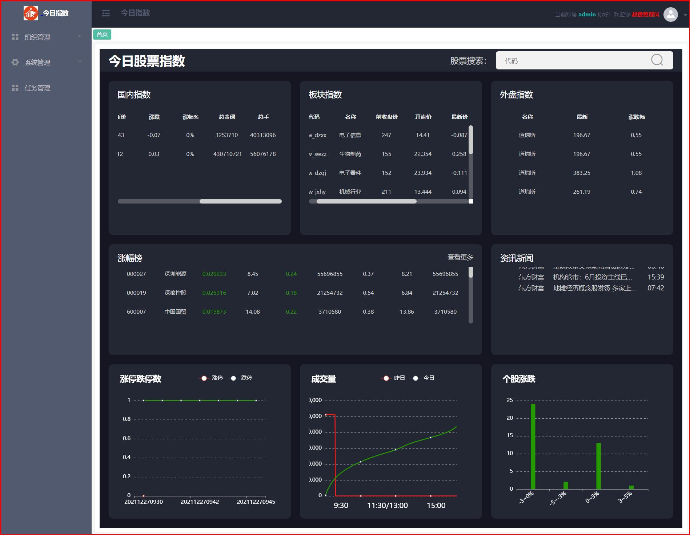

参考网站：

~~~tex
http://q.10jqka.com.cn/ (同花顺)
https://xueqiu.com/ (雪球)
https://finance.sina.com.cn/stock/ (新浪)
http://quote.eastmoney.com/ (东方财富)
~~~

## 2.核心概念介绍

### 2.1.股票相关概念介绍

#### 【1】什么是股票？

~~~tex
股票是股份公司发给股东证明其所入股份的一种有价证券(有效凭证)，它可以作为买卖对象和抵押品，是资金市场中主要的信用工具之一；
举例：我和朋友开公司，一人出10万块钱，那怎么证明公司里的20万里有我的10万呢？
	 最传统的办法就是发行股票，也就是盖章签字的纸质凭证。
	 每人出了10万，那我们就发行200股，这样每个人就分得100股，股票就是证明你是公司股东且占有公司200股里面100		股的一个凭证。
~~~

#### 【2】股票的分类

~~~tex
A股：★★★
   即人民币普通股票，是由中国境内注册公司发行，在境内上市，以人民币标明面值，供境内机构、组织或个人（2013年4月1日起，境内港澳台居民可开立A股账户）以人民币认购和交易的普通股股票。
   英文字母A没有实际意义，只是用来区分人民币普通股票和人民币特种股票。
 A股中的股票分类：
    绩优股：绩优股就是业绩优良公司的股票；
    垃圾股：与绩优股相对应，垃圾股指的是业绩较差的公司的股票；
    蓝筹股：指在其所属行业内占有重要支配性地位业绩优良成交活跃、红利优厚的大公司股票；
##########################################################################################
B股：也称为人民币特种股票。是指那些在中国大陆注册、在中国大陆上市的特种股票。以人民币标明面值，只能以外币认购和交易；部分股票也开放港元交易；
H股：也称为国企股，是指国有企业在香港 (Hong Kong) 上市的股票；
N股：是指那些在中国大陆注册、在纽约（New York）上市的外资股；
SCA股：是指那些主要生产或者经营等核心业务在中国大陆、而企业的注册地在新加坡（Singapore）或者其他国家和地区,但是在新加坡交易所上市挂牌的企业股票；
~~~

#### 【3】股票核心参数介绍

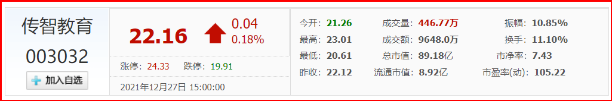

​	开盘价：

~~~tex
开盘价：是指证券交易所在每个交易日开市后的第一笔股票买卖成交的价格；
中国股市的开盘价格是由市场集合竞价所产生的。
在A股市场中，股票的开盘价是由集合竞价的9点15分至9点25分买卖双方的撮合，股票价格在有效价格范围内选取成交量最大的价位所产生的，也是证券交易所每个交易日开市后的第一笔每股买卖成交价格。如果集合竞价的时间内股票没有买卖或没有成交，则股票前一日的收盘价作为当日股票的开盘价。
一般状况：开盘参考价=前一买卖日收盘价。
~~~

​	收盘价：

~~~tex
收盘价又称收市价，是指某只股票在证券交易所每个交易日里的【最后一笔买卖成交价格】；
如果某只股票当日没有成交，则采用最近一次的成交价作为收盘价；
~~~

​	涨跌值：

~~~tex
当前股票的价格与前一天的收盘价比价，来反应股票的实时涨跌情况；
计算公式为：最新价格-前收盘价格
注意：一般在交易台上用“+”或“-”号表示，单位是元，正值为涨，负值为跌，否则为持平；
~~~

​	涨跌幅（涨幅）：

~~~Tex
涨跌幅是对涨跌值的描绘;
计算公式为：股票涨跌幅计算公式：（最新成交价-前收盘价）÷前收盘价×100%
也就是（涨跌值）÷前收盘价×100%
~~~

​	涨停与跌停：

~~~tex
涨停与跌停就是一种对股市涨跌幅的限制；
证券交易所为了抑制过度投机行为，防止市场出现过分的暴涨暴跌，强制约定在每天的交易中股票的涨跌幅必须在规定的区间内上下波动。如果股票价格上升到该限制幅度的最高限价为涨停板，而下跌至该限制幅度的最低限度为跌停板。
    1、涨停指的是价格涨到一定幅度，价格会被限制，不再变动，但是可以继续交易。
    2、跌停指的是价格跌到一定幅度，价格会被限制，不在变动，但是可以继续交易。
    3、在中国A股市场,均设有涨幅和跌幅的限制,他们都是【涨跌幅10%】的限制,即所谓的涨停和跌停。
注意事项：
	涨停和跌停适用中国所有A股，但是对于第一次上市交易股票当天是没有涨停限制的，第二天才有限制（打新）；
	股票交易采用T+1机制，也就是当日买进，那么最快第二个交易日才可卖出；
~~~

​	振幅：

~~~tex
股票振幅是指股票开盘后的当日最高价和最低价之间的差的绝对值与昨日收盘价的百分比，它在一定程度上表现股票的活跃程度。
计算公式为：（当日最高价-当日最低价）÷前收盘价 ×100%
~~~

​	成交量：

~~~tex
成交量指当天成交的股票总手数（1手=100股）;
计算则是由交易所直接进行计算;
~~~

​	成交金额：

~~~tex
股票成交额是指某一特定时期内，成交某种股票的金额，其单位以人民币"元"计算；
成交金额就是每股价格乘交易的手数，再乘上100。
例如：投资者以每股10元的价格买入50手，10X50X100=50000,此时的5万就是成交额。
注意：
    成交总金额又称总额，总额是指当天开盘以来总成交金额，单位以人民币"元"计算。
    简单的说，这个总金额是反应当日有多少资金进行了成交操作。
~~~

股票编码：

~~~Tex
1、创业板 创业板的代码是300打头的股票代码；
2、沪市A股 沪市A股的代码是以600、601或603打头；★★★
3、沪市B股 沪市B股的代码是以900打头；
4、深市A股 深市A股的代码是以000打头；★★★
5、中小板 中小板的代码是002打头；
6、深圳B股 深圳B股的代码是以200打头；
7、新股申购 沪市新股申购的代码是以730打头 深市新股申购的代码与深市股票买卖代码一样；
8、配股代码 沪市以700打头，深市以080打头 权证，沪市是580打头 深市是031打头。
9、 400开头的股票是三板市场股票。
注意：国内上市公司可选择在上海证券交易所（上证）、深证证券交易所（深证）挂牌上市,中小型企业可选择北交所上市；
~~~

K线：

~~~tex
K线图（Candlestick Charts）又称蜡烛图、日本线、【阴阳线】、棒线等，常用说法是“K线”，起源于日本十八世纪德川幕府时代（1603～1867年）的米市交易，用来计算米价每天的涨跌。
它是以每个交易日（或每个分析周期，甚至是月年）的开盘价、最高价、最低价、和收盘价绘制而成，结构上可分为上影线、下影线及中间实体三部分。
~~~

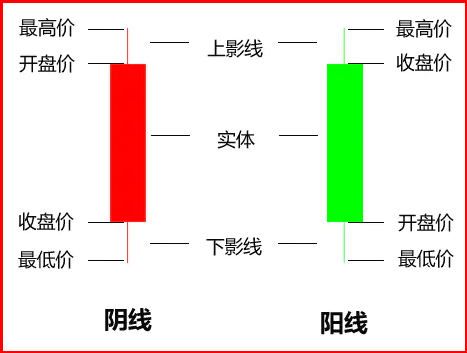

示例：


小结：

~~~tex
1.什么是股票？
2.什么是A股？
3.股票核心参数：开盘价、收盘价、涨跌、涨幅、振幅、涨停|跌停、成交量、成交金额等；
4.K线图：分时K线图、日k线图、周k线图等
~~~

### 2.2大盘与板块概念介绍

#### 【1】什么是大盘指数

~~~tex
1.大盘指数就是大家为了了解上市公司及股票市场的涨跌情况和市场的发展、健康程度，将上市公司所有股票或特定股票，经过专业计算得出的一个指数。然后交易所给它取了个名：上证综合指数和深证成份股指数。
说明：
股市中之所以要用到指数，就是因为股票市场中有太多的股票，我们不可能一次性将所有股票的行情走势都了解清楚，所以想要把握【大盘走势】，我们必须依靠指数！这也是为什么指数被称为股市晴雨表的原因了；
~~~


#### 【2】什么是板块指数

~~~tex
股票板块是指具有某种特定属性的股票组成的群体，比如：股票根据行业划分为19个板块，涵盖了农业、林业、牧业、渔业、采矿业、制造业、电力、热力、燃气及水生产和供应业、建筑业等行业。
这些股票因为有某一共同特征而被人为地归类在一起，而这一特征往往是被所谓股市庄家用来进行炒作的题材。
注意：
	根据定义板块的方式，主要分为：地域板块、行业板块、概念板块等；
~~~

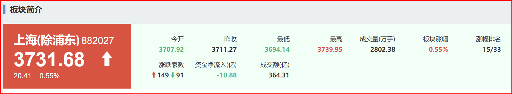

小结：

~~~tex
1.大盘相关概念？
2.板块相关概念？
~~~

## 3.项目架构

### 3.1 今日指数技术选型

#### 【1】前端技术

| 名称   | 技术                        | 场景   |
| ---- | ------------------------- | ---- |
| 基本骨架 | vue-cli+vue+element+axios |      |
| 报表   | echartsjs                 |      |
| 前端支持 | node webpack 等            |      |

#### 【2】后端技术栈

| 名称        | 技术                                       | 场景     |
| --------- | ---------------------------------------- | ------ |
| 基础框架      | springboot、mybatis-springboot、springMVC  | 项目基础骨架 |
| 安全框架      | boot-security+jwt                        | 认证与授权  |
| 缓存        | redis                                    | 缓存     |
| excel表格导出 | easyexcel                                |        |
| 小组件       | jode-date 、gson 、guava 、httpClient \| restTemplate 、线程池 |        |
| 定时任务      | xxljob                                   |        |
| 文档框架      | swagger                                  |        |
| 分库分表      | sharding-JDBC                            |        |
| 部署        | nginx                                    |        |

#### 【3】整体概览

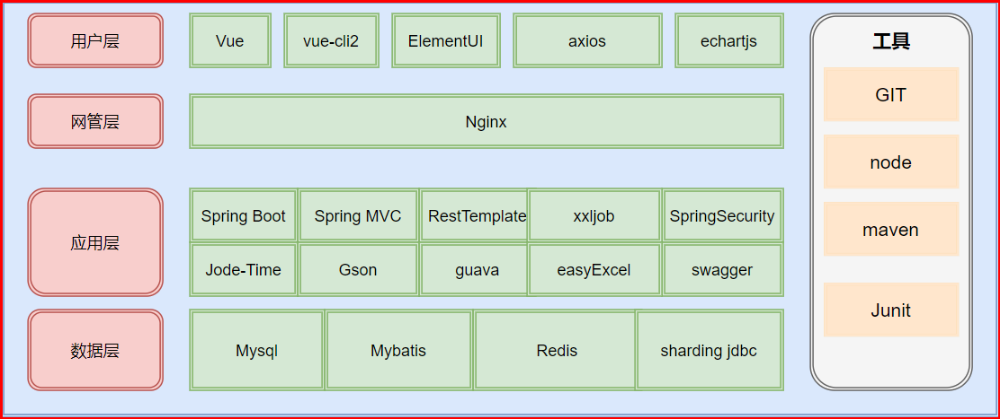

### 3.2 核心业务介绍

#### 【1】业务结构预览

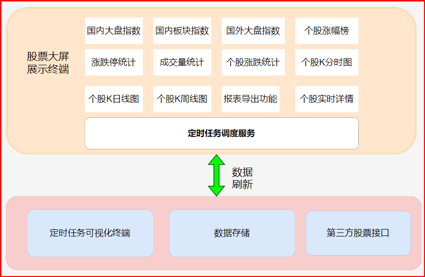

#### 【2】业务功能简介

~~~tex
1.定时任务调度服务
	XXL-JOB通过RestTemplate+多线程动态拉去股票接口数据，刷入数据库；
2.国内指数服务
3.板块指数服务
4.涨幅榜展示功能
5.涨停跌停数展示功能
6.成交量对比展示功能
7.个股涨停服务展示功能
8.个股详情展示功能
   	包含分时行情、日k线、周K线图等
9.个股描述服务；
10.报表导出服务
~~~

## 4. 软件开发流程说明

作为一名软件开发工程师,我们需要了解在软件开发过程中的开发流程， 以及软件开发过程中涉及到的岗位角色，角色的分工、职责， 并了解软件开发中涉及到的三种软件环境。那么这一小节，我们将从 软件开发流程、角色分工、软件环境 三个方面，来整体上介绍一下软件开发。

### 4.1  软件开发流程


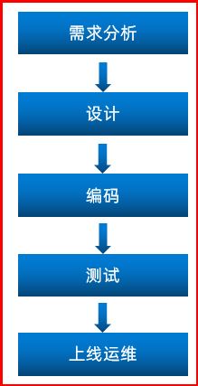

需求分析----》设计---》开发----》测试-----》发布|部署|运维

#### **1). 第1阶段: 需求分析**

完成产品原型、需求规格说明书|| 需求说明书的编写。  

产品原型：一般是通过网页(html)的形式展示业务功能,。比如包含页面的布局是什么样子的，点击某个菜单，打开什么页面，点击某个按钮，出现什么效果，都可以通过产品原型看到。 

需求规格说明书， 一般来说就是使用 Word 文档来描述当前项目有哪些功能，每一项功能的需求及业务流程是什么样的，都会在文档中描述。

#### **2). 第2阶段: 设计**

设计的内容包含 产品设计、UI界面设计、概要设计、详细设计、数据库设计。

在设计阶段，会出具相关的UI界面、及相关的设计文档。比如数据库设计，需要设计当前项目中涉及到哪些数据库，每一个数据库里面包含哪些表，这些表结构之间的关系是什么样的，表结构中包含哪些字段，字段类型都会在文档中描述清楚。

在该阶段查出：UI界面（纯静态的html页面）、概要设计文档（涵盖笼统的核心模块）、详细设计（具体功能的设计，包含接口设计产出：接口文档说明书）、数据库设计（设计业务关联的表、表与表之间的关系、表中的字段、字段的类型、索引等等）

#### **3). 第3阶段: 编码**

项目管理人员或者项目组长|架构师任务分发；

编写项目代码、并完成单元测试；

作为软件开发工程师，我们主要的工作就是在该阶段， 对分配给我们的模块功能，进行编码实现。编码实现完毕后，进行单元测试，单元测试通过后再进入到下一阶段；

#### **4). 第4阶段: 测试**

在该阶段中主要由测试人员, 对部署在测试环境的项目进行功能测试, 并出具测试报告。

#### **5). 第5阶段: 上线运维**

4个9999 保证全年99.9999%；

在项目上线之前， 会由运维人员准备服务器上的软件环境安装、配置， 配置完毕后， 再将我们开发好的项目，部署在服务器上运行。

沙箱环境|准生产环境：最大程度模拟生产环境，又不是生产环境；

注意：

我们作为软件开发工程师， 我们主要的任务是在编码阶段， 但是在一些小的项目组当中， 也会涉及到数据库的设计、测试等方面的工作。

#### 小结

​	**软件的开发流程：**  

```tex
市场调研||需求分析----设计----编码-----测试-----上线运维----后期维护
```

### 4.2 软件开发角色分工

学习了软件开发的流程之后， 我们还有必要了解一下在整个软件开发过程中涉及到的岗位角色，以及各个角色的职责分工。


| 岗位/角色 | 职责/分工                      |
| ----- | -------------------------- |
| 项目经理  | 对整个项目负责，任务分配、把控进度          |
| 产品经理  | 进行需求调研，输出需求调研文档、产品原型等、需求文档 |
| UI设计师 | 根据产品原型输出界面效果图              |
| 架构师   | 项目整体架构设计、技术选型等             |
| 开发工程师 | 功能代码实现                     |
| 测试工程师 | 编写测试用例，输出测试报告              |
| 运维工程师 | 软件环境搭建、项目上线                |

上述我们讲解的角色分工, 是在一个项目组中比较标准的角色分工, 但是在实际的项目中, 有一些项目组由于人员配置紧张, 可能并没有专门的架构师或测试人员, 这个时候可能需要有项目经理或者程序员兼任。

### 4.3 软件开发环境


在我们日常的软件开发中，会涉及到软件开发中的三套环境， 那么这三套环境分别是: 开发环境、测试环境、生产环境。 接下来，我们分别介绍一下这三套环境的作用和特点。

#### **1). 开发环境(development)**

我们作为软件开发人员，在开发阶段使用的环境，就是开发环境，一般外部用户无法访问。

比如，我们在开发中使用的MySQL数据库和其他的一些常用软件，我们可以安装在本地， 也可以安装在一台专门的服务器中， 这些应用软件仅仅在软件开发过程中使用， 项目测试、上线时，我们不会使用这套环境了，这个环境就是开发环境。

#### **2). 测试环境(testing)**

当软件开发工程师，将项目的功能模块开发完毕，并且单元测试通过后，就需要将项目部署到测试服务器上，让测试人员对项目进行测试。那这台测试服务器就是专门给测试人员使用的环境， 也就是测试环境，用于项目测试，一般外部用户无法访问。


#### **3). 生产环境(production)**

当项目开发完毕，并且由测试人员测试通过之后，就可以上线项目，将项目部署到线上环境，并正式对外提供服务，这个线上环境也称之为生产环境。

> 拓展知识:
>
> ​	**准生产环境:** 对于有的公司来说，项目功能开发好, 并测试通过以后，并不是直接就上生产环境。为了保证我们开发的项目在上线之后能够完全满足要求，就需要把项目部署在真实的环境中, 测试一下是否完全符合要求啊，这时候就诞生了准生产环境，你可以把他当做生产环境的克隆体，准生产环境的服务器配置, 安装的应用软件(JDK、Tomcat、数据库、中间件 ...) 的版本都一样，这种环境也称为 "仿真环境"。
>
> ​	ps.由于项目的性质和类型不同，有的项目可能不需要这个环境

## 5.后端开发环境搭建

开发工具版本要求：

| 数据库   | 版本       | 说明   |
| ----- | -------- | ---- |
| mysql | 5.6以上    |      |
| node  | v14.15.2 |      |
| idea  | 2020以上   |      |

### 5.1 数据库环境搭建

#### 【1】表结构介绍

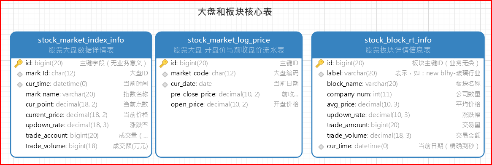

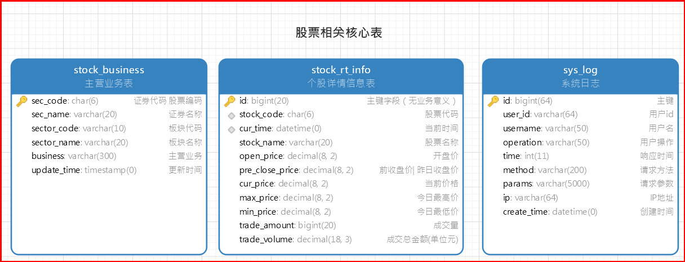

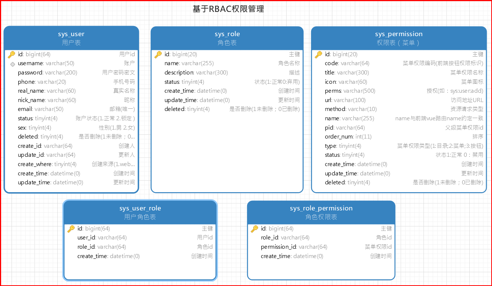

注意事项：后期股票相关的数据量非常庞大，表与表之间尽量不要构建外键约束（提升数据库性能），同时也为后期分库分表准备！

#### 【2】数据导入

直接将接将：**day01\资料\stock.sql**导入到数据库中, 自动构建库和表：

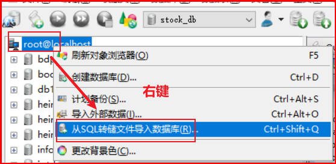

然后选择需要导入的sql文件：

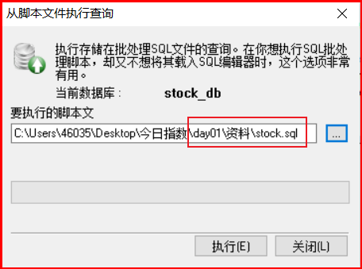

说明：

~~~tex
上述的表结构, 我们先简单的了解一下,大概有那些表, 每张表结构中存储什么样的数据, 有一个印象;
对于具体的表结构, 以及表结构中的字段, 在讲解具体的功能开发时, 我们再详细介绍;
~~~

### 5.2后端工程搭建

#### 【1】构建stock_parent父工程

  	创建stock_parent  maven工程：

~~~xml
<?xml version="1.0" encoding="UTF-8"?>
<project xmlns="http://maven.apache.org/POM/4.0.0"
         xmlns:xsi="http://www.w3.org/2001/XMLSchema-instance"
         xsi:schemaLocation="http://maven.apache.org/POM/4.0.0 http://maven.apache.org/xsd/maven-4.0.0.xsd">
    <modelVersion>4.0.0</modelVersion>

    <groupId>com.itheima.stock</groupId>
    <artifactId>stock_parent</artifactId>
    <version>1.0-SNAPSHOT</version>
    <modules>
        <module>stock_backend</module>
        <module>stock_xxljob_admin</module>
    </modules>
    <packaging>pom</packaging>
    <properties>
        <project.build.sourceEncoding>UTF-8</project.build.sourceEncoding>
        <maven.compiler.encoding>UTF-8</maven.compiler.encoding>
        <maven.compiler.source>8</maven.compiler.source>
        <maven.compiler.target>8</maven.compiler.target>
        <maven.test.skip>true</maven.test.skip>
        <mybatis-spring-boot-starter.version>2.1.4</mybatis-spring-boot-starter.version>
        <pagehelper-spring-boot-starter.version>1.2.12</pagehelper-spring-boot-starter.version>
        <mysql-driver.version>5.1.49</mysql-driver.version>
        <fastjson.version>1.2.71</fastjson.version>
        <springfox-swagger2.version>2.9.2</springfox-swagger2.version>
        <druid-spring-boot-starter.version>1.1.22</druid-spring-boot-starter.version>
        <druid-core-version>1.2.8</druid-core-version>
        <sharding-jdbc.version>4.0.0-RC1</sharding-jdbc.version>
        <jjwt.version>0.9.1</jjwt.version>
        <easyExcel.version>3.0.4</easyExcel.version>
        <xxl-job-core.version>2.3.0</xxl-job-core.version>
        <spring-boot.version>2.5.3</spring-boot.version>
        <joda-time.version>2.10.5</joda-time.version>
        <google.guava.version>30.0-jre</google.guava.version>
    </properties>
    <!--定义依赖版本锁定-->
    <dependencyManagement>
        <dependencies>
            <!--引入springboot依赖-->
            <dependency>
                <groupId>org.springframework.boot</groupId>
                <artifactId>spring-boot-starter-parent</artifactId>
                <version>${spring-boot.version}</version>
                <type>pom</type>
                <scope>import</scope>
            </dependency>
            <!--引入mybatis场景依赖-->
            <dependency>
                <groupId>org.mybatis.spring.boot</groupId>
                <artifactId>mybatis-spring-boot-starter</artifactId>
                <version>${mybatis-spring-boot-starter.version}</version>
            </dependency>
            <!--pageHelper场景依赖-->
            <dependency>
                <groupId>com.github.pagehelper</groupId>
                <artifactId>pagehelper-spring-boot-starter</artifactId>
                <version>${pagehelper-spring-boot-starter.version}</version>
            </dependency>
            <!--mysql驱动包-->
            <dependency>
                <groupId>mysql</groupId>
                <artifactId>mysql-connector-java</artifactId>
                <version>${mysql-driver.version}</version>
            </dependency>
            <!--shardingjdbc分库分表-->
            <dependency>
                <groupId>org.apache.shardingsphere</groupId>
                <artifactId>sharding-jdbc-spring-boot-starter</artifactId>
                <version>${sharding-jdbc.version}</version>
            </dependency>
            <!--json工具包-->
            <dependency>
                <groupId>com.alibaba</groupId>
                <artifactId>fastjson</artifactId>
                <version>${fastjson.version}</version>
            </dependency>
            <!--druid-boot依赖-->
            <dependency>
                <groupId>com.alibaba</groupId>
                <artifactId>druid-spring-boot-starter</artifactId>
                <version>${druid-spring-boot-starter.version}</version>
            </dependency>
            <!--druid core-->
            <dependency>
                <groupId>com.alibaba</groupId>
                <artifactId>druid</artifactId>
                <version>${druid-core-version}</version>
            </dependency>
            <!--swagger文档依赖-->
            <dependency>
                <groupId>io.springfox</groupId>
                <artifactId>springfox-swagger2</artifactId>
                <version>${springfox-swagger2.version}</version>
            </dependency>
            <dependency>
                <groupId>io.springfox</groupId>
                <artifactId>springfox-swagger-ui</artifactId>
                <version>${springfox-swagger2.version}</version>
            </dependency>
            <!--引入jwt依赖-->
            <dependency>
                <groupId>io.jsonwebtoken</groupId>
                <artifactId>jjwt</artifactId>
                <version>${jjwt.version}</version>
            </dependency>
            <!-- 导出 excel -->
            <dependency>
                <groupId>com.alibaba</groupId>
                <artifactId>easyexcel</artifactId>
                <version>${easyExcel.version}</version>
            </dependency>
            <!--xxl-job定义任务框架支持-->
            <dependency>
                <groupId>com.xuxueli</groupId>
                <artifactId>xxl-job-core</artifactId>
                <version>${xxl-job-core.version}</version>
            </dependency>
            <!--时间小工具-->
            <dependency>
                <groupId>joda-time</groupId>
                <artifactId>joda-time</artifactId>
                <version>${joda-time.version}</version>
            </dependency>
            <!--引入google的工具集-->
            <dependency>
                <groupId>com.google.guava</groupId>
                <artifactId>guava</artifactId>
                <version>${google.guava.version}</version>
            </dependency>
        </dependencies>
    </dependencyManagement>

    <build>
        <pluginManagement>
            <plugins>
              	<!--Springboot核心插件-->
                <plugin>
                    <groupId>org.springframework.boot</groupId>
                    <artifactId>spring-boot-maven-plugin</artifactId>
                    <version>${spring-boot.version}</version>
                    <configuration>
                        <excludes>
                            <!--插件运行时排除依赖-->
                            <exclude>
                                <groupId>org.springframework.boot</groupId>
                                <artifactId>spring-boot-configuration-processor</artifactId>
                            </exclude>
                        </excludes>
                    </configuration>
                </plugin>
                <!--打包跳过test -->
                <plugin>
                    <groupId>org.apache.maven.plugins</groupId>
                    <artifactId>maven-surefire-plugin</artifactId>
                    <configuration>
                        <skip>${maven.test.skip}</skip>
                    </configuration>
                </plugin>
            </plugins>
        </pluginManagement>
    </build>
</project>
~~~

注意事项：

~~~tex
1.打包方式：pom
2.通过dependencyManagement、pluginManagement锁定开发中的依赖和插件的版本;
~~~

#### 【2】构建stock_backend基础工程

创建stock_parent的maven子工程stock_backend:

##### 【2.1】引入依赖

​	  stock_backend工程被stock_parent父工程聚合，pom配置如下：

~~~xml
<?xml version="1.0" encoding="UTF-8"?>
<project xmlns="http://maven.apache.org/POM/4.0.0"
         xmlns:xsi="http://www.w3.org/2001/XMLSchema-instance"
         xsi:schemaLocation="http://maven.apache.org/POM/4.0.0 http://maven.apache.org/xsd/maven-4.0.0.xsd">
    <parent>
        <artifactId>stock_parent</artifactId>
        <groupId>com.itheima.stock</groupId>
        <version>1.0-SNAPSHOT</version>
    </parent>
    <modelVersion>4.0.0</modelVersion>
    <packaging>jar</packaging>
    <artifactId>stock_backend</artifactId>

    <properties>
        <maven.compiler.source>8</maven.compiler.source>
        <maven.compiler.target>8</maven.compiler.target>
    </properties>

    <dependencies>
        <!-- 基本依赖 -->
        <dependency>
            <groupId>org.springframework.boot</groupId>
            <artifactId>spring-boot-starter-web</artifactId>
        </dependency>
        <dependency>
            <groupId>org.springframework.boot</groupId>
            <artifactId>spring-boot-starter-aop</artifactId>
        </dependency>
        <dependency>
            <groupId>mysql</groupId>
            <artifactId>mysql-connector-java</artifactId>
        </dependency>
        <dependency>
            <groupId>org.springframework.boot</groupId>
            <artifactId>spring-boot-starter-test</artifactId>
            <scope>test</scope>
        </dependency>
        <dependency>
            <groupId>org.projectlombok</groupId>
            <artifactId>lombok</artifactId>
            <optional>true</optional>
        </dependency>
        <dependency>
            <groupId>org.mybatis.spring.boot</groupId>
            <artifactId>mybatis-spring-boot-starter</artifactId>
        </dependency>
        <dependency>
            <groupId>com.github.pagehelper</groupId>
            <artifactId>pagehelper-spring-boot-starter</artifactId>
        </dependency>
        <dependency>
            <groupId>com.alibaba</groupId>
            <artifactId>druid-spring-boot-starter</artifactId>
        </dependency>
        <!--配置提示-->
        <dependency>
            <groupId>org.springframework.boot</groupId>
            <artifactId>spring-boot-configuration-processor</artifactId>
            <optional>true</optional>
        </dependency>
        <!--时间小工具-->
        <dependency>
            <groupId>joda-time</groupId>
            <artifactId>joda-time</artifactId>
        </dependency>
    </dependencies>

    <build>
      	<!--打包名称-->
        <finalName>${project.artifactId}</finalName>
        <plugins>
            <plugin>
                <groupId>org.springframework.boot</groupId>
                <artifactId>spring-boot-maven-plugin</artifactId>
            </plugin>
            <!-- 打包跳过test -->
            <plugin>
                <groupId>org.apache.maven.plugins</groupId>
                <artifactId>maven-surefire-plugin</artifactId>
            </plugin>
        </plugins>
    </build>

</project>
~~~

##### 	  【2.2】配置yml

~~~yml
# web定义
server:
  port: 8081

spring:
  # 配置mysql数据源
  datasource:
    druid:
      username: root
      password: root
      url: jdbc:mysql://127.0.0.1:3306/stock_db?useUnicode=true&characterEncoding=UTF-8&allowMultiQueries=true&useSSL=false&serverTimezone=Asia/Shanghai
      driver-class-name: com.mysql.cj.jdbc.Driver
      # 初始化时建立物理连接的个数。初始化发生在显示调用 init 方法，或者第一次 getConnection 时
      initialSize: 6
      # 最小连接池数量
      minIdle: 2
      # 最大连接池数量
      maxActive: 20
      # 获取连接时最大等待时间，单位毫秒。配置了 maxWait 之后，缺省启用公平锁，
      # 并发效率会有所下降，如果需要可以通过配置 useUnfairLock 属性为 true 使用非公平锁。
      maxWait: 60000
      # 配置间隔多久才进行一次检测，检测需要关闭的空闲连接，单位是毫秒
      timeBetweenEvictionRunsMillis: 60000
      # 配置一个连接在池中最小生存的时间，单位是毫秒
      minEvictableIdleTimeMillis: 300000
      # 用来检测连接是否有效的 sql 因数据库方言而差, 例如 oracle 应该写成 SELECT 1 FROM DUAL
      validationQuery: SELECT 1 FROM DUAL
      # 建议配置为 true，不影响性能，并且保证安全性。申请连接的时候检测，
      # 如果空闲时间大于 timeBetweenEvictionRunsMillis，执行 validationQuery 检测连接是否有效。
      testWhileIdle: true
      # 申请连接时执行 validationQuery 检测连接是否有效，做了这个配置会降低性能。
      testOnBorrow: false
      # 归还连接时执行 validationQuery 检测连接是否有效，做了这个配置会降低性能。
      testOnReturn: false
      # 是否自动回收超时连接
      poolPreparedStatements: true
      maxPoolPreparedStatementPerConnectionSize: 20
      # 配置监控统计拦截的filters，去掉后监控界面sql无法统计，'wall'用于防火墙
      filters: stat,wall
      # 通过connectProperties属性来打开mergeSql功能；慢SQL记录
      connectionProperties: druid.stat.mergeSql=true;druid.stat.slowSqlMillis=5000

# 配置mybatis
mybatis:
  type-aliases-package: com.itheima.stock.pojo
  mapper-locations: classpath:mapper/*.xml
  configuration:
    map-underscore-to-camel-case: true
    cache-enabled: false #使全局的映射器启用或禁用缓存。
    lazy-loading-enabled: false #全局启用或禁用延迟加载。当禁用时，所有关联对象都会即时加载。
    aggressive-lazy-loading: true #当启用时，有延迟加载属性的对象在被调用时将会完全加载任意属性。否则，每种属性将会按需要加载。

# pagehelper配置
pagehelper:
  helper-dialect: mysql #指定分页数据库类型（方言）
  reasonable: true #合理查询超过最大也，则查询最后一页
  support-methods-arguments: true # 支持通过Mapper接口参数来传递分页参数，默认false
  params: pacount=countSql # POJO或者Map中发现了countSql属性，就会作为count参数使用
  returnPageInfo: check # always总是返回PageInfo类型,check检查返回类型是否为PageInfo,none返回Page
~~~

##### 【2.3】定义main启动类

~~~java
package com.itheima.stock;

import org.mybatis.spring.annotation.MapperScan;
import org.springframework.boot.SpringApplication;
import org.springframework.boot.autoconfigure.SpringBootApplication;
/**
 * @author by itheima
 * @Date 2021/12/29
 * @Description 定义main启动类
 */
@SpringBootApplication
@MapperScan("com.itheima.stock.mapper")
public class StockApp {
    public static void main(String[] args) {
        SpringApplication.run(StockApp.class,args);
    }
}
~~~

##### 【2.4】定义web测试接口

~~~java
package com.itheima.stock.controller;

import org.springframework.web.bind.annotation.GetMapping;
import org.springframework.web.bind.annotation.RequestMapping;
import org.springframework.web.bind.annotation.RestController;

/**
 * @author by itheima
 * @Date 2021/12/29
 * @Description 定义用户访问层
 */
@RestController
@RequestMapping("/api")
public class UserController {

    @GetMapping("/test")
    public String getName(){
        return "itheima";
    }
}
~~~

##### 【2.5】测试环境搭建

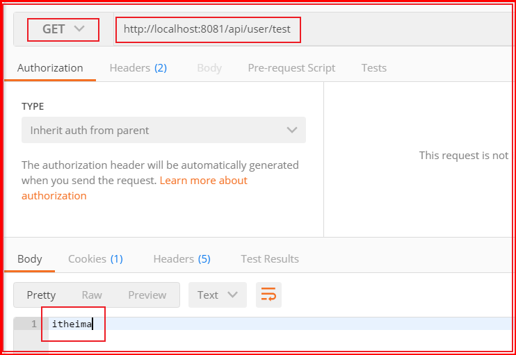

至此，工程基础环境搭建完毕！

###        5.3 快速构建mybatis业务开发环境

#### 【1】mybatis逆向工程使用

我们可借助mybatisX工具生成基础代码，步骤如下：

第一步：通过idea自带的database组件连接数据库：

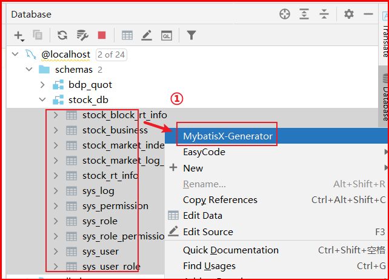

第二步：配置pojo实体类选项

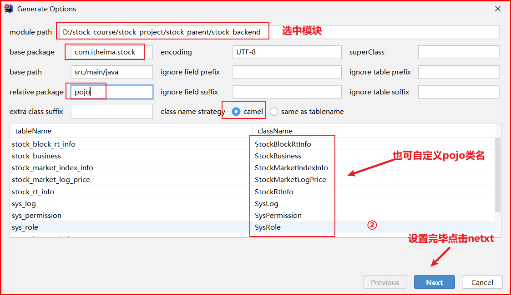

第三步：配置mapper接口和xml选项：

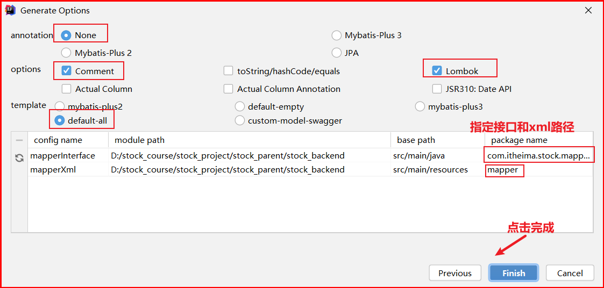

注意：也可直接导入day01\资料\mybatis逆向资料包下的代码；

#### 【2】集成mybatis的工程结构

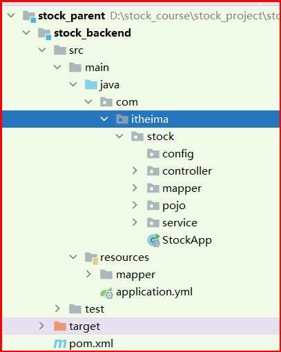

#### 【3】环境整体测试

~~~tex
目的：我们通过一个简单的web接口访问数据库，验证工程搭建情况
接口功能说明:查询所有上市公司主营业务数据
接口url:/api/quot/stock/business/all
~~~

##### 【3.1】定义mapper接口方法

​	   StockBusinessMapper接口和xml定义查询所有股票业务信息的接口方法：

~~~java
    List<StockBusiness> getAll();
~~~

~~~xml
    <select id="getAll" resultMap="BaseResultMap">
        select
        <include refid="Base_Column_List" />
        from stock_business
    </select>
~~~

##### 【3.2】定义服务接口及实现

​	定义服务接口：

~~~java
/**
 * @author by itheima
 * @Date 2021/12/19
 * @Description 定义股票服务接口
 */
public interface StockService {
    /**
     * 获取所有股票信息
     * @return
     */
    List<StockBusiness> getAllStockBusiness();
}    
~~~

​	  定义服务接口实现：

~~~java
/**
 * @author by itheima
 * @Date 2021/12/19
 * @Description
 */
@Service("stockService")
public class StockServiceImpl implements StockService {

    @Autowired
    private StockBusinessMapper stockBusinessMapper;

    @Override
    public List<StockBusiness> getAllStockBusiness() {
        return stockBusinessMapper.getAll();
    }
}    
~~~

##### 		【3.3】定义web访问接口

~~~java
/**
 * @author by itheima
 * @Date 2021/12/19
 * @Description
 */
@RestController
@RequestMapping("/api/quot")
@CrossOrigin
public class StockController {

    @Autowired
    private StockService stockService;

    @GetMapping("/stock/business/all")
    public List<StockBusiness> getAllBusiness(){
        return stockService.getAllStockBusiness();
    }
}    
~~~

##### 【3.4】启动项目测试

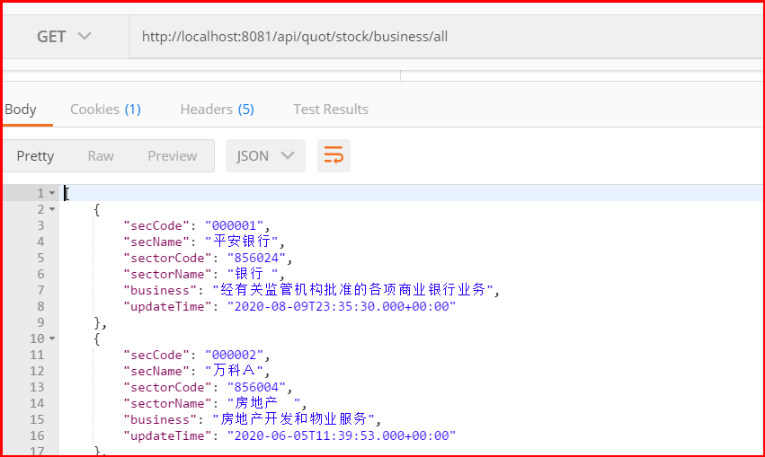

至此，后台基本开发环境构建完毕！

## 6.前端开发环境搭建

### 6.1 前端环境准备

#### 【1】node安装

前端node版本：

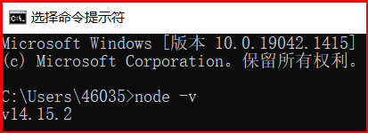

详见资料：

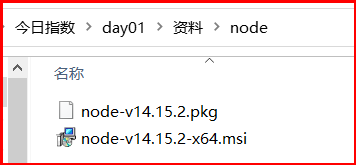

说明：我们在前面的课程中，已有安装，注意即可。

#### 【1】vs导入前端代码

资料：day01\资料\前端资料\stock_front_admin

使用vscode打开工程：

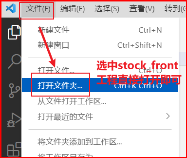

效果如下：

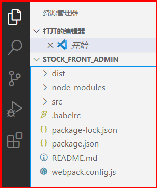

#### 【2】前端工程启动

~~~shell
npm run dev
~~~

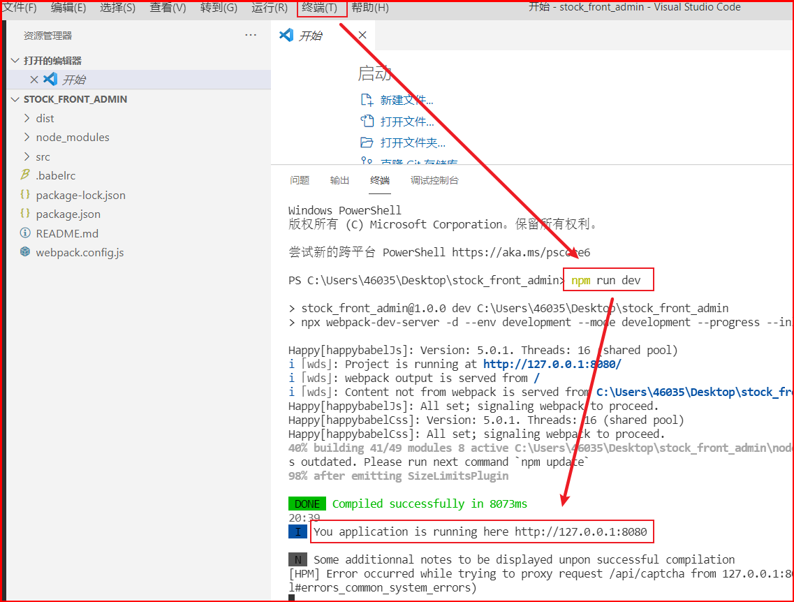

注意事项：如果启动报错，重新npm install 或者cnpm install

#### 【3】页面效果


### 6.2 前后端分离跨域问题

在前面的知识中，我们已经了解到项目进行前后端分离后，存在跨域问题，只需在前端进行简单配置，即可解决该问题；

#### 【1】前后端跨域配置

在stock_front_admin\src\settings.js文件下配置跨域：

~~~json
    devServer: {
        port: 8080,
        host: '127.0.0.1',// 开发host
        open:true,// 是否启动时打开浏览器
        disableHostCheck: true, // 映射外网时，需要设置为true
        /**
         * 域名，他将会基于 window.location来链接服务器，需要使用public配置
         * dev-server被代理到nginx中配置的 itheima.com
         */
        public: "127.0.0.1:8080",//itheima.com
        publicPath:'/',
        compress:true,
        overlay: {// 是否在浏览器全屏显示错误与警告
            warnings: false,
            errors:true
        },
        proxy: {// 跨域请求配置
            "/api": {
                secure: false,// 关闭安全检测，默认请求 https
                //target: "http://192.168.188.131:8081",
                target: "http://localhost:8081",
                changeOrigin: true,
                // pathRewrite: {"^/api" : ""},
            }
        },
    },
~~~

#### 【2】前后端交互数据格式

​     前端与后端使用json格式进行交互。

## 7.登录功能实现

### 7.1 需求分析

#### 1）页面原型效果


#### 2）相关的表结构

sys_user表如下：

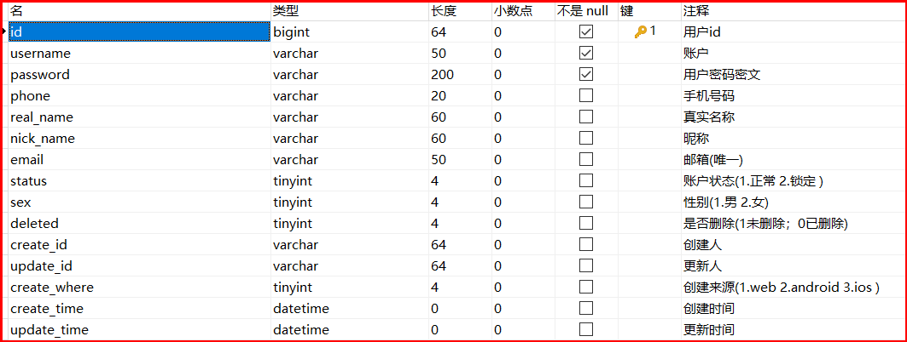

#### 3）访问接口定义

~~~json
请求接口：/api/login
请求方式：POST
请求数据示例：
	{
       username:'zhangsan',//用户名
       password:'666',//密码
       code:'1234' //校验码
    }
响应数据：
    {
        "code": 1,//成功1 失败0
        "data": {
        "id":"1237365636208922624",
        "username":"zhangsan",
        "nickName":"xiaozhang",
        "phone":"1886702304"
        }
    }
~~~

#### 4)封装请求和响应vo

请求vo封装：

~~~java
package com.itheima.stock.vo.req;

import lombok.Data;

/**
 * @author by itheima
 * @Date 2021/12/30
 * @Description 登录请求vo
 */
@Data
public class LoginReqVo {
    /**
     * 用户名
     */
    private String username;
    /**
     * 密码
     */
    private String password;
    /**
     * 验证码
     */
    private String code;
}
~~~

响应vo：

~~~java
package com.itheima.stock.vo.resp;

import lombok.AllArgsConstructor;
import lombok.Builder;
import lombok.Data;
import lombok.NoArgsConstructor;

/**
 * @author by itheima
 * @Date 2021/12/24
 * @Description 登录后响应前端的vo
 */
@Data
@NoArgsConstructor
@AllArgsConstructor
@Builder
public class LoginRespVo {
    /**
     * 用户ID
     */
    private String id;
    /**
     * 电话
     */
    private String phone;
    /**
     * 用户名
     */
    private String username;
    /**
     * 昵称
     */
    private String nickName;

}
~~~

定义公共响应vo：

~~~java
package com.itheima.stock.vo.resp;

import com.fasterxml.jackson.annotation.JsonInclude;

import java.io.Serializable;

/**
 * 返回数据类
 * @param <T>
 */
//保证序列化json的时候,如果是null的对象,key也会消失
@JsonInclude(JsonInclude.Include.NON_NULL)
public class R<T> implements Serializable {
    private static final long serialVersionUID = 7735505903525411467L;

    // 成功值
    private static final int SUCCESS_CODE = 1;
    // 失败值
    private static final int ERROR_CODE = 0;

    //状态码
    private int code;
    //消息
    private String msg;
    //返回数据
    private T data;

    private R(int code){
        this.code = code;
    }
    private R(int code, T data){
        this.code = code;
        this.data = data;
    }
    private R(int code, String msg){
        this.code = code;
        this.msg = msg;
    }
    private R(int code, String msg, T data){
        this.code = code;
        this.msg = msg;
        this.data = data;
    }

    public static <T> R<T> ok(){
        return new R<T>(SUCCESS_CODE,"success");
    }
    public static <T> R<T> ok(String msg){
        return new R<T>(SUCCESS_CODE,msg);
    }
    public static <T> R<T> ok(T data){
        return new R<T>(SUCCESS_CODE,data);
    }
    public static <T> R<T> ok(String msg, T data){
        return new R<T>(SUCCESS_CODE,msg,data);
    }

    public static <T> R<T> error(){
        return new R<T>(ERROR_CODE,"error");
    }
    public static <T> R<T> error(String msg){
        return new R<T>(ERROR_CODE,msg);
    }
    public static <T> R<T> error(int code, String msg){
        return new R<T>(code,msg);
    }

    public int getCode(){
        return code;
    }
    public String getMsg(){
        return msg;
    }
    public T getData(){
        return data;
    }
}
~~~

  定义响应状态枚举：

~~~java
package com.itheima.stock.common.enums;

/**
 * @author by itheima
 * @Date 2021/12/21
 * @Description
 */
public enum ResponseCode{
    ERROR(0,"操作失败"),
    SUCCESS(1,"操作成功"),
    DATA_ERROR(0,"参数异常"),
    NO_RESPONSE_DATA(0,"无响应数据"),
    SYSTEM_VERIFY_CODE_NOT_EMPTY(0,"验证码不能为空"),
    SYSTEM_VERIFY_CODE_ERROR(0,"验证码错误"),
    SYSTEM_USERNAME_NOT_EMPTY(0,"账号不能为空"),
    SYSTEM_USERNAME_NOT_EXISTS(0,"账号不存在"),
    SYSTEM_USERNAME_EXPIRED(0,"账户过期"),
    SYSTEM_USERNAME_LOCKED(0,"账户被锁"),
    SYSTEM_USERNAME_DISABLED(0,"账户被禁用"),
    SYSTEM_PASSWORD_ERROR(0,"账号或密码错误"),
    SYSTEM_PASSWORD_EXPIRED(0,"密码过期"),
    SYSTEM_USERNAME_OFFLINE(0,"已下线，请重新登录"),
    SYSTEM_ERROR(0,"系统异常请稍后再试"),
    ACCOUNT_EXISTS_ERROR(0,"该账号已存在"),
    TOKEN_ERROR(2,"用户未登录，请先登录"),
    NOT_PERMISSION(3,"没有权限访问该资源"),
    TOKEN_NOT_NULL(-1,"token 不能为空"),
    TOKEN_NO_AVAIL(-1,"token无效或过期"),
    TOKEN_PAST_DUE(-1,"登录失效,请重新登录"),
    TOKEN_EXISTS(-1,"账号异地登录，你已被迫退出"),
    OPERATION_MENU_PERMISSION_CATALOG_ERROR(0,"操作后的菜单类型是目录，所属菜单必须为默认顶级菜单或者目录"),
    OPERATION_MENU_PERMISSION_MENU_ERROR(0,"操作后的菜单类型是菜单，所属菜单必须为目录类型"),
    OPERATION_MENU_PERMISSION_BTN_ERROR(0,"操作后的菜单类型是按钮，所属菜单必须为菜单类型"),
    OPERATION_MENU_PERMISSION_URL_NOT_NULL(0,"菜单权限的url不能为空"),
    OPERATION_MENU_PERMISSION_URL_PERMS_NULL(0,"菜单权限的标识符不能为空"),
    OPERATION_MENU_PERMISSION_URL_METHOD_NULL(0,"菜单权限的请求方式不能为空"),
    OPERATION_MENU_PERMISSION_URL_CODE_NULL(0,"菜单权限的按钮标识不能为空"),
    OPERATION_MENU_PERMISSION_UPDATE(0,"操作的菜单权限存在子集关联不允许变更"),
    ROLE_PERMISSION_RELATION(0, "该菜单权限存在子集关联，不允许删除"),
    OLD_PASSWORD_ERROR(0,"旧密码不匹配");
    private int code;
    private String message;

    ResponseCode(int code, String message) {
        this.code = code;
        this.message = message;
    }

    public int getCode() {
        return 0;
    }

    public String getMessage() {
        return null;
    }
}
~~~

说明：上述的vo对象直接在：**今日指数\day01\资料\vo导入即可**；

### 7.2 登录功能开发实现

#### 1）stock_backend导入依赖资源

~~~xml
<!--apache工具包-->
<dependency>
    <groupId>org.apache.commons</groupId>
    <artifactId>commons-lang3</artifactId>
</dependency>
<!--密码加密和校验工具包-->
<dependency>
    <groupId>org.springframework.security</groupId>
    <artifactId>spring-security-crypto</artifactId>
</dependency>
<!--工具包-->
<dependency>
    <groupId>com.google.guava</groupId>
    <artifactId>guava</artifactId>
</dependency>
~~~

#### 2)配置密码加密服务

~~~java
package com.itheima.stock.config;

import org.springframework.context.annotation.Bean;
import org.springframework.context.annotation.Configuration;
import org.springframework.security.crypto.bcrypt.BCryptPasswordEncoder;
import org.springframework.security.crypto.password.PasswordEncoder;

/**
 * @author by itheima
 * @Date 2021/12/30
 * @Description 定义公共配置类
 */
@Configuration
public class CommonConfig {
    /**
     * 密码加密器
     * BCryptPasswordEncoder方法采用SHA-256对密码进行加密
     * @return
     */
    @Bean
    public PasswordEncoder passwordEncoder(){
        return new BCryptPasswordEncoder();
    }
}
~~~

密码加密测试：

~~~java
@SpringBootTest
public class TestAll {
    @Autowired
    private PasswordEncoder passwordEncoder;
        @Test
    public void testPwd(){
        String pwd="1234";
        //加密  $2a$10$WAWV.QEykot8sHQi6FqqDOAnevkluOZJqZJ5YPxSnVVWqvuhx88Ha
        String encode = passwordEncoder.encode(pwd);
        System.out.println(encode);
        /*
            matches()匹配明文密码和加密后密码是否匹配，如果匹配，返回true，否则false
            just test
         */
        boolean flag = passwordEncoder.matches(pwd, 				          "$2a$10$WAWV.QEykot8sHQi6FqqDOAnevkluOZJqZJ5YPxSnVVWqvuhx88Ha");
        System.out.println(flag);
    }
}    
~~~

#### 3)登录接口方法定义

~~~java
package com.itheima.stock.controller;

import com.itheima.stock.service.UserService;
import com.itheima.stock.vo.req.LoginReqVo;
import com.itheima.stock.vo.resp.LoginRespVo;
import com.itheima.stock.vo.resp.R;
import org.springframework.beans.factory.annotation.Autowired;
import org.springframework.web.bind.annotation.*;

/**
 * @author by itheima
 * @Date 2021/12/29
 * @Description 定义用户访问层
 */
@RestController
@RequestMapping("/api")
@CrossOrigin
public class UserController {

    @Autowired
    private UserService userService;

    /**
     * 用户登录功能实现
     * @param vo
     * @return
     */
    @PostMapping("/login")
    public R<LoginRespVo> login(@RequestBody LoginReqVo vo){
        R<LoginRespVo> r= this.userService.login(vo);
        return r;
    }

//    @GetMapping("/test")
//    public String getName(){
//        return "itheima";
//    }
}
~~~

#### 4）定义登录服务接口和实现

服务接口：

~~~java
package com.itheima.stock.service;

import com.itheima.stock.vo.req.LoginReqVo;
import com.itheima.stock.vo.resp.LoginRespVo;
import com.itheima.stock.vo.resp.R;

/**
 * @author by itheima
 * @Date 2021/12/30
 * @Description 用户服务
 */
public interface UserService {
    /**
     * 用户登录功能实现
     * @param vo
     * @return
     */
    R<LoginRespVo> login(LoginReqVo vo);
}
~~~

接口服务实现：

~~~java
package com.itheima.stock.service.impl;

import com.google.common.base.Strings;
import com.itheima.stock.common.enums.ResponseCode;
import com.itheima.stock.mapper.SysUserMapper;
import com.itheima.stock.pojo.SysUser;
import com.itheima.stock.service.UserService;
import com.itheima.stock.vo.req.LoginReqVo;
import com.itheima.stock.vo.resp.LoginRespVo;
import com.itheima.stock.vo.resp.R;
import org.springframework.beans.BeanUtils;
import org.springframework.beans.factory.annotation.Autowired;
import org.springframework.security.crypto.password.PasswordEncoder;
import org.springframework.stereotype.Service;

/**
 * @author by itheima
 * @Date 2021/12/30
 * @Description 定义服务接口实现
 */
@Service("userService")
public class UserServiceImpl implements UserService {

    @Autowired
    private SysUserMapper sysUserMapper;

    @Autowired
    private PasswordEncoder passwordEncoder;

    @Override
    public R<LoginRespVo> login(LoginReqVo vo) {
        if (vo==null || Strings.isNullOrEmpty(vo.getUsername()) || Strings.isNullOrEmpty(vo.getPassword())){
            return R.error(ResponseCode.DATA_ERROR.getMessage());
        }
        //根据用户名查询用户信息
        SysUser user=this.sysUserMapper.findByUserName(vo.getUsername());
        //判断用户是否存在，存在则密码校验比对
        if (user==null || !passwordEncoder.matches(vo.getPassword(),user.getPassword())){
            return R.error(ResponseCode.SYSTEM_PASSWORD_ERROR.getMessage());
        }
        //组装登录成功数据
        LoginRespVo respVo = new LoginRespVo();
        //属性名称与类型必须相同，否则copy不到
        BeanUtils.copyProperties(user,respVo);
        return  R.ok(respVo);
    }
}
~~~

#### 5)定义mapper方法

在SysUserMapper下定义接口方法：

~~~java
    /**
     * 根据用户名查询用户信息
     * @param username
     * @return
     */
    SysUser findByUserName(@Param("username") String username);
~~~

绑定xml：

~~~xml
    <select id="findByUserName" resultMap="BaseResultMap">
        select <include refid="Base_Column_List"/> from sys_user where
        username=#{username}
    </select>
~~~

#### 6)Postman测试

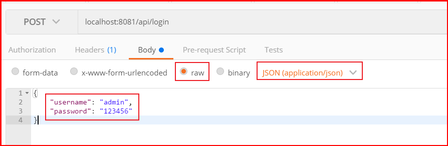

