# 今日指数-day02

## 今日目标

~~~tex
1. 完善基于前后端分用户验证码登录功能;
2. 理解验证码生成流程,并使用postman测试;
3. 理解并实现国内大盘数据展示功能;
4. 理解并实现国内板块数据展示功能;
5. 理解后端接口调试和前后端联调的概念;
~~~

## 1.验证码登录功能

### 1.1 验证码功能分析

#### 1）前后端分离架构的session问题

单体架构session实现验证码流程：

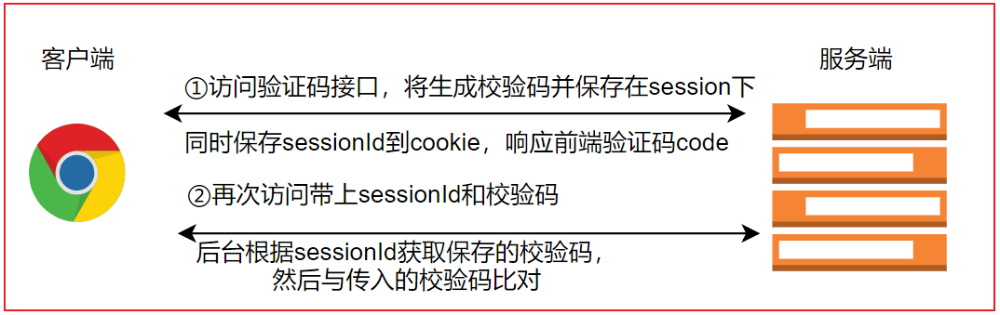

当前我们的项目采用前后端分离的技术架构，因为前后端请求存在跨域问题，会导致请求无法携带和服务器对应的cookie,导致session失效，且后续服务端也会做集群方案部署，整体来看使用session方案带来的扩展和维护成本是比较高的！

#### 2）验证码逻辑分析

我们可使用分布式缓存redis模拟session机制，实现验证码的生成和校验功能，核心流程如下：

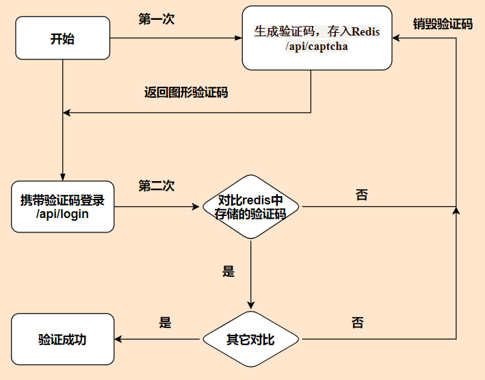

思考：存储redis中验证码的key又是什么呢？

​	    模拟sessionId ,我们可以借助工具类生成全局唯一ID；

#### 3）验证码生成接口说明

~~~json
请求路径：/api/captcha
请求参数：无
响应数据格式：
    {
        "code": 1,
        "data": {
            "code": "5411", //响应的验证码
            "rkey": "1479063316897845248" //保存在redis中验证码对应的key，模拟sessioinId
        }
    }
~~~

### 1.2.redis环境集成

​	前后端分离后，后台session无法共享使用，所以我们可以把验证码数据存入redis中，所以接下来，backend项目中先引	入redis的依赖：

~~~xml
<!--redis场景依赖-->
<dependency>
    <groupId>org.springframework.boot</groupId>
    <artifactId>spring-boot-starter-data-redis</artifactId>
</dependency>
<!-- redis创建连接池，默认不会创建连接池 -->
<dependency>
    <groupId>org.apache.commons</groupId>
    <artifactId>commons-pool2</artifactId>
</dependency>
<!--apache工具包，提供验证随机码工具类-->
<dependency>
    <groupId>org.apache.commons</groupId>
    <artifactId>commons-lang3</artifactId>
</dependency>
~~~

​	yml配置redis：

~~~yml
spring:
  # 配置缓存
  redis:
    host: 192.168.188.130
    port: 6379
    database: 0 #Redis数据库索引（默认为0）
    lettuce:
      pool:
        max-active: 8 # 连接池最大连接数（使用负值表示没有限制）
        max-wait: -1ms # 连接池最大阻塞等待时间（使用负值表示没有限制）
        max-idle: 8 # 连接池中的最大空闲连接
        min-idle: 1  # 连接池中的最小空闲连接
    timeout: PT10S # 连接超时时间（毫秒）
~~~

​	测试redis基础环境：

~~~java
package com.itheima.stock;

import org.junit.jupiter.api.Test;
import org.springframework.beans.factory.annotation.Autowired;
import org.springframework.boot.test.context.SpringBootTest;
import org.springframework.data.redis.core.RedisTemplate;

/**
 * @author by itheima
 * @Date 2021/12/30
 * @Description
 */
@SpringBootTest
public class TestRedis {

    @Autowired
    private RedisTemplate<String,String> redisTemplate;

    @Test
    public void test01(){
        //存入值
        redisTemplate.opsForValue().set("myname","zhangsan");
        //获取值
        String myname = redisTemplate.opsForValue().get("myname");
        System.out.println(myname);
    }   
}
~~~

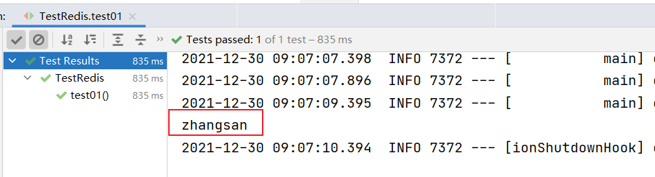

### 1.3 验证码功能实现

#### 1)配置id生成器

导入id生成器工具类：

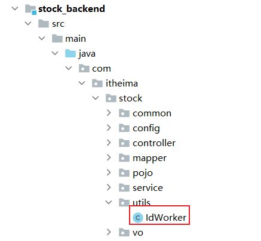

详见：**day02\资料\id工具类**

配置工具bean：

~~~java
package com.itheima.stock.config;

import com.itheima.stock.utils.IdWorker;
import org.springframework.context.annotation.Bean;
import org.springframework.context.annotation.Configuration;
import org.springframework.security.crypto.bcrypt.BCryptPasswordEncoder;
import org.springframework.security.crypto.password.PasswordEncoder;

/**
 * @author by itheima
 * @Date 2021/12/30
 * @Description 定义公共配置类
 */
@Configuration
public class CommonConfig {
    
    /**
     * 配置id生成器bean
     * @return
     */
    @Bean
    public IdWorker idWorker(){
        return new IdWorker();
    }

    /**
     * 密码加密器
     * BCryptPasswordEncoder方法采用SHA-256对密码进行加密
     * @return
     */
    @Bean
    public PasswordEncoder passwordEncoder(){
        return new BCryptPasswordEncoder();
    }
}
~~~

#### 2)定义web接口

​		在UserController接口定义访问方法：

~~~java
	/**
     * 生成验证码
     *  map结构：
     *      code： xxx,
     *      rkey: xxx
     * @return
     */
    @GetMapping("/captcha")
    public R<Map> generateCaptcha(){
        return this.userService.generateCaptcha();
    }
~~~

#### 3)定义生成验证码服务

在UserService服务接口：

~~~java
    /**
     * 生成验证码
     *  map结构：
     *      code： xxx,
     *      rkey: xxx
     * @return
     */
    R<Map> generateCaptcha();
~~~

方法实现：

~~~java
  
    @Autowired
    private RedisTemplate redisTemplate;
	/**
     * 分布式环境保证生成id唯一
     */
    @Autowired
    private IdWorker idWorker;  

	/**
     * 生成验证码
     *  map结构：
     *      code： xxx,
     *      rkey: xxx
     * @return
     */
    @Override
    public R<Map> generateCaptcha() {
        //1.生成4位数字验证码
        String checkCode = RandomStringUtils.randomNumeric(4);
        //2.获取全局唯一id
        String rkey=String.valueOf(idWorker.nextId());
        //验证码存入redis中，并设置有效期1分钟
        redisTemplate.opsForValue().set(rkey,checkCode,60, TimeUnit.SECONDS);
        //3.组装数据
        HashMap<String, String> map = new HashMap<>();
        map.put("rkey",rkey);
        map.put("code",checkCode);
        return R.ok(map);
    }
~~~

#### 4)访问测试

postman:http://127.0.0.1:8080/api/captcha

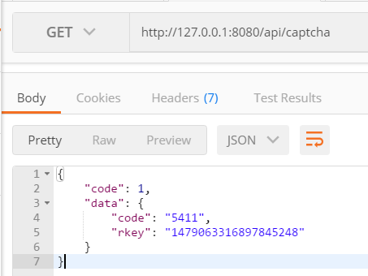

页面效果：

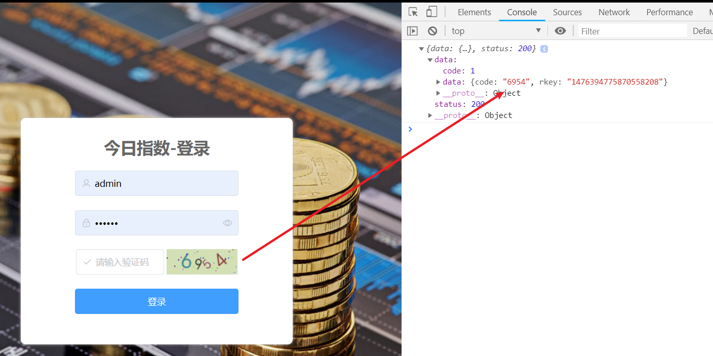

### 1.4 完善验证码登录功能

#### 1）完善登录请求VO

LoginReqVo添加rkey属性：

~~~java
package com.itheima.stock.vo.req;

import lombok.Data;

/**
 * @author by itheima
 * @Date 2021/12/30
 * @Description 登录请求vo
 */
@Data
public class LoginReqVo {
	//.....

    /**
     * 保存redis随机码的key
     */
    private String rkey;
}

~~~

#### 2)完善登录验证码逻辑

添加校验码校验功能：

~~~java
    /**
     * 用户登录服务实现
     * @param vo
     * @return
     */
    @Override
    public R<LoginRespVo> login(LoginReqVo vo) {
        if (vo==null || Strings.isNullOrEmpty(vo.getUsername())
                || Strings.isNullOrEmpty(vo.getPassword()) || Strings.isNullOrEmpty(vo.getRkey())){
            return R.error(ResponseCode.DATA_ERROR.getMessage());
        }
        //验证码校验
        //获取redis中rkey对应的code验证码
        String rCode = (String) redisTemplate.opsForValue().get(vo.getRkey());

        //校验
        if (Strings.isNullOrEmpty(rCode) || !rCode.equals(vo.getCode())) {
            return R.error(ResponseCode.DATA_ERROR.getMessage());
        }
        //redis清除key
        redisTemplate.delete(vo.getRkey());
        //根据用户名查询用户信息
        SysUser user=this.sysUserMapper.findByUserName(vo.getUsername());
        //判断用户是否存在，存在则密码校验比对
        if (user==null || !passwordEncoder.matches(vo.getPassword(),user.getPassword())){
            return R.error(ResponseCode.SYSTEM_PASSWORD_ERROR.getMessage());
        }
        //组装登录成功数据
        LoginRespVo respVo = new LoginRespVo();
        BeanUtils.copyProperties(user,respVo);
        return  R.ok(respVo);
    }
~~~

#### 3)登录测试联调

页面登录效果：

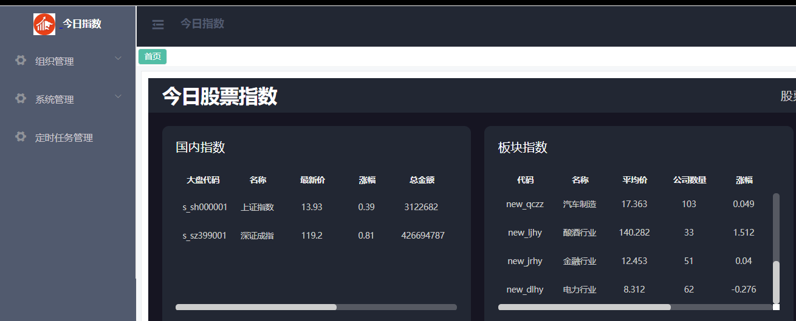

## 2.国内大盘指数功能

### 2.1国内大盘指数业务分析

#### 1）页面原型效果

大盘展示需要的字段：

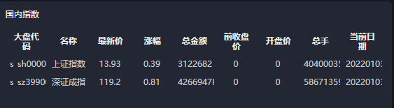

国内大盘数据包含：

~~~tex
大盘代码、名称、前收盘价、开盘价、最新价、涨幅、总金额、总手、当前日期
~~~

#### 2）相关表结构分析

大盘指数包含国内和国外的大盘数据，目前我们先完成国内大盘信数据的展示功能；

股票大盘数据详情表（stock_market_index_info）设计如下：

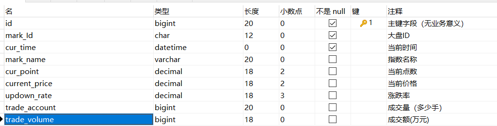

相关的开盘与收盘流水表（stock_market_log_price）设计如下：

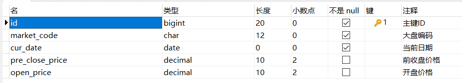

开盘和收盘流水表与股票大盘数据详情表通过market_code进行业务关联，同时一个大盘每天只产生一条开盘与收盘流水数据，该数据，后期通过定时任务统计获取；

显然后去上述数据，需要大盘表和价格流水表的联合查询；

#### 3）国内大盘数据注意事项

~~~tex
1.如果当前时间没有最新的大盘数据，则显示最近有效的大盘数据信息;
  比如：今天是周1上午九点，则显示上周五收盘时的大盘数据信息;☹☹☹
2.当前大盘的数据采集频率为一分钟一次;
~~~

工程直接导入日期工具类：**今日指数\day02\资料\date工具类\DateTimeUtil.java**

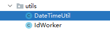

jode和工具类使用参考：**day02\资料\date工具类\TestJodeDate.java**

#### 4)国内大盘指数接口说明

~~~tex
请求路径：/api/quot/index/all
请求方式：GET
参数：无
~~~

​    响应数据格式：

~~~json
{
    "code": 1,
    "data": [
        {
            "tradeAmt": 235158296,//交易量
            "preClosePrice": 78.9,//前收盘价格
            "code": "s_sz399001",//大盘编码
            "name": "深证成指",//大盘名称
            "curDate": "202112261056",// 当前日期
            "openPrice": 79.2,//开盘价
            "tradeVol": 32434490,//交易金额
            "upDown": -0.89,//涨幅
            "tradePrice": -131.52//当前价格
        },
        {
            "tradeAmt": 1627113,
            "code": "s_sh000001",
            "name": "上证指数",
            "curDate": "202112261056",
            "tradeVol": 21549808,
            "upDown": -0.56,
            "tradePrice": -20.26
        }
    ]
}
~~~

#### 5）DO封装

~~~java
package com.itheima.stock.common.domain;

import lombok.Data;

import java.math.BigDecimal;

/**
 * @author by itheima
 * @Date 2022/1/9
 * @Description 定义封装多内大盘数据的实体类
 */
@Data
public class InnerMarketDomain {
    /*
      jdbc:bigint--->java:long
     */
    private Long tradeAmt;
    /*
        jdbc:decimal --->java:BigDecimal
     */
    private BigDecimal preClosePrice;
    private String code;
    private String name;
    private String curDate;
    private BigDecimal openPrice;
    private Long tradeVol;
    private BigDecimal upDown;
    private BigDecimal tradePrice;
}
~~~

注意：直接导入**day02\资料\domain\InnerMarketDomain.java**

### 2.2 国内大盘指数功能实现

#### 1）常量数据封装

将大盘或外盘的常量数据配置在yml下：

~~~yml
# 配置股票相关的参数
stock:
  inner: # A股
    - s_sh000001 # 上证ID
    - s_sz399001 #  深证ID
  outer: # 外盘
    - int_dji # 道琼斯
    - int_nasdaq # 纳斯达克
    - int_hangseng # 恒生
    - int_nikkei # 日经指数
    - b_TWSE # 台湾加权
    - b_FSSTI # 新加坡
~~~

实体类封装：

~~~java
package com.itheima.stock.common.domain;

import lombok.Data;
import org.springframework.boot.context.properties.ConfigurationProperties;

import java.util.List;

/**
 * @author by itheima
 * @Date 2021/12/30
 * @Description
 */
@ConfigurationProperties(prefix = "stock")
@Data
public class StockInfoConfig {
    //a股大盘ID集合
    private List<String> inner;
    //外盘ID集合
    private List<String> outer;
}
~~~

在main启动类上开启实体类配置：

~~~java
@SpringBootApplication
@MapperScan("com.itheima.stock.mapper")
@EnableConfigurationProperties(StockInfoConfig.class)
public class StockApp {
    public static void main(String[] args) {
        SpringApplication.run(StockApp.class,args);
    }
}
~~~

#### 2)定义国内大盘web接口

~~~java
package com.itheima.stock.controller;

import com.itheima.stock.pojo.StockBusiness;
import com.itheima.stock.service.StockService;
import com.itheima.stock.vo.resp.R;
import org.springframework.beans.factory.annotation.Autowired;
import org.springframework.web.bind.annotation.GetMapping;
import org.springframework.web.bind.annotation.RequestMapping;
import org.springframework.web.bind.annotation.RestController;

import java.util.List;
import java.util.Map;

/**
 * @author by itheima
 * @Date 2021/12/19
 * @Description
 */
@RestController
@RequestMapping("/api/quot")
public class StockController {

    @Autowired
    private StockService stockService;

	//其它省略.....
    /**
     * 获取国内最新大盘指数
     * @return
     */
    @GetMapping("/index/all")
    public R<List<InnerMarketDomain>> innerIndexAll(){
        return stockService.innerIndexAll();
    }
}
~~~

#### 3)定义国内大盘数据服务

服务接口：

~~~java
package com.itheima.stock.service;
import com.itheima.stock.pojo.StockBusiness;
import com.itheima.stock.vo.resp.R;

import java.util.List;
import java.util.Map;

/**
 * @author by itheima
 * @Date 2021/12/19
 * @Description 定义股票服务接口
 */
public interface StockService {
	//其它省略......
    /**
     * 获取国内大盘的实时数据
     * @return
     */
    R<List<InnerMarketDomain>> innerIndexAll();

}
~~~

服务接口实现：

~~~java
package com.itheima.stock.service.impl;

import com.itheima.stock.common.domain.StockInfoConfig;
import com.itheima.stock.mapper.StockBusinessMapper;
import com.itheima.stock.mapper.StockMarketIndexInfoMapper;
import com.itheima.stock.pojo.StockBusiness;
import com.itheima.stock.service.StockService;
import com.itheima.stock.vo.resp.R;
import org.springframework.beans.factory.annotation.Autowired;
import org.springframework.stereotype.Service;
import org.springframework.util.CollectionUtils;

import java.util.List;
import java.util.Map;

/**
 * @author by itheima
 * @Date 2021/12/19
 * @Description
 */
@Service("stockService")
public class StockServiceImpl implements StockService {

    @Autowired
    private StockBusinessMapper stockBusinessMapper;

    @Autowired
    private StockMarketIndexInfoMapper stockMarketIndexInfoMapper;

    @Autowired
    private StockInfoConfig stockInfoConfig;

    @Override
    public List<StockBusiness> getAllStockBusiness() {
        return stockBusinessMapper.findAll();
    }

    /**
     * 获取国内大盘的实时数据
     * @return
     */
    @Override
    public R<List<InnerMarketDomain>> innerIndexAll() {
        //1.获取国内大盘的id集合
        List<String> innerIds = stockInfoConfig.getInner();
        //2.获取最近最新的股票有效交易日
        Date lDate = DateTimeUtil.getLastDate4Stock(DateTime.now()).toDate();
        //mock数据
        String mockDate="20211226105600";//TODO后续大盘数据实时拉去，将该行注释掉 传入的日期秒必须为0
        lDate = DateTime.parse(mockDate, DateTimeFormat.forPattern("yyyyMMddHHmmss")).toDate();
        //3.调用mapper查询指定日期下对应的国内大盘数据
        List<InnerMarketDomain> maps=stockMarketIndexInfoMapper.selectByIdsAndDate(innerIds,lDate);
        //组装响应的额数据
        if (CollectionUtils.isEmpty(maps)) {
            return R.error(ResponseCode.NO_RESPONSE_DATA.getMessage());
        }
        return R.ok(maps);
    }
}
~~~

#### 4）定义mapper接口方法和xml

mapper下定义接口方法和xml：

~~~java
    /**
     * 根据注定的id集合和日期查询大盘数据
     * @param ids 大盘id集合
     * @param lastDate 对应日期
     * @return
     */
     List<InnerMarketDomain> selectByIdsAndDate(@Param("ids") List<String> ids, @Param("lastDate") Date lastDate);
~~~

XML绑定SQL分析：

SQL分析思路：

~~~sql
从设计角度看，大盘价格流水表和大盘实时流水表没有必然的练习，对于价格流水表仅仅记录当天的开盘价和前一个交易日的收盘价，也就是一个交易日仅产生一条数据，而大盘的实时流水则会产生N条数据，所以我们采取先查询大盘实时流水主表信息(将数据压扁)，然后再关联价格日流水表进行查询。
# 步骤1：先查询指定时间点下大盘主表对应的数据
select * from stock_market_index_info as smi 
where smi.mark_Id in ('s_sh000001','s_sz399001') and	 
 smi.cur_time='20211226105600';
#步骤2：将步骤1的结果作为一张表与log_price流水表左外连接查询，获取开盘和前收盘价格 
# 为什么左外？因为内连接只查询都存在的数据：
select tmp.trade_account as tradeAmt,tmp.mark_Id as code,tmp.mark_name as name,
date_format(tmp.cur_time,'%Y%m%d%H%i') as curDate,tmp.trade_volume as tradeVol,
tmp.updown_rate as upDown,tmp.current_price as tradePrice,sml.open_price as openPrice,
sml.pre_close_price preClosePrice
  from 
(
select * from stock_market_index_info as smi 
where smi.mark_Id in ('s_sh000001','s_sz399001') and	 
 smi.cur_time='20211226105600'
) as tmp left join stock_market_log_price as sml on 
sml.market_code=tmp.mark_id and 
 date_format(sml.cur_date,'%Y%m%d')=date_format(tmp.cur_time,'%Y%m%d');
~~~

定义mapper接口绑定SQL:

~~~xml
    <select id="selectByIdsAndDate" resultType="com.itheima.stock.common.domain.InnerMarketDomain">
        SELECT
        tmp.mark_Id AS code,
        tmp.mark_name AS name,
        sml.pre_close_price AS preClosePrice,
        sml.open_price AS openPrice,
        tmp.current_price AS tradePrice,
        tmp.updown_rate AS upDown,
        tmp.trade_account AS tradeAmt,
        tmp.trade_volume AS tradeVol,
        DATE_FORMAT( tmp.cur_time, '%Y%m%d') AS curDate
        FROM
        (
        SELECT	* 	FROM	stock_market_index_info AS smi
        WHERE smi.cur_time =#{lastDate}
        AND smi.mark_Id IN
        <foreach collection="ids" item="id" open="(" close=")" separator=",">
            #{id}
        </foreach>
        ) AS tmp
        LEFT JOIN stock_market_log_price AS sml ON tmp.mark_Id=sml.market_code
        AND DATE_FORMAT( sml.cur_date, '%Y%m%d' )= DATE_FORMAT(#{lastDate},'%Y%m%d' )
    </select>
~~~

#### 5)接口测试

postman:http://127.0.0.1:8080/api/quot/index/all

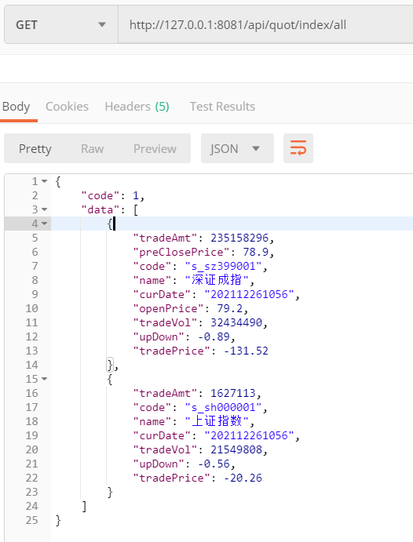

页面最终显示效果：

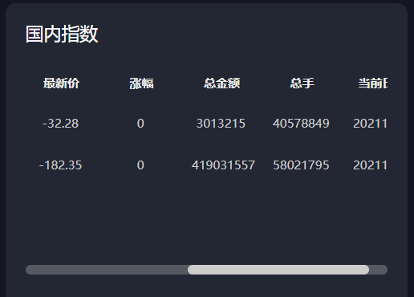

## 3.板块指数功能实现

### 3.1 国内板块指数业务分析

#### 1）功能原型效果

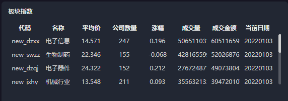

#### 2）板块表数据分析

 stock_block_rt_info板块表分析：

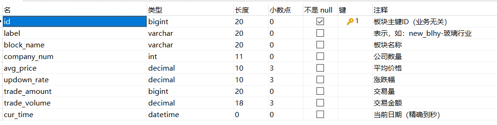

板块表涵盖了业务所需的所有字段数据。

#### 3）国内板块接口说明

~~~tex
需求说明: 沪深两市板块分时行情数据查询，以交易时间和交易总金额降序查询，取前10条数据
请求URL: /api/quot/sector/all
请求方式: GET
请求参数: 无
~~~

​	  接口响应数据格式：

~~~json
{
    "code": 1,
    "data": [
        {
            "companyNum": 247,//公司数量
            "tradeAmt": 5065110316,//交易量
            "code": "new_dzxx",//板块编码
            "avgPrice": 14.571,//平均价格
            "name": "电子信息",//板块名称
            "curDate": "20211230",//当前日期
            "tradeVol": 60511659145,//交易总金额
            "updownRate": 0.196//涨幅
        },
        {
            "companyNum": 155,
            "tradeAmt": 4281655990,
            "code": "new_swzz",
            "avgPrice": 22.346,
            "name": "生物制药",
            "curDate": "20211230",
            "tradeVol": 52026876373,
            "updownRate": -0.068
        }
    ]
}
~~~

#### 4）DO封装

~~~java
package com.itheima.stock.pojo;

import java.io.Serializable;
import java.math.BigDecimal;
import java.util.Date;

import lombok.AllArgsConstructor;
import lombok.Builder;
import lombok.Data;
import lombok.NoArgsConstructor;

/**
 * 股票板块详情信息表
 * @TableName stock_block_rt_info
 */
@Data
@AllArgsConstructor
@NoArgsConstructor
@Builder
public class StockBlockRtInfo implements Serializable {
    /**
     * 板块主键ID（业务无关）
     */
    private String id;

    /**
     * 表示，如：new_blhy-玻璃行业
     */
    private String label;

    /**
     * 板块名称
     */
    private String blockName;

    /**
     * 公司数量
     */
    private Integer companyNum;

    /**
     * 平均价格
     */
    private BigDecimal avgPrice;

    /**
     * 涨跌幅
     */
    private BigDecimal updownRate;

    /**
     * 交易量
     */
    private Long tradeAmount;

    /**
     * 交易金额
     */
    private BigDecimal tradeVolume;

    /**
     * 当前日期（精确到秒）
     */
    private Date curTime;

    private static final long serialVersionUID = 1L;
}
~~~

### 3.2 国内板块指数功能实现

#### 1）定义板块web访问接口方法

~~~java
    /**
     *需求说明: 沪深两市板块分时行情数据查询，以交易时间和交易总金额降序查询，取前10条数据
     * @return
     */
    @GetMapping("/sector/all")
    public R<List<StockBlockRtInfo>> sectorAll(){
        return stockService.sectorAllLimit();
    }
~~~

#### 2）定义服务方法和实现

服务接口方法：

~~~java
    /**
     *需求说明: 沪深两市板块分时行情数据查询，以交易时间和交易总金额降序查询，取前10条数据
     * @return
     */
    R<List<StockBlockRtInfo>> sectorAllLimit();
~~~

方法实现：

~~~java
  
	//注入mapper接口
    @Autowired
    private StockBlockRtInfoMapper stockBlockRtInfoMapper;	
    /**
     *需求说明: 沪深两市板块分时行情数据查询，以交易时间和交易总金额降序查询，取前10条数据
     * @return
     */
    @Override
    public R<List<StockBlockRtInfo>> sectorAllLimit() {
        //1.调用mapper接口获取数据 TODO 优化 避免全表查询 根据时间范围查询，提高查询效率
         List<StockBlockRtInfo> infos=stockBlockRtInfoMapper.sectorAllLimit();
        //2.组装数据
        if (CollectionUtils.isEmpty(infos)) {
            return R.error(ResponseCode.NO_RESPONSE_DATA.getMessage());
        }
        return R.ok(infos);
    }
~~~

#### 3）定义mapper方法与xml

mapper接口方法：

~~~java
    /**
     * 沪深两市板块分时行情数据查询，以交易时间和交易总金额降序查询，取前10条数据
     * @return
     */
    List<StockBlockRtInfo> sectorAllLimit();
~~~

定义mapper接口xml：

~~~xml
    <select id="sectorAllLimit" resultType="com.itheima.stock.common.domain.StockBlockDomain">
        select
            sbr.company_num  as companyNum,
            sbr.trade_amount as tradeAmt,
            sbr.label        as code,
            sbr.avg_price    as avgPrice,
            sbr.block_name   as name,
            date_format(sbr.cur_time,'%Y%m%d') as curDate,
            sbr.trade_volume as tradeVol,
            sbr.updown_rate  as updownRate
        from stock_block_rt_info as sbr
        order by sbr.cur_time desc,sbr.trade_volume desc
            limit 10
    </select>
~~~

#### 4) web接口测试

postman:http://127.0.0.1:8080/api/quot/sector/all

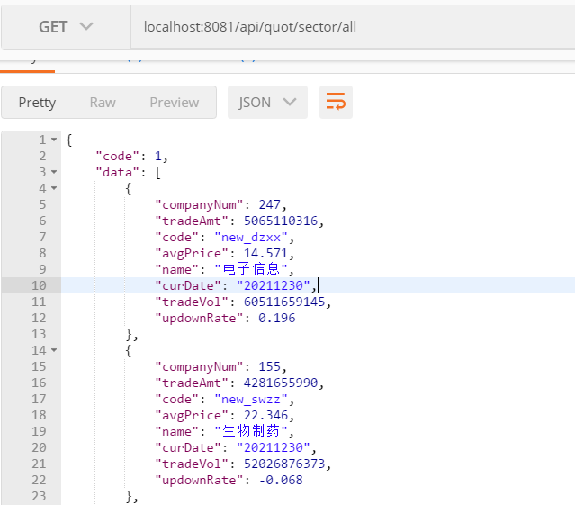

前端页面效果：

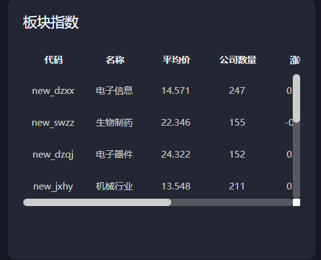

