# 今日指数-day03

## 目标

~~~tex
1. 理解涨幅榜业务需求;
2. 理解涨停跌停概念，并涨停跌停基本实现;
3. 理解涨停跌停SQL分析流程，并根据接口文档自定义实现;
4. 理解echarts基本使用;
5. 掌握easyExcel基本使用,并实现涨幅榜数据导出功能;
~~~


## 1.涨幅榜功能实现

### 1.1 股票涨幅榜功能分析

#### 1）涨幅榜原型效果


#### 2) 股票表结构分析

表：stock_rt_info流水表：

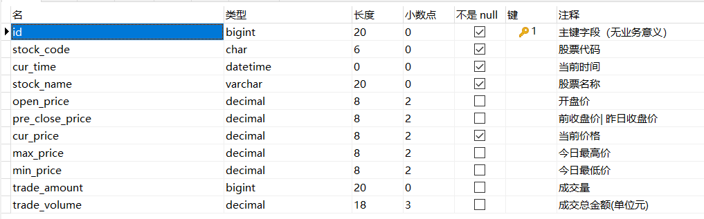

#### 3）涨幅榜功能分析

~~~tex
功能描述：统计沪深两市个股最新交易数据，并按涨幅降序排序查询前10条数据 
服务路径：/api/quot/stock/increase
服务方法：GET
请求频率：每分钟
请求参数：无
获取股票涨幅信息：股票ID 名称 前收盘价 当前价 交易量 交易金额 振幅 涨幅 涨跌 当前日期
~~~

​	响应数据格式：

~~~json
{
    "code": 1,
    "data": [
        {
            "tradeAmt": 4594802,//交易量
            "preClosePrice": 18.78,//前收盘价
            "amplitude": 0.059638,//振幅
            "code": "000004",//股票编码
            "name": "国华网安",//股票名称
            "curDate": "20211230",//当前日期
            "tradeVol": 4594802,//交易金额
            "increase": 0.039936,//涨跌
            "upDown": 0.75,//涨幅
            "tradePrice": 19.53//当前价格
        },
       //...省略....
    ]
}
~~~

#### 4）DO封装

~~~java
@Data
@NoArgsConstructor
@AllArgsConstructor
@Builder
public class StockUpdownDomain {
    /**
     * 交易量
     */
   private Long tradeAmt;
    /**
     * 前收盘价
     */
   private BigDecimal preClosePrice;
    /**
     * 振幅
     */
   private BigDecimal amplitude;
    /**
     * 股票编码
     */
   private String code;
    /**
     * 名称
     */
   private String name;
    /**
     * 日期
     */
   private String curDate;
    /**
     * 交易金额
     */
   private BigDecimal tradeVol;
    /**
     * 张涨跌
     */
   private BigDecimal increase;

    /**
     * 涨幅
     */
   private BigDecimal upDown;
    /**
     * 当前价格
     */
   private BigDecimal tradePrice;
}
~~~

#### 5）涨幅榜相关参数回顾

~~~tex
涨跌：当前价-前收盘价
涨幅：（当前价-前收盘价）/前收盘价 * 100%
振幅：（最高成交价-最低成交价）/前收盘价 * 100%
~~~

### 1.2 股票涨幅前10业务实现分析

~~~sql
# 分析：统计国内A股股票的最新数据，根据涨幅排序取前10
# 方式1：根据日期和涨幅降序排序取前10即可
select 
	sri.trade_amount as tradeAmt,
	sri.pre_close_price as preClosePrice,
	(sri.max_price- sri.min_price)/sri.pre_close_price as amplitude,
	sri.stock_code as code,
	sri.stock_name as name,
	date_format(sri.cur_time,'%Y%m%d') as curDate,
	sri.trade_volume as tradeVol,
	(sri.cur_price-sri.pre_close_price) as upDown,
	(sri.cur_price- sri.pre_close_price)/sri.pre_close_price as increase,
	sri.cur_price as tradePrice
from stock_rt_info as sri 
order by sri.cur_time desc,upDown desc
limit 10;
# 分析：方案1存在的问题：国内A股股票的最新数据等价于查询最近最新股票交易时间
# 点下的数据，同时排序时是全表排序计算的，然后排序完毕后，在筛选出前10条记录
# -----》大表全表排序，取前10---》先根据股票时间点过滤，过滤出的小结果集，然后
# 再将这个结果集排序，取10
# 方案2：【推荐】
# 核心思想：先根据业务推出过滤条件，然后根据过滤条件得到小结果集，然后再
# 将这个小的结果集进行排序运算取前10；
select 
	sri.trade_amount as tradeAmt,
	sri.pre_close_price as preClosePrice,
	(sri.max_price- sri.min_price)/sri.pre_close_price as amplitude,
	sri.stock_code as code,
	sri.stock_name as name,
	date_format(sri.cur_time,'%Y%m%d') as curDate,
	sri.trade_volume as tradeVol,
	(sri.cur_price-sri.pre_close_price) as upDown,
	(sri.cur_price- sri.pre_close_price)/sri.pre_close_price as increase,
	sri.cur_price as tradePrice
from stock_rt_info as sri 
where sri.cur_time='2021-12-30 09:42:00'
order by upDown desc
limit 10;
~~~

### 1.3 股票涨幅前10业务实现

#### 1）定义访问接口

~~~java
    /**
     * 沪深两市个股涨幅分时行情数据查询，以时间顺序和涨幅查询前10条数据
     * @return
     */
    @GetMapping("/stock/increase")
    public R<List<StockUpdownDomain>> stockIncreaseLimit(){
        return stockService.stockIncreaseLimit();
    }
~~~

#### 2）定义服务接口方法与实现

接口方法：

~~~java
    /**
     * 沪深两市个股涨幅分时行情数据查询，以时间顺序和涨幅查询前10条数据
     * @return
     */
    R<List<StockUpdownDomain>> stockIncreaseLimit();
~~~

方法实现：

~~~java
    /**
     * 沪深两市个股涨幅分时行情数据查询，以时间顺序和涨幅查询前10条数据
     * @return
     */
    @Override
    public R<List<StockUpdownDomain>> stockIncreaseLimit() {
        //1.直接调用mapper查询前10的数据 TODO 以时间顺序取前10
        //优化：
        //获取当前最近有效时间
        Date curDateTime = DateTimeUtil.getLastDate4Stock(DateTime.now()).toDate();
        //mock数据
        String mockStr="2021-12-27 09:47:00";
        curDateTime=DateTime.parse(mockStr,DateTimeFormat.forPattern("yyyy-MM-dd HH:mm:ss")).toDate();

        List<StockUpdownDomain> infos=stockRtInfoMapper.stockIncreaseLimit(curDateTime);
       //2.判断是否有数据
        if (CollectionUtils.isEmpty(infos)) {
            return R.error(ResponseCode.NO_RESPONSE_DATA.getMessage());
        }
        return R.ok(infos);
    }
~~~

#### 3）定义mapper接口方法与xml

在StockRtInfoMapper接口下定义方法：

~~~java
    /**
     * 沪深两市个股涨幅分时行情数据查询，以时间顺序和涨幅查询前10条数据
     * @param curTime 当前股票有效时间
     * @return
     */
    List<StockUpdownDomain> stockIncreaseLimit(@Param("curTime") Date curTime);
~~~

在StockRtInfoMapper.xml下定义绑定的SQL：

~~~xml

    <!--
        涨幅：（当前价-前收盘价）/收盘价
        涨跌：当前价-前收盘价
        振幅：（最高成交价-最低成交价）/收盘价
    -->
    <select id="stockIncreaseLimit" resultType="com.itheima.stock.common.domain.StockUpdownDomain">
        select
            trade_amount as tradeAmt,
            pre_close_price as preClosePrice,
            (max_price-min_price)/pre_close_price as amplitude,
            stock_code as code,
            stock_name as name,
            date_format(cur_time,'%Y%m%d') as curDate,
            trade_volume as tradeVol,
            cur_price-pre_close_price as increase,
            (cur_price-pre_close_price)/pre_close_price as upDown,
            cur_price as tradePrice
        from stock_rt_info
            where cur_time=#{curTime}
        order by  upDown desc limit 10
    </select>
~~~

#### 4）接口测试

postman测试：http://127.0.0.1:8080/api/quot/stock/increase

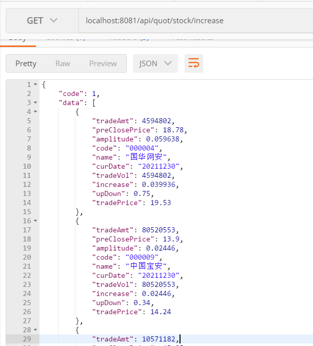

页面显示效果：


## 2.涨幅榜更多数据功能实现

### 2.1 涨幅榜更多数据功能分析

#### 1）原型效果

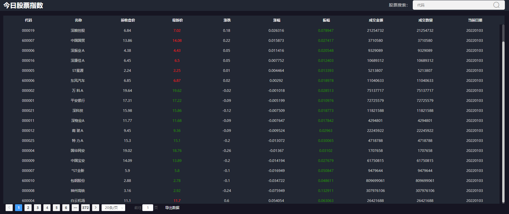

#### 2）涨幅榜分页查询功能分析

~~~json
功能描述：沪深两市个股行情列表查询 ,以时间顺序和涨幅分页查询
服务路径：/api/quot/stock/all
服务方法：GET
请求频率：每分钟
请求参数：
	{
        page:2 // 当前页
        pageSize:20 //每页大小
    }
~~~

​	  响应数据格式：

~~~json
{
    "code": 1,
    "data": {
        "totalRows": 46750,//总行数
        "totalPages": 4675,//总页数
        "pageNum": 2,//当前页
        "pageSize": 10,//每页大小
        "size": 10,//当前页大小
        "rows": [
            {
                "tradeAmt": 4594802,//交易量
                "preClosePrice": 18.78,//前收盘价
                "amplitude": 0.059638,//振幅
                "code": "000004",//股票编码
                "name": "国华网安",//股票名称
                "curDate": "20211230",//当前日期
                "tradeVol": 4594802,//交易金额
                "increase": 0.039936,//涨跌
                "upDown": 0.75,//涨幅
                "tradePrice": 19.53//当前价格
            },
            {
                "tradeAmt": 417200,
                "preClosePrice": 9.09,
                "amplitude": 0.014301,
                "code": "000020",
                "name": "深华发Ａ",
                "curDate": "20211230",
                "tradeVol": 417200,
                "increase": -0.0044,
                "upDown": -0.04,
                "tradePrice": 9.05
            },
           //.......
        ]
    }
}
~~~

​	说明：我们之期已经配置好了PageHelper分页查询相关信息：

~~~yaml
# pagehelper配置
pagehelper:
  helper-dialect: mysql #指定数据库，不指定的话会默认自动检测数据库类型
  reasonable: true #是否启用分页合理化，当pagenum< 1显示第一页，当pagenum > pages显示最后一页
~~~


### 2.2 更多涨幅信息功能实现

#### 1）定义分页对象

导入：**day03\资料\后端资料\PageResult.java**

~~~java
package com.itheima.stock.vo.resp;

import com.github.pagehelper.PageInfo;
import lombok.Data;
import java.io.Serializable;
import java.util.List;

/**
 * 分页工具类
 */
@Data
public class PageResult<T> implements Serializable {
    /**
     * 总记录数
     */
    private Long totalRows;

    /**
     * 总页数
     */
    private Integer totalPages;

    /**
     * 当前第几页
     */
    private Integer pageNum;
    /**
     * 每页记录数
     */
    private Integer pageSize;
    /**
     * 当前页记录数
     */
    private Integer size;
    /**
     * 结果集
     */
    private List<T> rows;

    /**
     * 分页数据组装
     * @param pageInfo
     * @return
     */
    public PageResult(PageInfo<T> pageInfo) {
        totalRows = pageInfo.getTotal();
        totalPages = pageInfo.getPages();
        pageNum = pageInfo.getPageNum();
        pageSize = pageInfo.getPageSize();
        size = pageInfo.getSize();
        rows = pageInfo.getList();
    }
}
~~~

#### 2）定义服务访问接口方法

~~~java
    /**
     * 沪深两市个股行情列表查询 ,以时间顺序和涨幅分页查询
     * @param page 当前页
     * @param pageSize 每页大小
     * @return
     */
    @GetMapping("/stock/all")
    public R<PageResult<StockUpdownDomain>> stockPage(Integer page,Integer pageSize){
        return stockService.stockPage(page, pageSize);
    }
~~~

#### 3）定义服务接口方法和实现

接口方法

~~~java
    /**
     * 沪深两市个股行情列表查询 ,以时间顺序和涨幅分页查询
     * @param page 当前页
     * @param pageSize 每页大小
     * @return
     */
    R<PageResult<StockUpdownDomain>> stockPage(Integer page, Integer pageSize);
~~~

实现

~~~java
    /**
     * 沪深两市个股行情列表查询 ,以时间顺序和涨幅分页查询
     * @param page 当前页
     * @param pageSize 每页大小
     * @return
     */
    @Override
    public R<PageResult<StockUpdownDomain>> stockPage(Integer page, Integer pageSize) {
        //1.设置分页参数
        PageHelper.startPage(page,pageSize);
        //2.通过mapper查询
        List<StockUpdownDomain> infos= stockRtInfoMapper.stockAll();
        if (CollectionUtils.isEmpty(infos)) {
            return R.error("暂无数据");
        }
        //3.封装到PageResult下
        //3.1 封装PageInfo对象
        PageInfo<StockUpdownDomain> listPageInfo = new PageInfo<StockUpdownDomain>(infos);
        //3.2 将PageInfo转PageResult
        PageResult<StockUpdownDomain> pageResult = new PageResult<>(listPageInfo);
        //4.封装R响应对象
        return R.ok(pageResult);
    }
~~~

#### 4）定义mapper接口方法和xml

在StockRtInfoMapper接口下定义：

~~~java
    /**
     * 根据时间和涨幅降序排序全表查询
     * @return
     */
    List<StockUpdownDomain> stockAll();
~~~

在StockRtInfoMapper.xml下定义绑定sql：

~~~xml
    <select id="stockAll" resultType="com.itheima.stock.common.domain.StockUpdownDomain">
        select
            sri.trade_amount as tradeAmt,
            sri.pre_close_price as preClosePrice,
            (sri.max_price-sri.min_price)/sri.pre_close_price as amplitude,
            sri.stock_code as code,
            sri.stock_name as name,
            date_format(sri.cur_time,'%Y%m%d') as curDate,
            sri.trade_volume as tradeVol,
            sri.cur_price-sri.pre_close_price as increase,
            (sri.cur_price-sri.pre_close_price)/sri.pre_close_price as upDown,
            sri.cur_price as tradePrice
        from stock_rt_info as sri
        order by sri.cur_time desc, upDown desc
    </select>
~~~

#### 5）web接口测试

postman测试：http://127.0.0.1:8080/api/quot/stock/all?page=2&pageSize=10

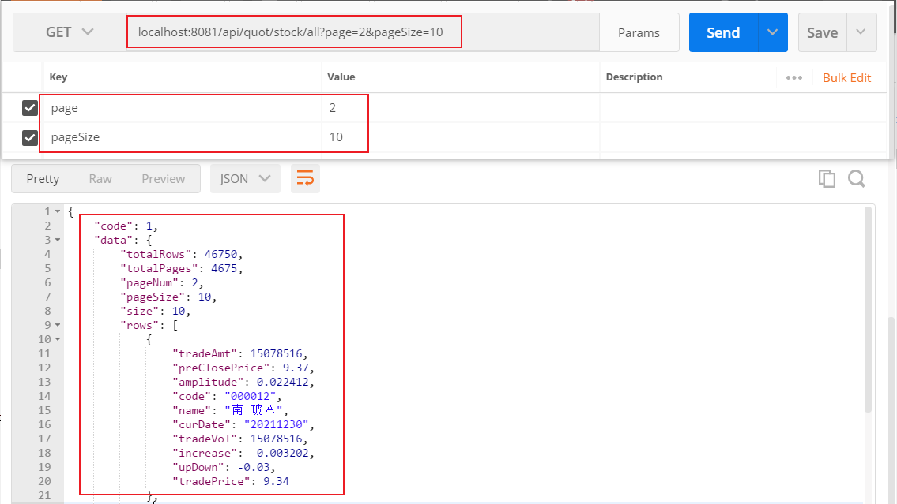

页面展示效果：

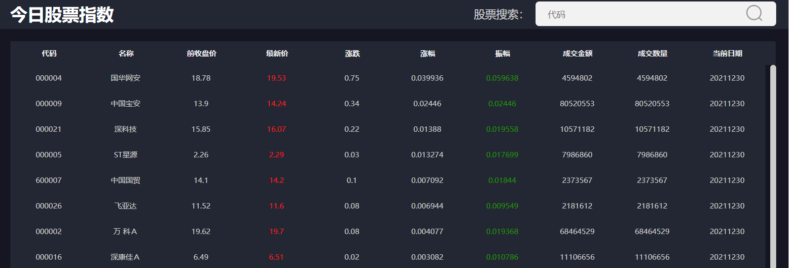

## 3.涨停跌停数据统计功能

### 3.1 涨停跌停数据统计业务分析

#### 1）涨跌停原型效果

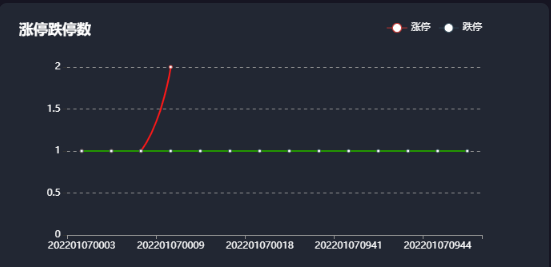

#### 2）涨停跌停概念回顾

~~~tex
涨停跌停是防止证券市场过度投机的产物，本意是防止股票市场过度波动；
在中国A股市场,均设有涨幅和跌幅的限制,他们都是10%的限制,即所谓的涨停和跌停；
注意：普通的股票最大涨跌幅为10%。特别处理股每天的最大涨跌幅不能超过前一交易日的5%；
总之：涨停>=10%涨幅
	 跌停<=-10%涨幅
~~~

#### 3）涨停跌停接口说明

~~~tex
功能描述：统计沪深两市T日(当前股票交易日)每分钟的涨跌停数据 
		注意：如果不在股票的交易日内，那么就统计最近的股票交易日下的数据
服务路径：/api/quot/stock/updown/count
服务方法：GET
请求频率：每分钟
请求参数：无
~~~

响应数据格式：

~~~json
{
    "code": 1,
    "data": {
        "upList": [
            {
                "count": 1,//涨停数量
                "time": "202112311412"//当天分时
            },
            {
                "count": 4,
                "time": "202112311413"
            }
        ],
        "downList": [
            {
                "count": 2,//跌停数量
                "time": "202112310925"//当天分时
            },
            {
                "count": 1,
                "time": "202112311415"
            }
        ]
    }
}
~~~

​	总之，业务要求获取当天交易日每分钟的涨跌停数；

### 3.2 T日涨跌停统计SQL分析

【1】统计指定日期下每分钟股票的涨停数据功能

~~~sql
-- 步骤1：统计指定日期范围下，涨停的数据和对应的日期
	select
		date_format( sri.cur_time, '%Y%m%d%H%i' ) as time,
		(sri.cur_price - sri.pre_close_price)/sri.pre_close_price as upDown 
	from
		stock_rt_info as sri 
	where
		sri.cur_time between '20220106092500' 
		and '20220106142500' 
	having
		upDown >= 0.1 
-- 步骤2：在步骤1查询结果基础上，根据时间分组统计每个时间的涨停个数
select
	tmp.time as time,
	count(*) as count 
from
	(
	select
		date_format( sri.cur_time, '%Y%m%d%H%i' ) as time,
		(sri.cur_price - sri.pre_close_price)/sri.pre_close_price as upDown 
	from
		stock_rt_info as sri 
	where
		sri.cur_time between '20220106092500' 
		and '20220106142500' 
	having
		upDown >= 0.1 
	) as tmp 
group by
	tmp.time
order by tmp.time asc;	
~~~

【2】统计指定日期下每分钟股票的跌停数据功能

~~~sql
-- 统计指定日期范围内的跌停SQL与涨停SQL语句格式一致，仅仅修改对应条件即可;
-- 分析出：mapper接口入参：
--	1.起始时间-startTime 
--	2.终止时间-endTime 
--	3.涨停和跌停的标识-flag 0：跌停 1：涨停
~~~


### 3.3 T日涨跌停统计功能实现

#### 1）定义访问接口

~~~java
    /**
     * 功能描述：沪深两市涨跌停分时行情数据查询，查询T日每分钟的涨跌停数据（T：当前股票交易日）
     * 		查询每分钟的涨停和跌停的数据的同级；
     * 		如果不在股票的交易日内，那么就统计最近的股票交易下的数据
     * 	 map:
     * 	    upList:涨停数据统计
     * 	    downList:跌停数据统计
     * @return
     */
    @GetMapping("/stock/updown/count")
    public R<Map> upDownCount(){
        return stockService.upDownCount();
    }
~~~

#### 2）定义服务接口方法与实现

服务接口定义：

~~~java
    /**
     * 功能描述：沪深两市涨跌停分时行情数据查询，查询T日每分钟的涨跌停数据（T：当前股票交易日）
     * 		查询每分钟的涨停和跌停的数据的同级；
     * 		如果不在股票的交易日内，那么就统计最近的股票交易下的数据
     * 	 map:
     * 	    upList:涨停数据统计
     * 	    downList:跌停数据统计
     * @return
     */
    R<Map> upDownCount();
~~~

方法实现：

~~~java
    /**
     * 功能描述：沪深两市涨跌停分时行情数据查询，查询T日每分钟的涨跌停数据（T：当前股票交易日）
     * 		查询每分钟的涨停和跌停的数据的同级；
     * 		如果不在股票的交易日内，那么就统计最近的股票交易下的数据
     * 	 map:
     * 	    upList:涨停数据统计
     * 	    downList:跌停数据统计
     * @return
     */
    @Override
    public R<Map> upDownCount() {
        //1.获取股票最近的有效交易日期,精确到秒
        DateTime curDateTime = DateTimeUtil.getLastDate4Stock(DateTime.now());
        //当前最近有效期
        Date curTime = curDateTime.toDate();
        //开盘日期
        Date openTime = DateTimeUtil.getOpenDate(curDateTime).toDate();
        //TODO mock_data 后续数据实时获取时，注释掉
        String curTimeStr="20220106142500";
        //对应开盘日期 mock_data
        String openTimeStr="20220106092500";
        curTime = DateTime.parse(curTimeStr, DateTimeFormat.forPattern("yyyyMMddHHmmss")).toDate();
        openTime = DateTime.parse(openTimeStr, DateTimeFormat.forPattern("yyyyMMddHHmmss")).toDate();
        //2.统计涨停的数据 约定：1代表涨停 0：跌停
        List<Map> upCount= stockRtInfoMapper.upDownCount(curTime,openTime,1);
        //3.统计跌停的数据
        List<Map> downCount= stockRtInfoMapper.upDownCount(curTime,openTime,0);
        //4.组装数据到map
        HashMap<String, List<Map>> info = new HashMap<>();
        info.put("upList",upCount);
        info.put("downList",downCount);
        //5.响应
       return R.ok(info);
    }
~~~

#### 3）mapper接口方法定义与xml

Mapper接口定义：

~~~java
    /**
     * 统计指定日期内涨停或者跌停的数据
     * 日期范围不能失效，否则分库分表查询失效
     * @param curTime 股票交易时间
     * @param openDate 对应的开盘日期
     * @param flag 1：涨停 0：跌停
     * @return
     */
    List<Map> upDownCount(@Param("avlDate") Date curTime, @Param("openDate") Date openDate, @Param("flag") Integer flag);
~~~

xml定义：

~~~xml
<!--
   sql思路：
      步骤1.统计出每分钟对应的涨幅数值
      步骤2.在步骤1的基础上，根据时间分组，查询每分钟内涨停/跌停的数量
-->
    <select id="upDownCount" resultType="java.util.Map">
        select
        tmp.time as time,
        count(*) as count
        from
        (
        select
        date_format(sri.cur_time,'%Y%m%d%H%i') as time,
        (sri.cur_price-sri.pre_close_price)/sri.pre_close_price as upDown
        from stock_rt_info as sri
        where sri.cur_time between #{openDate} and #{avlDate} having
        <if test="flag==1">
            upDown >=0.1
        </if>
        <if test="flag==0">
            upDown &lt;=-0.1
        </if>
        ) as
        tmp
        group by tmp.time
        order by tmp.time asc
    </select>
~~~

#### 4）web接口测试

postman测试地址：http://localhost:8080/api/quot//stock/updown/count

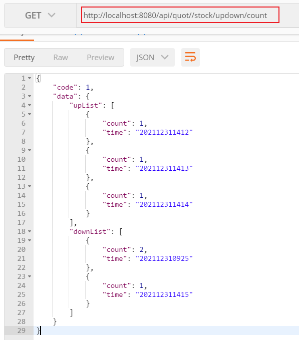

## 4.echart快速入门

### 4.1 echarts介绍

我们当前项目下的图形报表是使用echarts实现，所以接下来我们学习下echart的基本使用。

echarts Apache官网：https://echarts.apache.org/zh/index.html

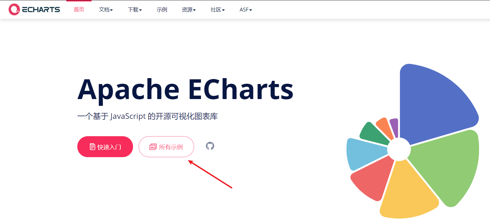

点击所有示例，可快速学习echarts的基本使用：

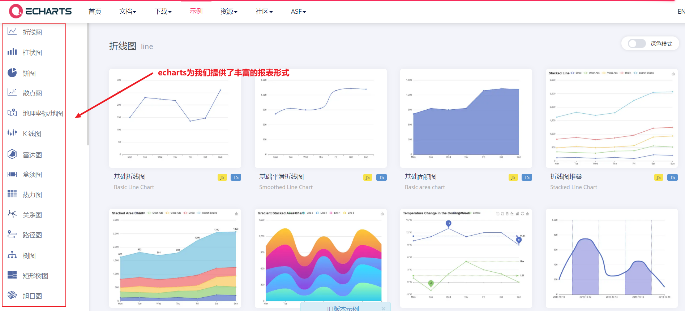

我们以折线图为例，演示echarts的基本使用：

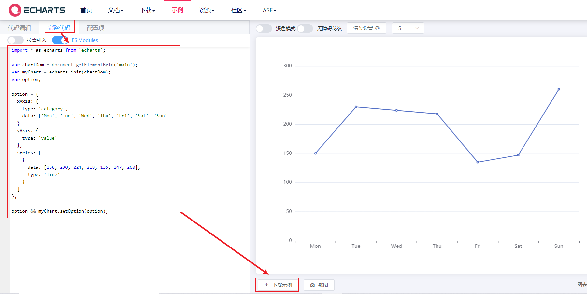

我们发现对于不同的图形展示方式，只需提供x轴和y轴数据即可；

### 4.2 vue使用echarts

#### 1）vscode打开测试工程

vs打开: **day03\资料\echart_vue_project** 工程，并启动

~~~shell
npm run serve
~~~

#### 2) 工程安装echarts依赖

~~~shell
npm install echarts -S
说明：-D：仅仅用于开发环境  -S：既用于开发环境，又可用于生产环境
~~~

命令执行完毕后，我们发现工程package.json文件下已经引入了echarts依赖：

~~~json
  "dependencies": {
    "core-js": "^3.6.5",
    "echarts": "^5.2.2",
    "vue": "^2.6.11"
  }
~~~

#### 3) 配置echarts

在main.js入口文件下引入echarts,并将echarts对象挂在Vue对象下；

~~~js
import Vue from 'vue'
import App from './App.vue'
//引入echarts对象
import * as echarts from 'echarts'

Vue.config.productionTip = false

//挂在在Vue全局对象下
Vue.prototype.$echarts=echarts
new Vue({
  render: h => h(App),
}).$mount('#app')
~~~

#### 4) vue组件使用echarts

~~~vue
<template>
  <div id="app" >
    <h1>echartjs入门</h1>
    <div ref="echartDiv" :style="{width: '100%', height: '500px'}"></div>
  </div>
</template>

<script>

export default {
  name: 'App',
  methods:{
    drawLine(){
           this.myChart = this.$echarts.init(this.$refs.echartDiv);
           let eOption = {
              xAxis: {
                type: 'category',
                data: ['Mon', 'Tue', 'Wed', 'Thu', 'Fri', 'Sat', 'Sun']
              },
            yAxis: {
              type: 'value'
            },
            series: [
              {
                data: [150, 230, 224, 218, 135, 147, 260],
                type: 'line'
              }
            ]
    };
    this.myChart.setOption(eOption);
    }
  },
  mounted(){
    this.drawLine();
  }
}
</script>

<style>
#app {
  font-family: Avenir, Helvetica, Arial, sans-serif;
  -webkit-font-smoothing: antialiased;
  -moz-osx-font-smoothing: grayscale;
  text-align: center;
  color: #2c3e50;
  margin-top: 60px;
}
</style>
~~~

#### 5) 页面效果：

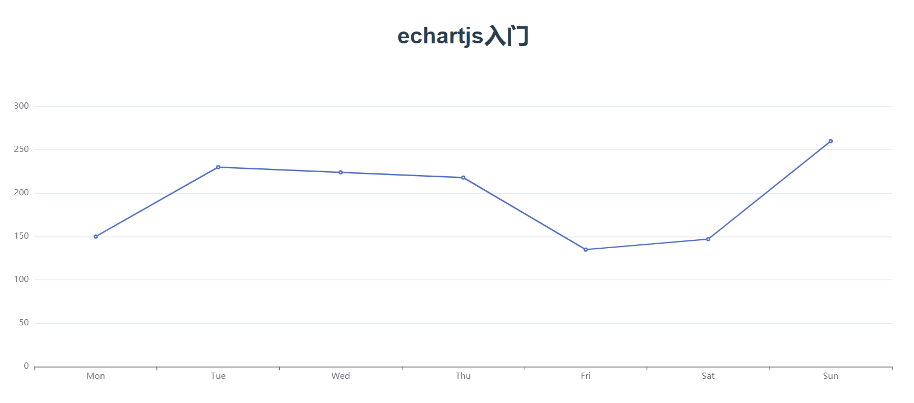

### 4.3 项目中echarts的使用

#### 1) 配置和使用流程说明

我们项目的前端也是同样的使用方式：

项目在package.json中已经引入了echart依赖：

~~~json
  "dependencies": {
    "axios": "^0.19.0",
    "core-js": "^3.19.3",
    "echarts": "^4.7.0",
   	//.......
  }   
~~~

main.js引入echarts:

~~~js
import echarts from 'echarts'
Vue.prototype.$echarts = echarts
~~~


#### 2) 前端显示效果

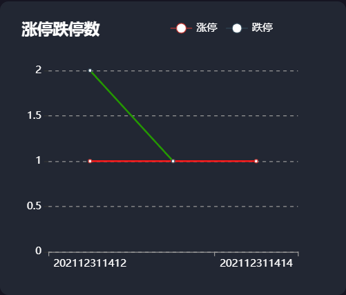

注意：点击涨停和跌停，也可单独显示；

## 5.easyExcel快速入门

### 5.1 easyExcel介绍

#### 1) easyExcel官网介绍

~~~tex
传统操作Excel大多都是利用Apach POI进行操作的，但是POI框架并不完善，使用过程非常繁琐且有较多的缺陷：
    动态操作Excel非常繁琐,对于新手来说，很难在短时间内上手;
    读写时需要占用较大的内存，当数据量大时容易发生内存溢出问题（OOM）;
基于上述原因，阿里开源出一款易上手，且比较节省内存的Excel操作框架：EasyExcel
注意：easyExcel底层使用POI实现的；
~~~

官网地址：https://www.yuque.com/easyexcel/doc/easyexcel

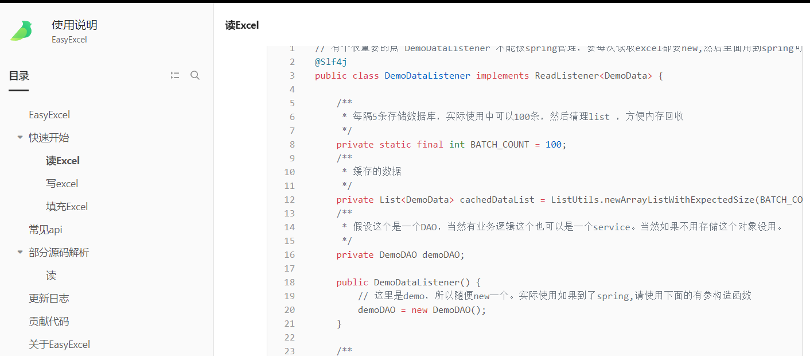

依赖资源：

```xml
<!--引入easyexcel-->
<dependency>
    <groupId>com.alibaba</groupId>
    <artifactId>easyexcel</artifactId>
    <version>3.0.4</version>
</dependency>
```

#### 2）Excel相关结构介绍

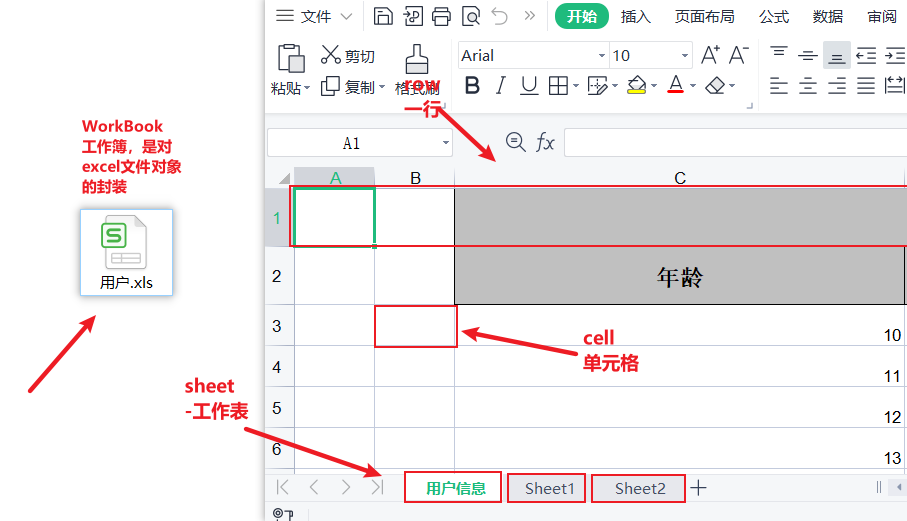

### 5.2 easyExcel导出数据-1

#### 1）构建测试实体类

~~~java
package com.itheima.stock.pojo;

import lombok.AllArgsConstructor;
import lombok.Builder;
import lombok.Data;
import lombok.NoArgsConstructor;

import java.io.Serializable;
import java.util.Date;

/**
 * @author by itheima
 * @Date 2021/12/19
 * @Description
 */
@Data
@NoArgsConstructor
@AllArgsConstructor
@Builder
public class User implements Serializable {
    private String userName;
    private Integer age;
    private String address;
    private Date birthday;
}
~~~

#### 2）数据导出到excel

~~~java
package com.itheima.stock;

import com.alibaba.excel.EasyExcel;
import com.itheima.stock.pojo.User;
import org.junit.jupiter.api.Test;

import java.util.ArrayList;
import java.util.Date;
import java.util.List;

/**
 * @author by itheima
 * @Date 2021/12/31
 * @Description
 */
public class TestEasyExcel {

    public List<User> init(){
        //组装数据
        ArrayList<User> users = new ArrayList<>();
        for (int i = 0; i < 10; i++) {
            User user = new User();
            user.setAddress("上海"+i);
            user.setUserName("张三"+i);
            user.setBirthday(new Date());
            user.setAge(10+i);
            users.add(user);
        }
        return users;
    }
    /**
     * 直接导出后，表头名称默认是实体类中的属性名称
     */
    @Test
    public void test02(){
        List<User> users = init();
        //不做任何注解处理时，表头名称与实体类属性名称一致
        EasyExcel.write("C:\\Users\\46035\\Desktop\\ex\\用户.xls",User.class).sheet("用户信息").doWrite(users);
    }
}
~~~

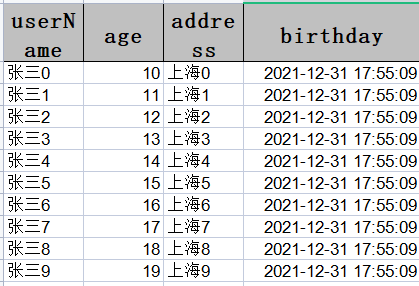

#### 3）自定义表头

修改User实体类,设置表头数据和排序规则：

~~~java
package com.itheima.stock.pojo;

import com.alibaba.excel.annotation.ExcelProperty;
import lombok.AllArgsConstructor;
import lombok.Builder;
import lombok.Data;
import lombok.NoArgsConstructor;
import java.io.Serializable;
import java.util.Date;

/**
 * @author by itheima
 * @Date 2021/12/19
 * @Description
 */
@Data
@NoArgsConstructor
@AllArgsConstructor
@Builder
/**
  * 通过注解自定义表头名称 注解添加排序规则，值越大 越靠近右边
*/
public class User implements Serializable {
    @ExcelProperty(value = {"用户名"},index = 1)
    private String userName;
    @ExcelProperty(value = {"年龄"},index = 2)
    private Integer age;
    @ExcelProperty(value = {"地址"} ,index = 4)
    private String address;
    @ExcelProperty(value = {"生日"},index = 3)
    private Date birthday;
}
~~~

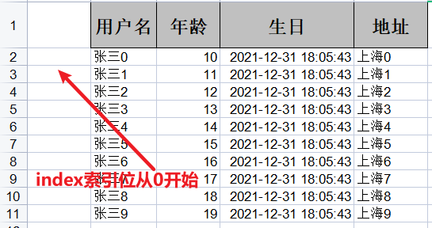

### 5.3 easyExcel导出数据-2

#### 4）自定义日期格式

~~~java
package com.itheima.stock.pojo;

import com.alibaba.excel.annotation.ExcelProperty;
import com.alibaba.excel.annotation.format.DateTimeFormat;
import lombok.AllArgsConstructor;
import lombok.Builder;
import lombok.Data;
import lombok.NoArgsConstructor;

import java.io.Serializable;
import java.util.Date;

/**
 * @author by itheima
 * @Date 2021/12/19
 * @Description
 */
@Data
@NoArgsConstructor
@AllArgsConstructor
@Builder
public class User implements Serializable {
    @ExcelProperty(value = {"用户名"},index = 1)
    private String userName;
    @ExcelProperty(value = {"年龄"},index = 2)
    private Integer age;
    @ExcelProperty(value = {"地址"} ,index = 4)
    private String address;
    @ExcelProperty(value = {"生日"},index = 3)
    //注意：日期格式注解由alibaba.excel提供
    @DateTimeFormat("yyyy/MM/dd HH:mm")
    private Date birthday;
}
~~~


#### 5）合并表头

添加合并表头信息：

~~~java
package com.itheima.stock.pojo;

import com.alibaba.excel.annotation.ExcelIgnore;
import com.alibaba.excel.annotation.ExcelProperty;
import com.alibaba.excel.annotation.format.DateTimeFormat;
import lombok.AllArgsConstructor;
import lombok.Builder;
import lombok.Data;
import lombok.NoArgsConstructor;

import java.io.Serializable;
import java.util.Date;

/**
 * @author by itheima
 * @Date 2021/12/19
 * @Description
 */
@Data
@NoArgsConstructor
@AllArgsConstructor
@Builder
public class User implements Serializable {
    @ExcelProperty(value = {"用户基本信息","用户名"},index = 1)
    private String userName;
    @ExcelProperty(value = {"用户基本信息","年龄"},index = 2)
    private Integer age;
    @ExcelProperty(value = {"用户基本信息","地址"} ,index = 4)
    private String address;
    @ExcelProperty(value = {"用户基本信息","生日"},index = 3)
    //注意：日期格式注解由alibaba.excel提供
    @DateTimeFormat("yyyy/MM/dd HH:mm")
    private Date birthday;
}
~~~

效果：

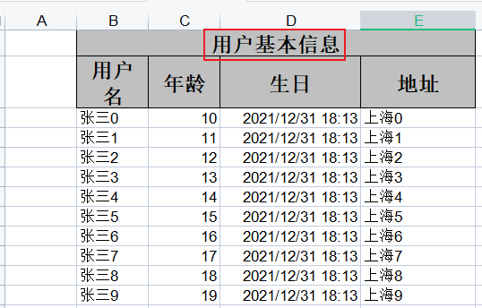

【6】忽略表头信息

~~~java
/**
 * @author by itheima
 * @Date 2021/12/19
 * @Description
 */
@Data
@NoArgsConstructor
@AllArgsConstructor
@Builder
public class User implements Serializable {
    @ExcelProperty(value = {"用户基本信息","用户名"},index = 1)
    @ExcelIgnore
    private String userName;
    @ExcelProperty(value = {"用户基本信息","年龄"},index = 2)
    private Integer age;
    @ExcelProperty(value = {"用户基本信息","地址"} ,index = 4)
    private String address;
    @ExcelProperty(value = {"用户基本信息","生日"},index = 3)
    //注意：日期格式注解由alibaba.excel提供
    @DateTimeFormat("yyyy/MM/dd HH:mm")
    private Date birthday;
}
~~~

效果：

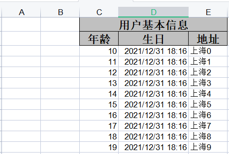

#### 6）设置单元格大小

~~~java
@Data
@NoArgsConstructor
@AllArgsConstructor
@Builder
@HeadRowHeight(value = 35) // 表头行高
@ContentRowHeight(value = 25) // 内容行高
@ColumnWidth(value = 50) // 列宽
public class User implements Serializable {
    @ExcelProperty(value = {"用户基本信息","用户名"},index = 1)
    @ExcelIgnore
    private String userName;
    @ExcelProperty(value = {"用户基本信息","年龄"},index = 2)
    private Integer age;
    @ExcelProperty(value = {"用户基本信息","地址"} ,index = 4)
    private String address;
    @ExcelProperty(value = {"用户基本信息","生日"},index = 3)
    //注意：日期格式注解由alibaba.excel提供
    @DateTimeFormat("yyyy/MM/dd HH:mm")
    private Date birthday;
}
~~~

效果：

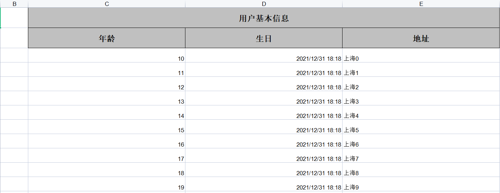

### 5.4 easyExcel导入数据

~~~java
    /**
     * excel数据格式必须与实体类定义一致，否则数据读取不到
     */
    @Test
    public void readExcel(){
        ArrayList<User> users = new ArrayList<>();
        //读取数据
        EasyExcel.read("C:\\Users\\46035\\Desktop\\ex\\用户.xls", User.class, new AnalysisEventListener<User>() {
            @Override
            public void invoke(User o, AnalysisContext analysisContext) {
                System.out.println(o);
                users.add(o);
            }
            @Override
            public void doAfterAllAnalysed(AnalysisContext analysisContext) {
                System.out.println("完成。。。。");
            }
        }).sheet().doRead();
        System.out.println(users);
    }
~~~

## 6.涨幅榜数据导出功能

### 6.1 涨幅榜功能分析

#### 1）原型效果

通过点击【导出数据】按钮，将当前页的数据导出到excel下：

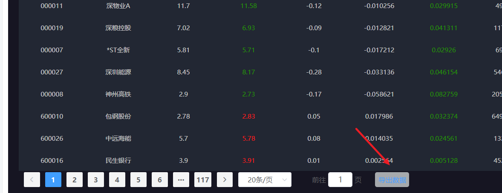

#### 2）涨幅榜数据导出接口说明

接口说明：

~~~json
功能说明：将指定页数据导出到excel表下
请求地址：/api/quot/stock/export
请求方式：GET
入参：
	{
        page:2 // 当前页
        pageSize:20 //每页大小
    }
响应：excel文件
~~~

#### 3）功能实现准备

导入excel实体类：**day03\课件\资料\StockExcelDomain.java**

### 6.2 涨幅信息数据导出功能实现

#### 1) 定义web访问方法

~~~java
    /**
     * 将指定页的股票数据导出到excel表下
     * @param response
     * @param page  当前页
     * @param pageSize 每页大小
     */
    @GetMapping("/stock/export")
    public void stockExport(HttpServletResponse response,Integer page,Integer pageSize){
         stockService.stockExport(response,page,pageSize);
    }
~~~

#### 2) 定义服务接口及实现

接口定义：

~~~java
    /**
     * 将指定页的股票数据导出到excel表下
     * @param response
     * @param page  当前页
     * @param pageSize 每页大小
     */
    void stockExport(HttpServletResponse response, Integer page, Integer pageSize);
~~~

接口实现：

~~~java
    /**
     * 将指定页的股票数据导出到excel表下
     * @param response
     * @param page  当前页
     * @param pageSize 每页大小
     */
    @Override
    public void stockExport(HttpServletResponse response, Integer page, Integer pageSize) {
        try {
            //1.设置响应数据的类型:excel
            response.setContentType("application/vnd.ms-excel");
            //2.设置响应数据的编码格式
            response.setCharacterEncoding("utf-8");
            //3.设置默认的文件名称
            // 这里URLEncoder.encode可以防止中文乱码 当然和easyexcel没有关系
            String fileName = URLEncoder.encode("stockRt", "UTF-8");
            //设置默认文件名称
            response.setHeader("content-disposition", "attachment;filename=" + fileName + ".xlsx");
            //4.分页查询股票数据
            PageHelper.startPage(page,pageSize);
            List<StockUpdownDomain> infos = this.stockRtInfoMapper.stockAll();
            Gson gson = new Gson();
            List<StockExcelDomain> excelDomains = infos.stream().map(info -> {
                StockExcelDomain domain=new StockExcelDomain();
                BeanUtils.copyProperties(info,domain);
                return domain;
            }).collect(Collectors.toList());
            //5.导出
            EasyExcel.write(response.getOutputStream(),StockExcelDomain.class).sheet("股票数据").doWrite(excelDomains);
        } catch (IOException e) {
           log.info("股票excel数据导出异常，当前页：{}，每页大小：{}，异常信息：{}",page,pageSize,e.getMessage());
        }
    }
~~~

#### 3) 访问测试效果

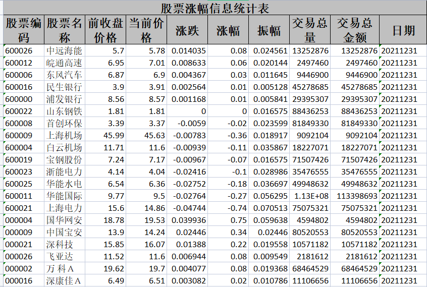


