# 今日指数-day04

## 今日目标

~~~tex
1.理解股票T和T-1概念，实现成交量对比功能;
2.理解个股涨跌幅度统计功能;
   2.1 分析业务，SQL落地;
   2.2 完善不存在数据的区间默认回显功能;
3.理解个股分时K线业务，并实现功能;
4.理解个股日K线业务，并实现功能;   
~~~

## 1.股票成交量对比功能

### 1.1 股票成交量对比功能分析

#### 1） 股票成交量对比功能原型

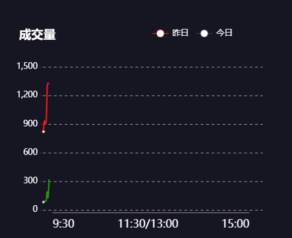

相关表结构：

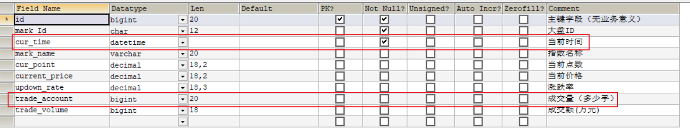

#### 2）成交量对比功能接口分析

~~~tex
功能描述：统计国内A股大盘T日和T-1日成交量对比功能（成交量为沪市和深市成交量之和）
服务路径：/api/quot/stock/tradevol
服务方法：GET
请求频率：每分钟
请求参数：无
~~~

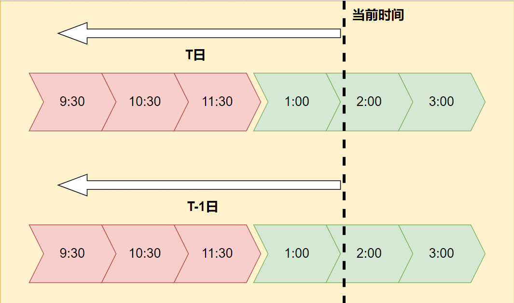	

注意事项：

~~~tex
如果当前日期不在股票交易日，则按照前一个有效股票交易日作为T日查询
~~~

返回数据格式：

~~~json
{
    "code": 1,
    "data": {
        "volList": [{"count": 3926392,"time": "202112310930"},......],//T日每分钟成交量信息
        "yesVolList":[{"count": 3926392,"time": "202112310930"},......]//T-1日每分钟成交量信息 
		}
}
~~~

### 1.2 成交量对比功能实现

#### 1）定义web服务接口方法

~~~java
    /**
     * 功能描述：统计国内A股大盘T日和T-1日成交量对比功能（成交量为沪市和深市成交量之和）
     *   map结构示例：
     *      {
     *         "volList": [{"count": 3926392,"time": "202112310930"},......],
     *       "yesVolList":[{"count": 3926392,"time": "202112310930"},......]
     *      }
     * @return
     */
    @GetMapping("/stock/tradevol")
    public R<Map> stockTradeVol4InnerMarket(){
        return stockService.stockTradeVol4InnerMarket();
    }
~~~

#### 2）定义服务接口方法与实现

服务接口方法：

~~~java
    /**
     * 功能描述：统计国内A股大盘T日和T-1日成交量对比功能（成交量为沪市和深市成交量之和）
     *   map结构示例：
     *      {
     *         "volList": [{"count": 3926392,"time": "202112310930"},......],
     *       "yesVolList":[{"count": 3926392,"time": "202112310930"},......]
     *      }
     * @return
     */
    R<Map> stockTradeVol4InnerMarket();
~~~

服务接口方法实现：

~~~java
    /**
     * 功能描述：统计国内A股大盘T日和T-1日成交量对比功能（成交量为沪市和深市成交量之和）
     *   map结构示例：
     *      {
     *         "volList": [{"count": 3926392,"time": "202112310930"},......],
     *       "yesVolList":[{"count": 3926392,"time": "202112310930"},......]
     *      }
     * @return
     */
    @Override
    public R<Map> stockTradeVol4InnerMarket() {
        //1.获取最近的股票交易日时间，精确到分钟 T交易日
        DateTime tDate = DateTimeUtil.getLastDate4Stock(DateTime.now());
        Date tDateTime = tDate.toDate();
        //对应的开盘时间
        Date tOpenTime = DateTimeUtil.getOpenDate(tDate).toDate();
        //TODO 后续注释掉 mock-data
        String tDateStr="20220103143000";
        tDateTime = DateTime.parse(tDateStr, DateTimeFormat.forPattern("yyyyMMddHHmmss")).toDate();
        //mock-data
        String openDateStr="20220103093000";
        tOpenTime = DateTime.parse(openDateStr, DateTimeFormat.forPattern("yyyyMMddHHmmss")).toDate();
        //获取T-1交易日
        DateTime preTDate = DateTimeUtil.getPreviousTradingDay(tDate);
        Date preTTime = preTDate.toDate();
        Date preTOpenTime=DateTimeUtil.getOpenDate(preTDate).toDate();
        //TODO 后续注释掉 mock-data
        String preTStr="20220102143000";
        preTTime = DateTime.parse(preTStr, DateTimeFormat.forPattern("yyyyMMddHHmmss")).toDate();
        //mock-data
        String openDateStr2="20220102093000";
        preTOpenTime= DateTime.parse(openDateStr2, DateTimeFormat.forPattern("yyyyMMddHHmmss")).toDate();
        //2.获取T日的股票大盘交易量统计数据
        List<Map> tData=stockMarketIndexInfoMapper.stockTradeVolCount(stockInfoConfig.getInner(),tOpenTime,tDateTime);
        //3.获取T-1的数据
        List<Map> preTData=stockMarketIndexInfoMapper.stockTradeVolCount(stockInfoConfig.getInner(),preTOpenTime,preTTime);
        //4.组装数据
        HashMap<String, List<Map>> data = new HashMap<>();
        data.put("volList",tData);
        data.put("yesVolList",preTData);
        return R.ok(data);
    }
~~~

注意：我们当前的数据不是实时的真实数据，当前选择合适的时间实现查询即可；

#### 3）定义mapper接口和xml

定义mapper接口方法：

~~~java
    /**
     * 查询指定大盘下的指定日期下小于等于指定时间的数据，结果包含：每分钟内，整体大盘的交易量的统计
     * @param marketIds 股票大盘的编码code集合
     * @param openDate 开盘时间
     * @param tStr 日期时间，精确到秒
     * @return
     */
    List<Map> stockTradeVolCount(@Param("marketIds") List<String> marketIds, @Param("openDate") Date openDate , @Param("stockDateTime") Date tStr);
~~~

XML方法绑定：

~~~sql
    <select id="stockTradeVolCount" resultType="java.util.Map">
        select
        date_format(smi.cur_time,'%Y%m%d%H%i') as time,
        sum(smi.trade_account) as count
        from
        stock_market_index_info as smi
        where
          smi.cur_time between #{openDate} and #{stockDateTime}
        and
        smi.mark_Id in
        <foreach collection="marketIds" item="id" separator="," open="(" close=")">
            #{id}
        </foreach>
        group by time
    </select>
~~~

其它SQL思路：

~~~sql
# 先确定测试环境中T和T-1日期 T:20220103 T-1:20220102
SELECT
  DATE_FORMAT(smi.cur_time,'%Y%m%d') AS evrDate,
  MIN(smi.cur_time) AS startTime,
  MAX(smi.cur_time) AS endTime,
  COUNT(*) AS rows
FROM stock_market_index_info AS smi
GROUP BY evrDate;
# 分析：统计2022-01-03天的截止到13:30:00每分钟的大盘（上证和深证）成交量
# 入参：2022-01-03 13:30:00 或者20220103133000 
select *  from
stock_market_index_info as smi where 
date_format(smi.cur_time,'%Y%m%d')=date_format('20220103133000','%Y%m%d') and
smi.cur_time<='20220103133000' and
smi.mark_Id in ('s_sz399001','s_sh000001')
# 步骤2：查询需要的数据是：1.每分钟的值，比如：202201031330 2.sum(成交量)
select date_format(smi.cur_time,'%Y%m%d%H%i') as time,sum(smi.trade_account) as count  from
stock_market_index_info as smi where 
date_format(smi.cur_time,'%Y%m%d')=date_format('20220103133000','%Y%m%d') and
smi.cur_time<='20220103133000'  and
smi.mark_Id in ('s_sz399001','s_sh000001')
group by time;
~~~

说明：最好不要在日期字段添加函数，这样会导致作用在日期字段上的索引失效，且后续分库分片中也失效；

#### 4）web接口测试

postman:http://localhost:8080/api/quot/stock/tradevol

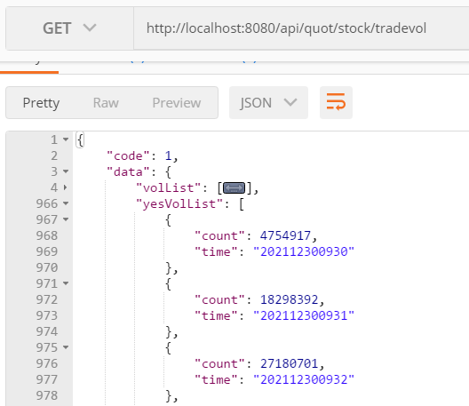

页面效果如下：

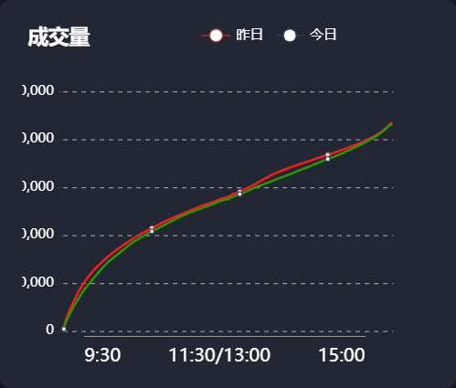

## 2.个股分时涨跌幅度统计功能

### 2.1 个股分时涨跌幅度统计功能分析

#### 1）个股涨跌幅度功能原型

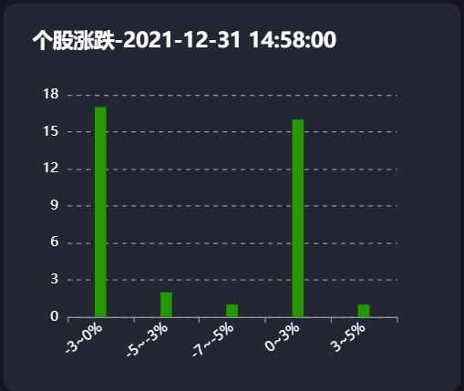

#### 2）个股分时涨跌幅度统计功能接口分析

~~~tex
功能描述：统计当前时间下（精确到分钟），股票在各个涨跌区间的数量
服务路径：/api/quot/stock/updown
服务方法：GET
请求频率：每分钟
请求参数：无
注意事项：如果当前不在股票有效时间内，则以前一个有效股票交易日作为查询时间点；
~~~

响应数据格式：

~~~json
{
    "code": 1,
    "data": {
        "time": "2021-12-31 14:58:00",
        "infos": [
            {
                "count": 17,
                "title": "-3~0%"
            },
            {
                "count": 2,
                "title": "-5~-3%"
            },
            {
                "count": 1,
                "title": "-7~-5%"
            },
            {
                "count": 16,
                "title": "0~3%"
            },
            {
                "count": 1,
                "title": "3~5%"
            }
        ]
    }
}
~~~

#### 3）股票涨跌幅区间定义

~~~tex
"<-7%" 、 "-7~-5%"、 "-5~-3%" 、 "-3~0%" 、"0~3%" 、 "3~5%" 、 "5~7%" 、 ">7%"
~~~

### 2.2 个股涨跌幅度区间统计功能实现

#### 1）定义web访问接口

~~~java
    /**
     * 查询当前时间下股票的涨跌幅度区间统计功能
     * 如果当前日期不在有效时间内，则以最近的一个股票交易时间作为查询点
     * @return
     */
    @GetMapping("/stock/updown")
    public R<Map> getStockUpDown(){
        return stockService.stockUpDownScopeCount();
    }
~~~

#### 2）定义服务接口和实现

定义服务接口：

~~~java
    /**
     * 查询当前时间下股票的涨跌幅度区间统计功能
     * 如果当前日期不在有效时间内，则以最近的一个股票交易时间作为查询点
     * @return
     */
     R<Map> stockUpDownScopeCount();
~~~

定义实现：

~~~java
    /**
     * 功能描述：统计在当前时间下（精确到分钟），股票在各个涨跌区间的数量
     *  如果当前不在股票有效时间内，则以最近的一个有效股票交易时间作为查询时间点；
     * @return
     *  响应数据格式：
     *  {
     *     "code": 1,
     *     "data": {
     *         "time": "2021-12-31 14:58:00",
     *         "infos": [
     *             {
     *                 "count": 17,
     *                 "title": "-3~0%"
     *             },
     *             //...
     *             ]
     *     }
     */
    @Override
    public R<Map> stockUpDownScopeCount() {
        //1.获取当前时间下最近的一个股票交易时间 精确到秒
        DateTime avlDateTime = DateTimeUtil.getLastDate4Stock(DateTime.now());
        Date avlDate = avlDateTime.toDate();
        //TODO 后续删除 mock-data
        String  mockDate="20220106095500";
        avlDate = DateTime.parse(mockDate, DateTimeFormat.forPattern("yyyyMMddHHmmss")).toDate();
        //2.查询
        List<Map> maps=stockRtInfoMapper.stockUpDownScopeCount(avlDate);
        //3.组装data
        HashMap<String, Object> data = new HashMap<>();
        data.put("time",avlDateTime.toString("yyyy-MM-dd HH:mm:ss"));
        data.put("infos",maps);
        //返回响应数据
        return R.ok(data);
    }
~~~

### 2.3 个股涨跌幅度SQL分析

#### 3）定义mapper接口方法与xml

mapper接口方法定义

~~~java
    /**
     * 统计指定时间点下，各个涨跌区间内股票的个数
     * @param avlDate
     * @return
     */
    List<Map> stockUpDownScopeCount(@Param("avlDate") Date avlDate);
~~~

SQL分析步骤：

~~~sql
# 步骤1：统计当前时间下，每只股票的涨幅值
select
	date_format( sri.cur_time, '%Y%m%d%H%i' ) as curTime,
	( sri.cur_price - sri.pre_close_price )/ sri.pre_close_price as rate 
from
	stock_rt_info as sri 
where
	sri.cur_time = '20220106095500'
# 步骤2：将步骤1的查询结果中数据转换为区间范围集合
	select
			CASE
				WHEN tmp.rate > 0.07 THEN  '>7%'
				WHEN tmp.rate > 0.05 AND tmp.rate <= 0.07 THEN '5~7%'
				WHEN tmp.rate > 0.03 AND tmp.rate <= 0.05 THEN '3~5%'
				WHEN tmp.rate > 0 AND tmp.rate <= 0.03 THEN '0~3%'
				WHEN tmp.rate > -0.03 AND tmp.rate <= 0 THEN '-3~0%'
				WHEN tmp.rate > -0.05 AND tmp.rate <= -0.03 THEN '-5~-3%'
				WHEN tmp.rate > -0.07 AND tmp.rate <= -0.05 THEN '-7~-5%'
				ELSE '<-7%'
			END 'title'
  from
		(
			select
			date_format(sri.cur_time,'%Y%m%d%H%i') as curTime,
			(sri.cur_price-sri.pre_close_price)/sri.pre_close_price as rate
			from stock_rt_info as sri
			where sri.cur_time='20220106095500'
		)as tmp
# 步骤3：根据区间分组，统计各个区间数据量
				select
					tmp2.title,
					count(*) as count
        from
        (select
					CASE
						WHEN tmp.rate > 0.07 THEN  '>7%'
						WHEN tmp.rate > 0.05 AND tmp.rate <= 0.07 THEN '5~7%'
						WHEN tmp.rate > 0.03 AND tmp.rate <= 0.05 THEN '3~5%'
						WHEN tmp.rate > 0 AND tmp.rate <= 0.03 THEN '0~3%'
						WHEN tmp.rate > -0.03 AND tmp.rate <= 0 THEN '-3~0%'
						WHEN tmp.rate > -0.05 AND tmp.rate <= -0.03 THEN '-5~-3%'
						WHEN tmp.rate > -0.07 AND tmp.rate <= -0.05 THEN '-7~-5%'
						ELSE '<-7%'
					END 'title'
        from
        (select
        date_format(sri.cur_time,'%Y%m%d%H%i') as curTime,
        (sri.cur_price-sri.pre_close_price)/sri.pre_close_price as rate
        from stock_rt_info as sri
        where sri.cur_time='20220106095500')
        as tmp)
        as tmp2 group by tmp2.title
~~~

xml定义：

~~~xml
    <select id="stockUpDownScopeCount" resultType="java.util.Map">
        select
        tmp2.title,
        count(*) as count
        from
        (select
        CASE
        WHEN tmp.rate > 0.07 THEN  '>7%'
        WHEN tmp.rate > 0.05 AND tmp.rate &lt;= 0.07 THEN '5~7%'
        WHEN tmp.rate > 0.03 AND tmp.rate &lt;= 0.05 THEN '3~5%'
        WHEN tmp.rate > 0 AND tmp.rate &lt;= 0.03 THEN '0~3%'
        WHEN tmp.rate > -0.03 AND tmp.rate &lt;= 0 THEN '-3~0%'
        WHEN tmp.rate > -0.05 AND tmp.rate &lt;= -0.03 THEN '-5~-3%'
        WHEN tmp.rate > -0.07 AND tmp.rate &lt;= -0.05 THEN '-7~-5%'
        ELSE '&lt;-7%'
        END 'title'
        from
        (select
        date_format(sri.cur_time,'%Y%m%d%H%i') as curTime,
        (sri.cur_price-sri.pre_close_price)/sri.pre_close_price as rate
        from stock_rt_info as sri
        where sri.cur_time=#{avlDate})
        as tmp)
        as tmp2 group by tmp2.title
    </select>
~~~

**是不是大量特殊转换非常麻烦？**

在mapper文件中的SQL遇到特殊字符，如：< 等，建议使用**<![CDATA[ sql 语句 ]]>**标记，将sql语句包裹住，不被解析器解析，所以最终xml方式：

~~~xml
    <select id="stockUpDownScopeCount" resultType="java.util.Map">
    <![CDATA[
        select
            tmp2.title,
            count(*) as count
        from
            (select
            CASE
            WHEN tmp.rate > 0.07 THEN  '>7%'
            WHEN tmp.rate > 0.05 AND tmp.rate <= 0.07 THEN '5~7%'
            WHEN tmp.rate > 0.03 AND tmp.rate <= 0.05 THEN '3~5%'
            WHEN tmp.rate > 0 AND tmp.rate <= 0.03 THEN '0~3%'
            WHEN tmp.rate > -0.03 AND tmp.rate <= 0 THEN '-3~0%'
            WHEN tmp.rate > -0.05 AND tmp.rate <= -0.03 THEN '-5~-3%'
            WHEN tmp.rate > -0.07 AND tmp.rate <= -0.05 THEN '-7~-5%'
            ELSE '<-7%'
            END 'title'
            from
            (select
            date_format(sri.cur_time,'%Y%m%d%H%i') as curTime,
            (sri.cur_price-sri.pre_close_price)/sri.pre_close_price as rate
            from stock_rt_info as sri
            where sri.cur_time=#{avlDate})
            as tmp)
            as tmp2 group by tmp2.title
    ]]>
    </select>
~~~

#### 4）功能测试

postman测试:http://localhost:8080/api/quot/stock/updown

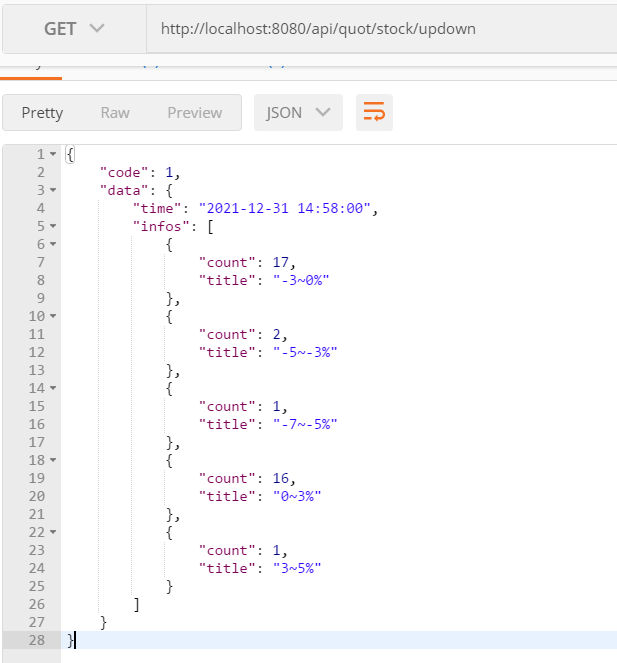

页面展示效果：

### 2.4 个股涨幅幅度排序优化

#### 1）问题

~~~tex
1.我们当前在前端查询的数据是无序展示的，需要后端对数据进行合理排序，这样前端才能顺序展示;
2.对于不存在数据的区间不显示，显然不合理，我们可对无数据的区间默认为0给前端显示；
~~~

最终效果：

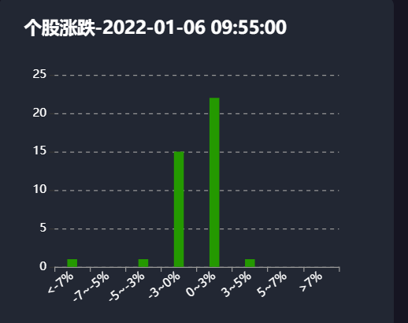

实现过程：

#### 2）yml中顺序定义股票涨幅范围集合

~~~yml
# 配置股票相关的参数
stock:
  upDownRange:
    - "<-7%"
    - "-7~-5%"
    - "-5~-3%"
    - "-3~0%"
    - "0~3%"
    - "3~5%"
    - "5~7%"
    - ">7%"
~~~

yml中顺序定义区间范围值，这样加载到内存时也可保证其顺序性；

#### 3) 封装实体类

~~~java
@Data
@ConfigurationProperties(prefix = "stock")
public class StockInfoConfig {
    //a股大盘ID集合
    private List<String> inner;
    //外盘ID集合
    private List<String> outer;
    //股票区间
    private List<String> upDownRange;
}
~~~

#### 4)  过滤实现

~~~java
    /**
     * 查询当前时间下股票的涨跌幅度区间统计功能
     * 如果当前日期不在有效时间内，则以最近的一个股票交易时间作为查询点
     * @return
     */
    @Override
    public R<Map> stockUpDownScopeCount() {
        //1.获取当前时间下最近的一个股票交易时间 精确到秒
        DateTime avlDateTime = DateTimeUtil.getLastDate4Stock(DateTime.now());
        Date avlDate = avlDateTime.toDate();
        //TODO 后续删除 mock-data
        String  mockDate="20220106095500";
        avlDate = DateTime.parse(mockDate, DateTimeFormat.forPattern("yyyyMMddHHmmss")).toDate();
        //2.查询
        List<Map> maps=stockRtInfoMapper.stockUpDownScopeCount(avlDate);
        //获取去股票涨幅区间的集合
        List<String> upDownRange = stockInfoConfig.getUpDownRange();
        //将list集合下的字符串映射成Map对象
        List<Map> orderMap = upDownRange.stream().map(key -> {
            Optional<Map> title = maps.stream().filter(map -> key.equals(map.get("title"))).findFirst();
            //判断对应的map是否存在
            Map tmp = null;
            if (title.isPresent()) {
                tmp = title.get();
            } else {
                tmp = new HashMap();
                tmp.put("title", key);
                tmp.put("count", 0);
            }
            return tmp;
        }).collect(Collectors.toList());
        //3.组装data
        HashMap<String, Object> data = new HashMap<>();
        data.put("time",avlDateTime.toString("yyyy-MM-dd HH:mm:ss"));
        data.put("infos",orderMap);
        //返回响应数据
        return R.ok(data);
    }
~~~

## 3.个股分时K线行情功能

### 3.1 个股分时K线行情功能分析

#### 1）个股分时K线行情原型效果

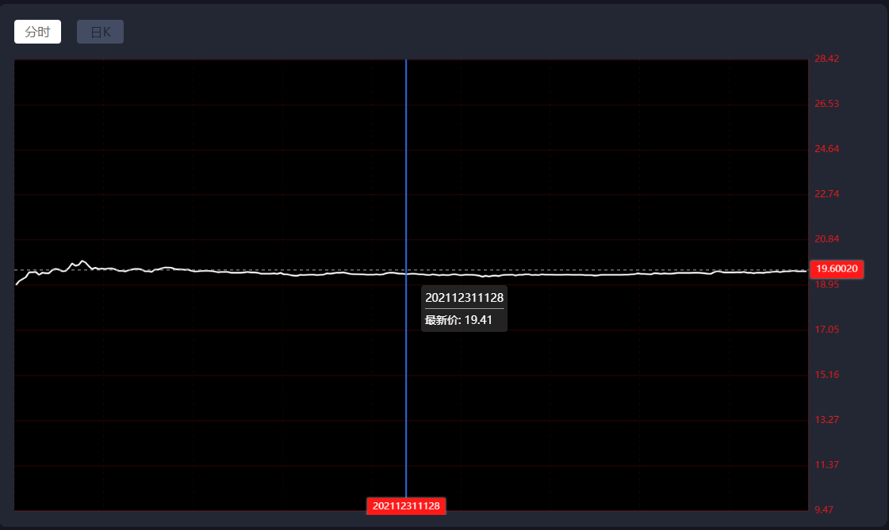

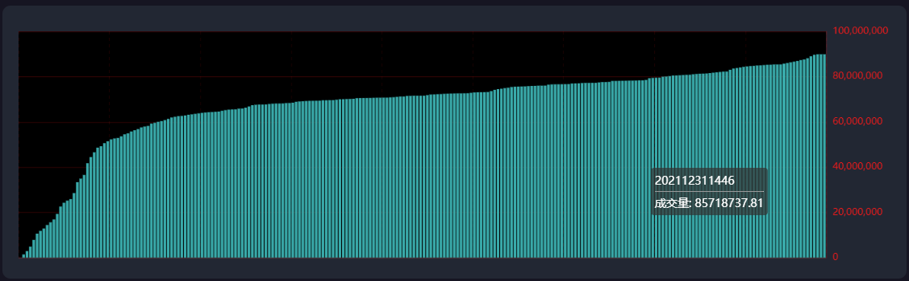

#### 2）个股分时K线行情接口说明

~~~tex
功能描述：查询个股的分时行情数据，也就是统计指定股票T日每分钟的交易数据；
服务路径：/api/quot/stock/screen/time-sharing
服务方法：GET
请求参数：code(股票code)
请求频率：每分钟
响应数据字段：日期 交易量 交易金额 最低价 最高价 前收盘价 公司名称 开盘价 股票code 当前价
注意点：如果当前日期不在有效时间内，则以最近的一个股票交易时间作为查询时间点
~~~

返回数据格式：

~~~json
{
    "code": 1,
    "data": [
        {
            "date": "202112310925",//当前时间，精确到分钟
            "tradeAmt": 63263,//当前交易量
            "code": "000021",//股票编码
            "lowPrice": 15.85,//最低价格
            "preClosePrice": 15.85,//前收盘价格
            "name": "深科技",//股票名称
            "highPrice": 15.85,//最高价格
            "openPrice": 15.85,//开盘价
            "tradeVol": 1002718.55,//交易金额
            "tradePrice": 15.85//当前价格（最新价格）
        },
        {
            "date": "202112310930",
            "tradeAmt": 236890,
            "code": "000021",
            "lowPrice": 15.85,
            "preClosePrice": 15.85,
            "name": "深科技",
            "highPrice": 15.97,
            "openPrice": 15.85,
            "tradeVol": 3770610.93,
            "tradePrice": 15.96
        }
          ]
}
~~~

#### 3）DO封装

~~~java
/**
 * @author by itheima
 * @Date 2022/2/28
 * @Description 个股分时数据封装
 */
@Data
@NoArgsConstructor
@AllArgsConstructor
@Builder
public class Stock4MinuteDomain {
    /**
     * 日期，eg:202201280809
     */
   private String date;
    /**
     * 交易量
     */
   private Long tradeAmt;
    /**
     * 股票编码
     */
   private String code;
    /**
     * 最低价
     */
   private BigDecimal lowPrice;
    /**
     * 前收盘价
     */
   private BigDecimal preClosePrice;
    /**
     * 股票名称
     */
   private String name;
    /**
     * 最高价
     */
   private BigDecimal highPrice;
    /**
     * 开盘价
     */
   private BigDecimal openPrice;

    /**
     * 当前交易总金额
     */
   private BigDecimal tradeVol;
    /**
     * 当前价格
     */
   private BigDecimal tradePrice;
}
~~~

### 3.2 个股分时K线行情功能实现

#### 1）定义web服务接口

~~~java
    /**
     * 功能描述：查询单个个股的分时行情数据，也就是统计指定股票T日每分钟的交易数据；
     *         如果当前日期不在有效时间内，则以最近的一个股票交易时间作为查询时间点
     * @param code 股票编码
     * @return
     */
    @GetMapping("/stock/screen/time-sharing")
    public R<List<Stock4MinuteDomain>> stockScreenTimeSharing(String code){
        return stockService.stockScreenTimeSharing(code);
    }
~~~

#### 2）定义服务接口方法与实现

服务接口方法：

~~~java
    /**
     * 功能描述：查询单个个股的分时行情数据，也就是统计指定股票T日每分钟的交易数据；
     *         如果当前日期不在有效时间内，则以最近的一个股票交易时间作为查询时间点
     * @param code 股票编码
     * @return
     */
    R<List<Stock4MinuteDomain>> stockScreenTimeSharing(String code);
~~~

接口实现：

~~~java
    /**
     * 功能描述：查询单个个股的分时行情数据，也就是统计指定股票T日每分钟的交易数据；
     *         如果当前日期不在有效时间内，则以最近的一个股票交易时间作为查询时间点
     * @param code 股票编码
     * @return
     */
    @Override
    public R<List<Stock4MinuteDomain>> stockScreenTimeSharing(String code) {
        //1.获取最近有效的股票交易时间
        DateTime curDateTime = DateTimeUtil.getLastDate4Stock(DateTime.now());
        //获取当前日期
        Date curDate = curDateTime.toDate();
        //获取当前日期对应的开盘日期
        Date openDate = DateTimeUtil.getOpenDate(curDateTime).toDate();
        //TODO 后续删除 mock-data
        String mockDate="20220106142500";
        curDate=DateTime.parse(mockDate, DateTimeFormat.forPattern("yyyyMMddHHmmss")).toDate();
        String openDateStr="20220106093000";
        openDate=DateTime.parse(openDateStr, DateTimeFormat.forPattern("yyyyMMddHHmmss")).toDate();
        List<Stock4MinuteDomain> maps= stockRtInfoMapper.stockScreenTimeSharing(code,openDate,curDate);
        //响应前端
        return R.ok(maps);
    }
~~~

#### 3）定义mapper接口和xml

mapper接口方法：

~~~java
    /**
     * 查询指定股票在指定日期下的每分钟的成交流水信息
     * @param code 股票编码
     * @param avlDate 最近的股票有效交易日期
     * @return
     */
    List<Stock4MinuteDomain> stockScreenTimeSharing(@Param("stockCode") String code, @Param("startDate") Date avlDate, @Param("endtDate") Date endDate);
~~~

xml sql绑定：

~~~xml
    <select id="stockScreenTimeSharing" resultType="com.itheima.stock.common.domain.Stock4MinuteDomain">
        select
            date_format(sri.cur_time,'%Y%m%d%H%i') as date,
            sri.trade_amount as tradeAmt,
            sri.stock_code as code,
            sri.min_price lowPrice,
            sri.pre_close_price as preClosePrice,
            sri.stock_name as name,
            sri.max_price as highPrice,
            sri.open_price as openPrice,
            sri.trade_volume as tradeVol,
            sri.cur_price as tradePrice
                from stock_rt_info as sri
                where	sri.stock_code=#{stockCode}
                  and sri.cur_time between #{startDate} and #{endtDate}
    </select>
~~~

#### 4）web接口测试

postman测试：http://localhost:8080/api/quot/stock/screen/time-sharing?code=600019

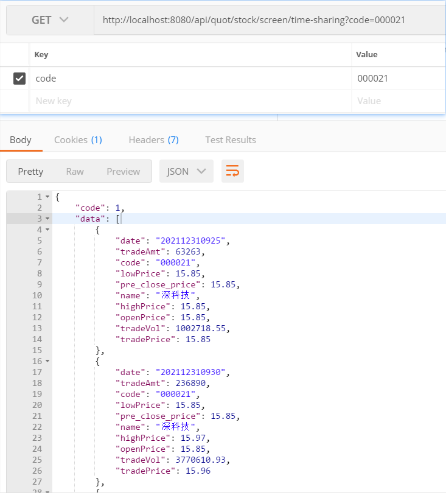

页面效果：

## 4.个股日K线详情功能

### 4.1 个股日K线详情功能分析

#### 1）个股日K线详情功能原型

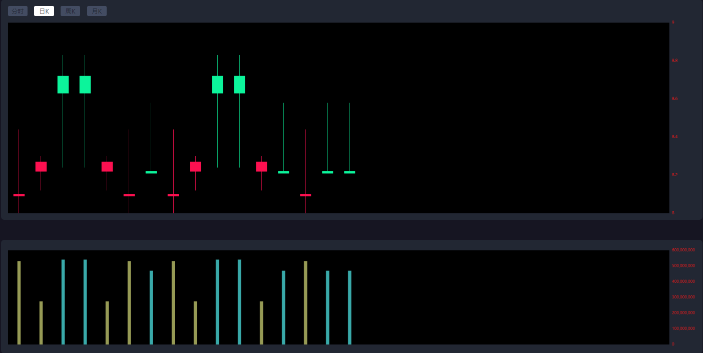

#### 2）个股日K线详情功能接口说明

~~~Tex
功能描述：个股日K数据查询 ，可以根据时间区间查询数日的K线数据
		默认查询历史20天的数据；
服务路径：/api/quot/stock/screen/dkline
服务方法：GET
请求参数：code(股票编码)
请求频率：每分钟
~~~

数据结构：

~~~json
{
    "code": 1,
    "data": [
        {
            "date": "20211220",//日期
            "tradeAmt": 28284252,//交易量(指收盘时的交易量，如果当天未收盘，则显示最新数据)
            "code": "000021",//股票编码
            "lowPrice": 16,//最低价格（指收盘时记录的最低价，如果当天未收盘，则显示最新数据）
            "name": "深科技",//名称
            "highPrice": 16.83,//最高价（指收盘时记录的最高价，如果当天未收盘，则显示最新数据）
            "openPrice": 16.8,//开盘价
            "tradeVol": 459088567.58,//交易金额（指收盘时记录交易量，如果当天未收盘，则显示最新数据）
            "closePrice": 16.81//当前收盘价（指收盘时的价格，如果当天未收盘，则显示最新cur_price）
            "preClosePrice": 16.81//前收盘价
        },
        //......
    ]
}
~~~

#### 3)DO封装

~~~java

/**
 * @author by itheima
 * @Date 2022/2/28
 * @Description 个股日K数据封装
 */
@Data
@NoArgsConstructor
@AllArgsConstructor
@Builder
public class Stock4EvrDayDomain {
    /**
     * 日期，eg:202201280809
     */
   private String date;
    /**
     * 交易量
     */
   private Long tradeAmt;
    /**
     * 股票编码
     */
   private String code;
    /**
     * 最低价
     */
   private BigDecimal lowPrice;
    /**
     * 股票名称
     */
    private String name;
    /**
     * 最高价
     */
    private BigDecimal highPrice;
    /**
     * 开盘价
     */
    private BigDecimal openPrice;
    /**
     * 当前交易总金额
     */
    private BigDecimal tradeVol;
    /**
     * 当前收盘价格指收盘时的价格，如果当天未收盘，则显示最新cur_price）
     */
    private BigDecimal closePrice;
    /**
     * 前收盘价
     */
   private BigDecimal preClosePrice;
}
~~~

#### 4）个股日K线详情实现思路

~~~tex
1.统计指定股票在指定日期范围内，每天日期的最大值（收盘时间）;
2.查询在指定时间(步骤1的收盘时间)对应的股票数据；
~~~

### 4.2 个股日K线详情功能实现

#### 1）定义web接口方法

~~~java

    /**
     * 单个个股日K 数据查询 ，可以根据时间区间查询数日的K线数据
     * @param stockCode 股票编码
     */
    @RequestMapping("/stock/screen/dkline")
    public R<List<Map>> getDayKLinData(@RequestParam("code") String stockCode){
        return stockService.stockCreenDkLine(stockCode);
    }
~~~

#### 2）定义服务方法和实现

服务接口方法：

~~~java
    /**
     * 单个个股日K 数据查询 ，可以根据时间区间查询数日的K线数据
     * @param stockCode 股票编码
     */
    R<List<Stock4EvrDayDomain>> stockCreenDkLine(String code);
~~~

服务接口实现方法：

~~~java
    /**
     * 功能描述：单个个股日K数据查询 ，可以根据时间区间查询数日的K线数据
     * 		默认查询历史20天的数据；
     * @param code 股票编码
     * @return
     */
    @Override
    public R<List<Stock4EvrDayDomain>> stockCreenDkLine(String code) {
        //获取当前日期前推20天
        DateTime curDateTime = DateTimeUtil.getLastDate4Stock(DateTime.now());
        //当前时间节点
        Date curTime = curDateTime.toDate();
        //前推20
        Date pre20Day = curDateTime.minusDays(20).toDate();

        //TODO 后续删除
        String avlDate="20220106142500";
        curTime=DateTime.parse(avlDate, DateTimeFormat.forPattern("yyyyMMddHHmmss")).toDate();
        String openDate="20220101093000";
        pre20Day=DateTime.parse(openDate, DateTimeFormat.forPattern("yyyyMMddHHmmss")).toDate();
        List<Stock4EvrDayDomain> infos = stockRtInfoMapper.stockCreenDkLine(code, pre20Day, curTime);
        return R.ok(infos);
    }
~~~

### 4.3 个股日K线详情功能SQL分析

#### 3) SQL分析

~~~sql
说明：因为在股票流水中，开盘价、最高价、最低价、当前价等信息在每条记录中都会记录，所以我们更加关注的是每天的收盘价格，业务要求如果当前没有收盘，则以最新价格作为收盘价，所以该业务就可以转化成查询每天最大交易时间对应的信息；
步骤1：查询指定股票在指定日期范围内每天的最大时间，说白了就是以天分组，求每天最大时间
select
	max( sri.cur_time ) as closeDate 
from
	stock_rt_info as sri 
where
	sri.stock_code ='600021' 
	and sri.cur_time between '20220101093000' and '20220106142500' 
group by
	date_format( sri.cur_time, '%Y%m%d' )
步骤2：以步骤1查询结果作为条件，同统计指定时间点下，股票的数据信息
        select
            date_format(sri2.cur_time,'%Y%m%d'),
            sri2.trade_amount as tradeAmt,
            sri2.stock_code as code,
            sri2.min_price as lowPrice,
            sri2.stock_name as name,
            sri2.max_price as highPrice,
            sri2.open_price as openPrice,
            sri2.trade_volume as tradeVol,
            sri2.cur_price as closePrice,
            sri2.pre_close_price as preClosePrice
        from
            stock_rt_info as sri2
        where sri2.stock_code='600021'  and sri2.cur_time in (
          select
          	max( sri.cur_time ) as closeDate 
          from
          	stock_rt_info as sri 
          where
          	sri.stock_code ='600021' 
          	and sri.cur_time between '20220101093000' and '20220106142500' 
          group by
          	date_format( sri.cur_time, '%Y%m%d' )
        )	
~~~

#### 4）定义mapper接口方法与xml

在StockRtInfoMapper定义接口方法：

~~~java
    /**
     *  统计指定股票在指定日期范围内的每天交易数据统计
     * @param code 股票编码
     * @param beginDate 前推的日期时间
     * @return
     */
    List<Stock4EvrDayDomain> stockCreenDkLine(@Param("stockCode") String code, @Param("beginDate") Date beginDate, @Param("endDate") Date endDate);
~~~

在StockRtInfoMapper.xml定义sql：	

~~~xml
    <select id="stockCreenDkLine" resultType="com.itheima.stock.common.domain.Stock4EvrDayDomain">
        select
            date_format(sri2.cur_time,'%Y%m%d'),
            sri2.trade_amount as tradeAmt,
            sri2.stock_code as code,
            sri2.min_price as lowPrice,
            sri2.stock_name as name,
            sri2.max_price as highPrice,
            sri2.open_price as openPrice,
            sri2.trade_volume as tradeVol,
            sri2.cur_price as closePrice,
            sri2.pre_close_price as preClosePrice
        from
            stock_rt_info as sri2
        where sri2.stock_code=#{stockCode} and sri2.cur_time in (
            select
            max(sri.cur_time) as closeDate
        from stock_rt_info as sri
        where sri.stock_code=#{stockCode} and sri.cur_time between #{beginDate} and #{endDate}
        group by date_format(sri.cur_time,'%Y%m%d')
            )
    </select>
~~~

#### 5）web接口测试

postman测试：http://localhost:8080/api/quot/stock/screen/dkline?code=600019

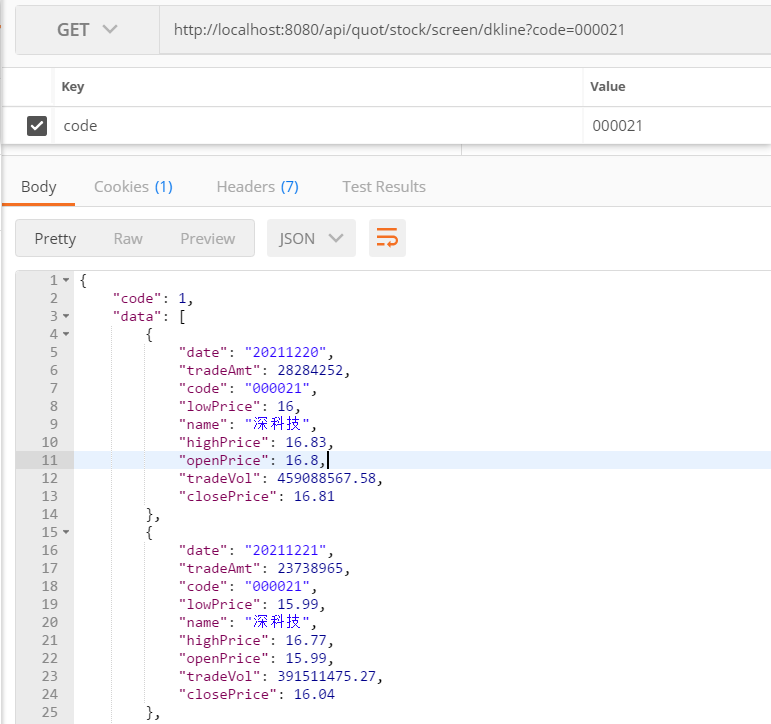

页面效果：

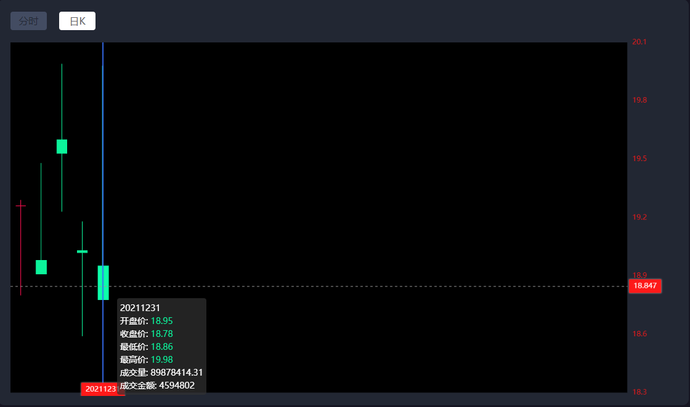

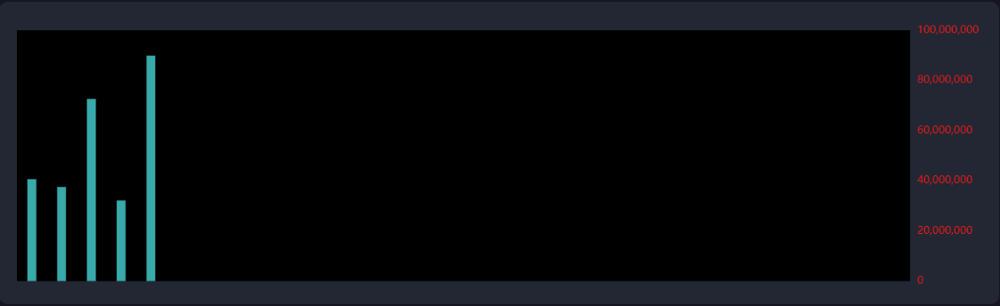

#### 6）逻辑拆分实现[作业]

分析：

~~~tex
当前SQL以嵌套查询的方式实现，但是对于股票流水表，随着时间的积累数据量会越来越大，后期我们肯定会进行分库分表处理，而嵌套的查询可能会带来跨库跨表查询的情况，造成性能瓶颈问题，所以我们可以将该业务拆解实现；
第一步：仅仅查询指定股票在指定日期范围内的每天的最大时间；
第二步：将第一步的结果作为条件查询对应的数据；
上述两步封装到两个mapper接口方法中，通过服务逻辑调用实现；
~~~

【1】定义查询指定时间范围下股票每日的最大日期的接口方法

~~~java
    /**
     * 获取指定日期范围内的收盘价格
     * @param code 股票编码
     * @param beginDate 起始时间
     * @param endDate 结束时间
     * @return
     */
    List<Date> getCloseDates(@Param("code") String code, @Param("beginDate") Date beginDate, @Param("endDate") Date endDate);
~~~

绑定xml：

~~~xml
    <select id="getCloseDates" resultType="java.util.Date">
        select
            max(sri.cur_time) as closeDate
        from stock_rt_info as sri
        where sri.stock_code=#{code} and sri.cur_time between #{beginDate} and #{endDate}
        group by date_format(sri.cur_time,'%Y%m%d')
    </select>
~~~

【2】定义批量查询指定时间点下股票数据接口方法

~~~java
    /**
     * 获取指定股票在指定日期下的数据
     * @param code 股票编码
     * @param dates 指定日期集合
     * @return
     */
    List<Stock4EvrDayDomain> getStockCreenDkLineData(@Param("code") String code, @Param("dates") List<Date> dates);
~~~

xml绑定：

~~~xml
    <select id="getStockCreenDkLineData" resultType="com.itheima.stock.common.domain.Stock4EvrDayDomain">
             select
                 date_format(sri2.cur_time,'%Y%m%d') as date,
                 sri2.trade_amount as tradeAmt,
                 sri2.stock_code as code,
                 sri2.min_price as lowPrice,
                 sri2.stock_name as name,
                 sri2.max_price as highPrice,
                 sri2.open_price as openPrice,
                 sri2.trade_volume as tradeVol,
                 sri2.cur_price as closePrice,
                 sri2.pre_close_price as preClosePrice
             from stock_rt_info as sri2
                where sri2.stock_code=#{code} and sri2.cur_time in
                <foreach collection="dates" item="date" open="(" close=")" separator=",">
                    #{date}
                </foreach>
    </select>
~~~

【3】调整服务逻辑

~~~java
    /**
     * 功能描述：单个个股日K数据查询 ，可以根据时间区间查询数日的K线数据
     * 		默认查询历史20天的数据；
     * @param code 股票编码
     * @return
     */
    @Override
    public R<List<Stock4EvrDayDomain>> stockCreenDkLine(String code) {
        //获取当前日期前推20天
        DateTime curDateTime = DateTimeUtil.getLastDate4Stock(DateTime.now());
        //当前时间节点
        Date curTime = curDateTime.toDate();
        //前推20
        Date pre20Day = curDateTime.minusDays(20).toDate();

        //TODO 后续删除
        String avlDate="20220106142500";
        curTime=DateTime.parse(avlDate, DateTimeFormat.forPattern("yyyyMMddHHmmss")).toDate();
        String openDate="20220101093000";
        pre20Day=DateTime.parse(openDate, DateTimeFormat.forPattern("yyyyMMddHHmmss")).toDate();
       // List<Stock4EvrDayDomain> infos = stockRtInfoMapper.stockCreenDkLine(code, pre20Day, curTime);
        //获取指定范围的收盘日期集合
        List<Date> closeDates=stockRtInfoMapper.getCloseDates(code,pre20Day,curTime);
        //根据收盘日期精准查询，如果不在收盘日期，则查询最新数据
        List<Stock4EvrDayDomain> infos= stockRtInfoMapper.getStockCreenDkLineData(code,closeDates);
        return R.ok(infos);
    }
~~~

