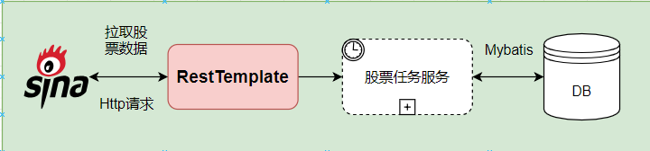
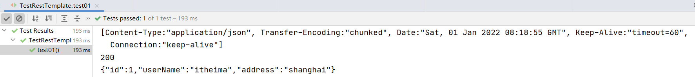
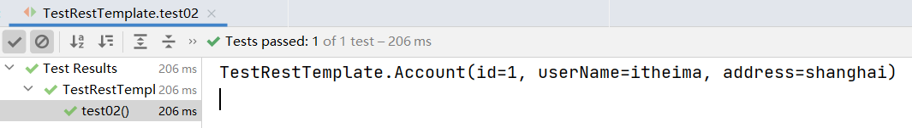
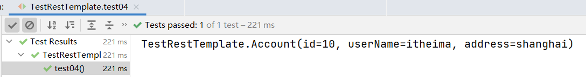
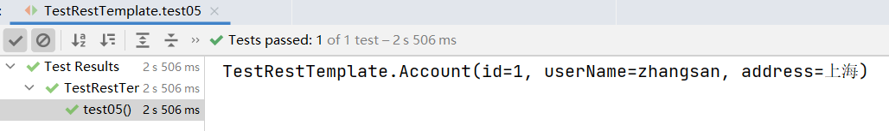
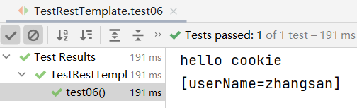
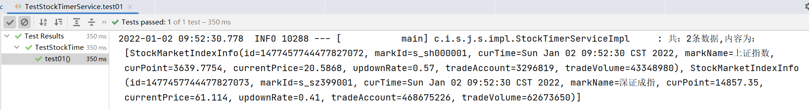
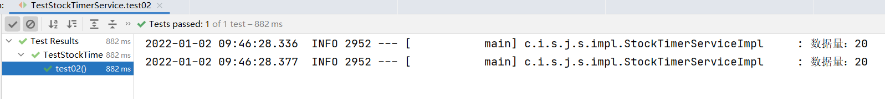
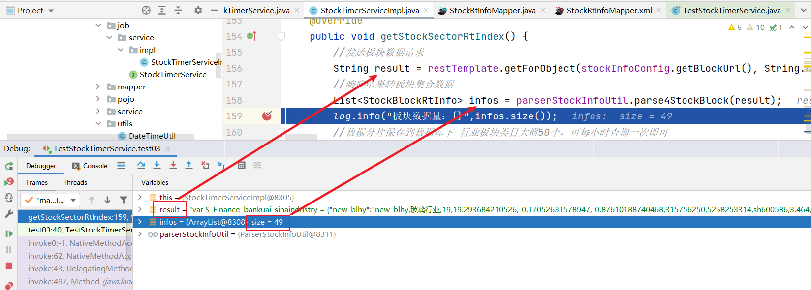

# 今日指数-day05

## 今日目标

~~~tex
1.掌握RestTemplate基本使用;
2.阅读并理解第三方股票接口API;
3.基于RestTemplate实现国内大盘数据采集功能;
   3.1 项目集成RestTemplate;
   3.2 理解基于正则解析响应数据原理;
   3.3 掌握常用lambda集合流操作;
4.基于RestTemplate实现国内板块和股票流水数据采集功能;
5.熟悉mybatis批量插入实现;
~~~

## 1.RestTemplate入门

### 1.1 RestTemplate环境准备

#### 1）背景说明

~~~tex
当前我们的数据库中的股票数据都是伪造出来的，实际上项目中的股票数据需要借助第三方接口实时拉取；
Spring框架已为我们封装了一套后端访问http接口的模板工具：RestTemplate。
RestTemplate非常轻量级，使用简单易上手。
~~~



其它http请求组件：

~~~tex
RestTemplate:首推---》使用非常简单 
HttpClient:apache
OkHttpClient
~~~

准备：启动http访问服务的测试工程：day05\资料\http测试接口工程\test4http

#### 2）工程配置RestTemplate

在stock_backend工程下配置RestTemplate bean：

~~~java
package com.itheima.stock.config;

import org.springframework.context.annotation.Bean;
import org.springframework.context.annotation.Configuration;
import org.springframework.web.client.RestTemplate;

/**
 * @author by itheima
 * @Date 2022/1/1
 * @Description 定义访问http服务的配置类
 */
@Configuration
public class HttpClientConfig {
    /**
     * 定义restTemplate bean
     * @return
     */
    @Bean
    public RestTemplate restTemplate(){
        return new RestTemplate();
    }
}
~~~

### 1.2 RestTemplate API入门-1

#### 1）get请求携带参数访问外部url

~~~java
package com.itheima.stock;

import org.junit.jupiter.api.Test;
import org.springframework.beans.factory.annotation.Autowired;
import org.springframework.boot.test.context.SpringBootTest;
import org.springframework.http.HttpHeaders;
import org.springframework.http.HttpStatus;
import org.springframework.http.ResponseEntity;
import org.springframework.web.client.RestTemplate;

/**
 * @author by itheima
 * @Date 2022/1/1
 * @Description
 */
@SpringBootTest
public class TestRestTemplate {

    @Autowired
    private RestTemplate restTemplate;

    /**
     * 测试get请求携带url参数，访问外部接口
     */
    @Test
    public void test01(){
        String url="http://localhost:6666/account/getByUserNameAndAddress?userName=itheima&address=shanghai";
        /*
          参数1：url请求地址
          参数2：请求返回的数据类型
         */
        ResponseEntity<String> result = restTemplate.getForEntity(url, String.class);
        //获取响应头
        HttpHeaders headers = result.getHeaders();
        System.out.println(headers.toString());
        //响应状态码
        int statusCode = result.getStatusCodeValue();
        System.out.println(statusCode);
        //响应数据
        String respData = result.getBody();
        System.out.println(respData);
    }
}
~~~

效果：



#### 2）get请求响应数据自动封装vo实体对象

~~~java
    /**
     * 测试响应数据自动封装到vo对象
     */
    @Test
    public void test02(){
        String url="http://localhost:6666/account/getByUserNameAndAddress?userName=itheima&address=shanghai";
        /*
          参数1：url请求地址
          参数2：请求返回的数据类型
         */
        Account account = restTemplate.getForObject(url, Account.class);
        System.out.println(account);
    }

    @Data
    public static class Account {

        private Integer id;

        private String userName;

        private String address;
        
    }
~~~

效果：



#### 3）请求头携带参数访问外部接口

~~~java
    /**
     * 请求头设置参数，访问指定接口
     */
    @Test
    public void test03(){
        String url="http://localhost:6666/account/getHeader";
        //设置请求头参数
        HttpHeaders headers = new HttpHeaders();
        headers.add("userName","zhangsan");
        //请求头填充到请求对象下
        HttpEntity<Map> entry = new HttpEntity<>(headers);
        //发送请求
        ResponseEntity<String> responseEntity = restTemplate.exchange(url, HttpMethod.GET, entry, String.class);
        String result = responseEntity.getBody();
        System.out.println(result);
    }
~~~

效果：


### 1.3 RestTemplate API入门-2

#### 4）POST请求模拟form表单访问外部接口

~~~java
    /**
     * post模拟form表单提交数据
     */
    @Test
    public void test04(){
        String url="http://localhost:6666/account/addAccount";
        //设置请求头，指定请求数据方式
        HttpHeaders headers = new HttpHeaders();
        headers.add("Content-type","application/x-www-form-urlencoded");
        //组装模拟form表单提交数据
        LinkedMultiValueMap<String, Object> map = new LinkedMultiValueMap<>();
        map.add("id","10");
        map.add("userName","itheima");
        map.add("address","shanghai");
        HttpEntity<LinkedMultiValueMap<String, Object>> httpEntity = new HttpEntity<>(map, headers);
        /*
            参数1：请求url地址
            参数2：请求方式 POST
            参数3：请求体对象，携带了请求头和请求体相关的参数
            参数4：响应数据类型
         */
        ResponseEntity<Account> exchange = restTemplate.exchange(url, HttpMethod.POST, httpEntity, Account.class);
        Account body = exchange.getBody();
        System.out.println(body);
    }
~~~

效果：



#### 5）POST请求发送JSON数据

~~~java
    /**
     * post发送json数据
     */
    @Test
    public void test05(){
        String url="http://localhost:6666/account/updateAccount";
        //设置请求头的请求参数类型
        HttpHeaders headers = new HttpHeaders();
        headers.add("Content-type","application/json; charset=utf-8");
        //组装json格式数据
//        HashMap<String, String> reqMap = new HashMap<>();
//        reqMap.put("id","1");
//        reqMap.put("userName","zhangsan");
//        reqMap.put("address","上海");
//        String jsonReqData = new Gson().toJson(reqMap);
        String jsonReq="{\"address\":\"上海\",\"id\":\"1\",\"userName\":\"zhangsan\"}";
        //构建请求对象
        HttpEntity<String> httpEntity = new HttpEntity<>(jsonReq, headers);
          /*
            发送数据
            参数1：请求url地址
            参数2：请求方式
            参数3：请求体对象，携带了请求头和请求体相关的参数
            参数4：响应数据类型
         */
        ResponseEntity<Account> responseEntity = restTemplate.exchange(url, HttpMethod.POST, httpEntity, Account.class);
      //或者
     // Account account=restTemplate.postForObject(url,httpEntity,Account.class);
        Account body = responseEntity.getBody();
        System.out.println(body);
    }
~~~

效果：



#### 6）获取接口响应的cookie数据

~~~java
    /**
     * 获取请求cookie值
     */
    @Test
    public void test06(){
        String url="http://localhost:6666/account/getCookie";
        ResponseEntity<String> result = restTemplate.getForEntity(url, String.class);
        //获取cookie
        List<String> cookies = result.getHeaders().get("Set-Cookie");
        //获取响应数据
        String resStr = result.getBody();
        System.out.println(resStr);
        System.out.println(cookies);
    }
~~~

效果：



## 2.金融股票API接口说明

### 1）接口说明

目前市面上有一些正规的API金融接口，可为我们提供实时的股票金融数据，同时也提供有较为完整的开发文档，用起来也会更方便一些，但是大多是付费的（关于股票数据，沪深官方不提供给一般的投资者，需要有一定的资质才可以！）；

以下为可用的股票API接口：

| 提供方   | 地址                                       | 是否收费 |
| ----- | ---------------------------------------- | ---- |
| 新浪财经  | https://hq.sinajs.cn/list=sh601003,sh601001 | 否    |
| 腾讯财经  | http://qt.gtimg.cn/q=sh601003,sh601001   | 否    |
| 雪球    | https://stock.xueqiu.com/v5/stock/realtime/quotec.json?symbol=SH601003,SH601001 | 付费   |
| 聚合数据  | https://www.juhe.cn/                     | 付费   |
| 阿里云社区 | https://market.aliyun.com/products/56956004/ | 付费   |

参考：**day05\资料\股票接口**

### 2）sina API接口说明

我们当前以新浪接口为例获取股票实时数据，新浪财经提供了国内大盘、外盘、板块等数据的接口，比如：

~~~js
获取国内大盘实时数据：
    http://hq.sinajs.cn/list=s_sh000001,s_sz399001
    数据响应格式：
    var hq_str_s_sh000001="上证指数,3639.7754,20.5868,0.57,3296819,43348980";
    var hq_str_s_sz399001="深证成指,14857.35,61.114,0.41,468675226,62673650";
-------------------------------------------------------------------------------------------- 
获取国外大盘实时数据：
	http://hq.sinajs.cn/list=int_dji,int_nasdaq,int_hangseng,int_nikkei,b_TWSE,b_FSSTI
	数据响应格式：
	var hq_str_int_dji="道琼斯,36338.30,-59.78,-0.16";
    var hq_str_int_nasdaq="纳斯达克,15644.97,-96.59,-0.61";
    var hq_str_int_hangseng="恒生指数,23397.67,285.66,1.24";
    var hq_str_int_nikkei="日经指数,28791.71,-115.17,-0.40";
    var hq_str_b_TWSE="台湾台北指数,18218.84,-29.44,-0.16";
    var hq_str_b_FSSTI="富时新加坡海峡时报指数,3123.68,-2.96,-0.09";
-------------------------------------------------------------------------------------------- 
获取国内股票实时数据：
	http://hq.sinajs.cn/list=sz000002,sh600015
	数据响应格式：
	var hq_str_sz000002="万 科Ａ,19.140,19.120,19.760,19.970,19.100,19.750,19.760,115918655,2275602656.000,63100,19.750,101500,19.740,119300,19.730,148300,19.720,163700,19.710,64066,19.760,159900,19.770,201000,19.780,398002,19.790,610600,19.800,2021-12-31,15:00:03,00";
	var hq_str_sh600015="华夏银行,5.590,5.590,5.600,5.610,5.580,5.590,5.600,18110584,101293498.000,1019571,5.590,2017808,5.580,742200,5.570,323100,5.560,158000,5.550,671217,5.600,1811303,5.610,1101018,5.620,515467,5.630,333800,5.640,2021-12-31,15:00:00,00,";
--------------------------------------------------------------------------------------------
获取国内股票板块实时数据：
	http://vip.stock.finance.sina.com.cn/q/view/newSinaHy.php
	数据格式：
	var S_Finance_bankuai_sinaindustry = {
"new_blhy":"new_blhy,玻璃行业,19,19.293684210526,-0.17052631578947,-0.87610188740468,315756250,5258253314,sh600586,3.464,9.260,0.310,金晶科技",
"new_cbzz":"new_cbzz,船舶制造,8,12.15875,0.0125,0.10291242152928,214866817,2282104956,sh600150,0.978,24.790,0.240,中国船舶",
  //........省略.......
}
~~~

## 3.股票国内大盘数据采集

### 3.1 股票国内大盘数据采集准备

#### 1）股票常量数据配置

配置大盘、板块、股票相关的通用参数：

~~~yml
# 配置股票相关的参数
stock:
  inner: # 国内大盘ID
    - s_sh000001 # 上证ID
    - s_sz399001 #  深证ID
  outer: # 外盘ID
    - int_dji # 道琼斯
    - int_nasdaq # 纳斯达克
    - int_hangseng # 恒生
    - int_nikkei # 日经指数
    - b_TWSE # 台湾加权
    - b_FSSTI # 新加坡
  marketUrl: http://hq.sinajs.cn/list=
  blockUrl: http://vip.stock.finance.sina.com.cn/q/view/newSinaHy.php    
~~~

#### 2）股票常量数据封装

~~~java
package com.itheima.stock.common.domain;

import lombok.Data;
import org.springframework.boot.context.properties.ConfigurationProperties;
import java.util.List;
/**
 * @author by itheima
 * @Date 2021/12/30
 * @Description
 */
@ConfigurationProperties(prefix = "stock")
@Data
public class StockInfoConfig {
    //a股大盘ID集合
    private List<String> inner;
    //外盘ID集合
    private List<String> outer;
    //大盘参数获取url
    private String marketUrl;
    //板块参数获取url
    private String blockUrl;
}
~~~

 在main启动类开启配置:

~~~java
@SpringBootApplication
@MapperScan("com.itheima.stock.mapper")
@EnableConfigurationProperties(StockInfoConfig.class)//开启常用参数配置bean
public class StockApp {
    public static void main(String[] args) {
        SpringApplication.run(StockApp.class,args);
    }
}
~~~

#### 3）国内大盘响应数据说明

~~~js
var hq_str_s_sh000001="上证指数,3094.668,-128.073,-3.97,436653,5458126";
数据含义----------->指数名称,当前点数,当前价格,涨跌率,成交量（手）,成交额（万元）;
~~~

#### 4) 回顾java正则

参考：**day05\资料\Java正则表达式.mhtml**

~~~java
    @Test
    public void testRep2(){
        // 按指定模式在字符串查找
        String line = "This order was placed for QT3000! OK?";
        String pattern = "(\\D*)(\\d+)(.*)";

        // 创建 Pattern 对象
        Pattern r = Pattern.compile(pattern);

        // 现在创建 matcher 对象
        Matcher m = r.matcher(line);
        if (m.find( )) {
            System.out.println("Found value: " + m.group(0) );
            System.out.println("Found value: " + m.group(1) );
            System.out.println("Found value: " + m.group(2) );
            System.out.println("Found value: " + m.group(3) );
        } else {
            System.out.println("NO MATCH");
        }
    }
~~~

### 3.2 股票国内大盘数据拉去实现

#### 1）定义股票大盘数据采集服务接口

服务接口：

~~~java
/**
 * @author by itheima
 * @Date 2022/1/14
 * @Description 定义采集股票数据的定时任务的服务接口
 */
public interface StockTimerTaskService {
    /**
     * 获取国内大盘的实时数据信息
     */
    void getInnerMarketInfo();
} 
~~~

定义服务接口实现：

~~~java
@Service("stockTimerTaskService")
@Slf4j
public class StockTimerTaskServiceImpl implements StockTimerTaskService {

    @Autowired
    private RestTemplate restTemplate;

    @Autowired
    private StockInfoConfig stockInfoConfig;

    @Autowired
    private IdWorker idWorker;

    @Override
    public void getInnerMarketInfo() {
        //组装动态url
        //http://hq.sinajs.cn/list=s_sh000001,s_sz399001
        String innerUrl=stockInfoConfig.getMarketUrl()+String.join(",",stockInfoConfig.getInner());
        //设置请求头信息
        HttpHeaders headers = new HttpHeaders();
        headers.add("Referer","https://finance.sina.com.cn/stock/");
        headers.add("User-Agent","Mozilla/5.0 (Windows NT 10.0; WOW64) AppleWebKit/537.36 (KHTML, like Gecko) Chrome/72.0.3626.121 Safari/537.36");
        //发起请求
        String result = restTemplate.postForObject(innerUrl, new HttpEntity<>(headers), String.class);
//        String result = restTemplate.getForObject(innerUrl, String.class);
        String reg="var hq_str_(.+)=\"(.+)\";";
        Pattern pattern = Pattern.compile(reg);
        Matcher matcher = pattern.matcher(result);
        //收集大盘封装后后的对象
        ArrayList<StockMarketIndexInfo> list = new ArrayList<>();
        while (matcher.find()) {
            //获取大盘的id
            String marketCode = matcher.group(1);
            System.out.println(marketCode);
            //其它信息
            String other = matcher.group(2);
            String[] others = other.split(",");
            //大盘名称
            String marketName=others[0];
            //当前点
            BigDecimal curPoint=new BigDecimal(others[1]);
            //当前价格
            BigDecimal curPrice=new BigDecimal(others[2]);
            //涨跌率
            BigDecimal upDownRate=new BigDecimal(others[3]);
            //成交量
            Long tradeAmount=Long.valueOf(others[4]);
            //成交金额
            Long tradeVol=Long.valueOf(others[5]);
            //当前日期
            Date now = DateTimeUtil.getDateTimeWithoutSecond(DateTime.now()).toDate();
            //封装对象
            StockMarketIndexInfo stockMarketIndexInfo = StockMarketIndexInfo.builder().id(idWorker.nextId()+"")
                    .markName(marketName)
                    .tradeVolume(tradeVol)
                    .tradeAccount(tradeAmount)
                    .updownRate(upDownRate)
                    .curTime(now)
                    .curPoint(curPoint)
                    .currentPrice(curPrice)
                    .markId(marketCode)
                    .build();
            list.add(stockMarketIndexInfo);
        };
        log.info("集合长度：{}，内容：{}",list.size(),list);
        //批量插入
        if (CollectionUtils.isEmpty(list)) {
            log.info("");
            return;
        }
        String curTime = DateTime.now().toString(DateTimeFormat.forPattern("yyyyMMddHHmmss"));
        log.info("采集的大盘数据：{},当前时间：{}",list,curTime);
        //TODO 后续完成批量插入功能
    }
} 
~~~

#### 2）国内股票大盘数据采集单元测试

~~~java
package com.itheima.stock;

import com.itheima.stock.job.service.StockTimerService;
import org.junit.jupiter.api.Test;
import org.springframework.beans.factory.annotation.Autowired;
import org.springframework.boot.test.context.SpringBootTest;

/**
 * @author by itheima
 * @Date 2022/1/1
 * @Description
 */
@SpringBootTest
public class TestStockTimerService {
    @Autowired
    private StockTimerTaskService stockTimerService;

    /**
     * 获取大盘数据
     */
    @Test
    public void test01(){
        stockTimerService.getInnerMarketInfo();
    }
}    
~~~



### 3.3 大盘数据批量保存功能实现

#### 1）定义mapper接口方法

在StockMarketIndexInfoMapper接口添加方法：

~~~java
    /**
     * 批量插入股票大盘数据
     * @param infos
     */
    int insertBatch(List<StockMarketIndexInfo> infos);
~~~

#### 2）绑定xml sql

在StockMarketIndexInfoMapper.xml添加sql：

~~~xml
    <insert id="insertBatch">
        insert into stock_market_index_info
        ( id,mark_Id,cur_time
        ,mark_name,cur_point,current_price
        ,updown_rate,trade_account,trade_volume
        )
        values
        <foreach collection="list" item="smi" separator=",">
            (#{smi.id,jdbcType=BIGINT},#{smi.markId,jdbcType=CHAR},#{smi.curTime,jdbcType=TIMESTAMP}
            ,#{smi.markName,jdbcType=VARCHAR},#{smi.curPoint,jdbcType=DECIMAL},#{smi.currentPrice,jdbcType=DECIMAL}
            ,#{smi.updownRate,jdbcType=DECIMAL},#{smi.tradeAccount,jdbcType=BIGINT},#{smi.tradeVolume,jdbcType=BIGINT}
            )
        </foreach>
    </insert>
~~~

#### 3）国内大盘数据批量插入实现

注入mapper，然后批量插入：

~~~java
    @Autowired
    private StockMarketIndexInfoMapper stockMarketIndexInfoMapper;  

	/**
     * 获取国内大盘数据
     */
    @Override
    public void getInnerMarketInfo() {
		//....省略N行....
        //批量插入
        int count = this.stockMarketIndexInfoMapper.insertBatch(infos);
        log.info("批量插入了：{}条数据",count);
    }
~~~

## 4.股票实时数据采集

### 4.1 股票数据采集准备

#### 1）股票响应数据结构说明

~~~js
var hq_str_sh601006="大秦铁路, 27.55, 27.25, 26.91, 27.55, 26.20, 26.91, 26.92,22114263, 589824680, 4695, 26.91, 57590, 26.90, 14700, 26.89, 14300,
26.88, 15100, 26.87, 3100, 26.92, 8900, 26.93, 14230, 26.94, 25150, 26.95, 15220, 26.96, 2008-01-11, 15:05:32";
这个字符串由许多数据拼接在一起，不同含义的数据用逗号隔开了，按照程序员的思路，顺序号从0开始。
0：”大秦铁路”，股票名字；
1：”27.55″，今日开盘价；
2：”27.25″，昨日收盘价；
3：”26.91″，当前价格；
4：”27.55″，今日最高价；
5：”26.20″，今日最低价；
6：”26.91″，竞买价，即“买一”报价；
7：”26.92″，竞卖价，即“卖一”报价；
8：”22114263″，成交的股票数，由于股票交易以一百股为基本单位，所以在使用时，通常把该值除以一百；
9：”589824680″，成交金额，单位为“元”，为了一目了然，通常以“万元”为成交金额的单位，所以通常把该值除以一万；
10：”4695″，“买一”申请4695股，即47手；
11：”26.91″，“买一”报价；
12：”57590″，“买二”
13：”26.90″，“买二”
14：”14700″，“买三”
15：”26.89″，“买三”
16：”14300″，“买四”
17：”26.88″，“买四”
18：”15100″，“买五”
19：”26.87″，“买五”
20：”3100″，“卖一”申报3100股，即31手；
21：”26.92″，“卖一”报价
(22, 23), (24, 25), (26,27), (28, 29)分别为“卖二”至“卖四的情况”
30：”2008-01-11″，日期；
31：”15:05:32″，时间；
~~~

我们发现数据结构与大盘数据一致；

#### 2）股票编码注意事项

~~~tex
1、创业板 创业板的代码是300打头的股票代码；
2、沪市A股 沪市A股的代码是以600、601或603打头；★★★
3、沪市B股 沪市B股的代码是以900打头；
4、深市A股 深市A股的代码是以000打头；★★★
5、中小板 中小板的代码是002打头；
6、深圳B股 深圳B股的代码是以200打头；
7、新股申购 沪市新股申购的代码是以730打头 深市新股申购的代码与深市股票买卖代码一样；
8、配股代码 沪市以700打头，深市以080打头 权证，沪市是580打头 深市是031打头；
9、 400开头的股票是三板市场股票；
~~~

注意：我们当前的平台仅仅统计沪深两市A股的数据；

#### 3）思路分析

国内A股上市企业达3000+，一次性批量获取某个时间点下股票的详情数据，显然网络IO开销过大，我们可以尝试将A股的id集合做数据分片，然后再分批次批量获取股票的实时信息；

所以接下来，我们先完成获取A股code编码集合的功能；

#### 4）获取A股股票code信息

在StockBusinessMapper 接口定义方法：

```java
    /**
     * 获取所有股票的code
     * @return
     */
    List<String> getStockIds();
```

绑定xml：

```xml
<select id="getStockIds" resultType="java.lang.String">
    select sec_code from stock_business
</select>
```

单元测试

```java
    /**
     * 获取A股数据
     */
    @Test
    public void test02(){
        stockTimerService.getStockRtIndex();
    }
```



### 4.2 股票实时数据拉取实现

通过研究接口响应的数据，我们发现无论是国内大盘、外盘，还是A股数据，内容格式都是一致的，所以我们通过一个工具类统一处理。

导入工具类：**day05\资料\解析工具类\ParserStockInfoUtil.java**

#### 1）定义股票拉取服务接口方法

在StockTimerService接口下定义：

~~~java

    /**
     * 定义获取分钟级股票数据
     */
    void getStockRtIndex();
~~~

在StockTimerServiceImpl下实现：

~~~java
   //注入格式解析bean
   @Autowired
    private ParserStockInfoUtil parserStockInfoUtil; 

   @Autowired
    private StockBusinessMapper stockBusinessMapper;

   /**
     * 批量获取股票分时数据详情信息
     * http://hq.sinajs.cn/list=sz000002,sh600015
     */
    @Override
    public void getStockRtIndex() {
        //批量获取股票ID集合
        List<String> stockIds = stockBusinessMapper.getStockIds();
        //计算出符合sina命名规范的股票id数据
         stockIds = stockIds.stream().map(id -> {
            return id.startsWith("6") ? "sh" + id : "sz" + id;
        }).collect(Collectors.toList());
        //设置公共请求头对象
                //设置请求头数据
        HttpHeaders headers = new HttpHeaders();
        headers.add("Referer","https://finance.sina.com.cn/stock/");
        headers.add("User-Agent","Mozilla/5.0 (Windows NT 10.0; WOW64) AppleWebKit/537.36 (KHTML, like Gecko) Chrome/72.0.3626.121 Safari/537.36");
        HttpEntity<String> entity = new HttpEntity<>(headers);
        //一次性查询过多，我们将需要查询的数据先进行分片处理，每次最多查询20条股票数据
        Lists.partition(stockIds,20).forEach(list->{
            //拼接股票url地址
            String stockUrl=stockInfoConfig.getMarketUrl()+String.join(",",list);
            //获取响应数据
            String result = restTemplate.postForObject(stockUrl,entity,String.class);
            List<StockRtInfo> infos = parserStockInfoUtil.parser4StockOrMarketInfo(result, 3);
            log.info("数据量：{}",infos.size());
            //TODO 批量插入
        });
    }
~~~

### 4.3 股票实时数据批量保存功能实现

#### 1）定义mapper接口方法和xml sql绑定

在StockRtInfoMapper接口方法下定义：

~~~java
    /**
     * 批量插入功能
     * @param stockRtInfoList
     */
    int insertBatch(List<StockRtInfo> stockRtInfoList);
~~~

在StockRtInfoMapper.xml定义绑定sql：

~~~xml

    <insert id="insertBatch">
        insert into stock_rt_info
        ( id,stock_code,cur_time
        ,stock_name,open_price,pre_close_price
        ,cur_price,max_price,min_price
        ,trade_amount,trade_volume)
        values
        <foreach collection="list" item="si" separator=",">
            (#{si.id,jdbcType=BIGINT},#{si.stockCode,jdbcType=CHAR},#{si.curTime,jdbcType=TIMESTAMP}
            ,#{si.stockName,jdbcType=VARCHAR},#{si.openPrice,jdbcType=DECIMAL},#{si.preClosePrice,jdbcType=DECIMAL}
            ,#{si.curPrice,jdbcType=DECIMAL},#{si.maxPrice,jdbcType=DECIMAL},#{si.minPrice,jdbcType=DECIMAL}
            ,#{si.tradeAmount,jdbcType=BIGINT},#{si.tradeVolume,jdbcType=DECIMAL})
        </foreach>
    </insert>
~~~

#### 2）修改股票拉取服务逻辑

~~~java
    /**
     * 批量获取股票分时数据详情信息
     * http://hq.sinajs.cn/list=sz000002,sh600015
     */
    @Override
    public void getStockRtIndex() {
        //批量获取股票ID集合
        List<String> stockIds = stockBusinessMapper.getStockIds();
        //计算出符合sina命名规范的股票id数据
         stockIds = stockIds.stream().map(id -> {
            return id.startsWith("6") ? "sh" + id : "sz" + id;
        }).collect(Collectors.toList());
        //一次性查询过多，我们将需要查询的数据先进行分片处理，每次最多查询20条股票数据
        Lists.partition(stockIds,20).forEach(list->{
            //拼接股票url地址
            String stockUrl=stockInfoConfig.getMarketUrl()+String.join(",",list);
            //获取响应数据
            String result = restTemplate.getForObject(stockUrl, String.class);
            List<StockRtInfo> infos = parserStockInfoUtil.parser4StockOrMarketInfo(result, 3);
            log.info("数据量：{}",infos.size());
            //批量插入数据库
            stockRtInfoMapper.insertBatch(infos);
        });
    }
~~~

## 5.板块实时数据采集

### 5.1 板块实时数据采集准备

​	板块数据接口依旧使用新浪提供的内部接口：

~~~url
http://vip.stock.finance.sina.com.cn/q/view/newSinaHy.php
~~~

拉取的数据格式如下：

~~~json
var S_Finance_bankuai_sinaindustry = {
"new_blhy":"new_blhy,玻璃行业,19,19.293684210526,-0.17052631578947,-0.87610188740468,315756250,5258253314,sh600586,3.464,9.260,0.310,金晶科技",
"new_cbzz":"new_cbzz,船舶制造,8,12.15875,0.0125,0.10291242152928,214866817,2282104956,sh600150,0.978,24.790,0.240,中国船舶",
  //........省略.......
}
~~~

解析思路：

​      我们通过RestTemplate拉取数据后，直接使用=正则切割，就可获取一个标准的json格式；

各个参数的语义如下：

~~~tex
数据格式：
"new_blhy,玻璃行业,19,19.293684210526,-0.17052631578947,-0.87610188740468,315756250,5258253314,sh600586,3.464,9.260,0.310,金晶科技"
参数语义：
['0.板块编码',1.'板块',2.'公司家数',3.'平均价格',4.'涨跌额',5.'涨跌幅',6.'总成交量',7.'总成交金额',8.'领涨股代码',9.'涨跌幅',10.'当前价',11.'涨跌额',12.'领涨股名称']
~~~

### 5.2  板块实时数据采集实现

#### 1）定义采集服务接口方法及实现

在StockTimerService上定义板块接口方法：

~~~java

    /**
     * 获取板块数据
     */
    void getStockSectorRtIndex();
~~~

在StockTimerServiceImpl定义实现：

~~~java
    /**
     * 获取板块实时数据
     * http://vip.stock.finance.sina.com.cn/q/view/newSinaHy.php
     */
    @Override
    public void getStockSectorRtIndex() {
        //发送板块数据请求
        String result = restTemplate.getForObject(stockInfoConfig.getBlockUrl(), String.class);
        //响应结果转板块集合数据
        List<StockBlockRtInfo> infos = parserStockInfoUtil.parse4StockBlock(result);
        log.info("板块数据量：{}",infos.size());
    }
~~~

#### 2）断点测试

定义测试方法：

~~~java
	 /**
     * 获取板块数据测试
     */
    @Test
    public void test03() throws InterruptedException {
        stockTimerService.getStockSectorRtIndex();
    }
~~~

效果：



### 5.3 板块实时数据采集批量插入

#### 1）定义mapper接口方法和xml

在StockBlockRtInfoMapper下定义方法：

~~~java
    /**
     * 板块信息批量插入
     * @param list
     * @return
     */
    int insertBatch(List<StockBlockRtInfo> list);
~~~

定义xml：

~~~xml
    <insert id="insertBatch">
        insert into stock_block_rt_info
        ( id,label,block_name
        ,company_num,avg_price,updown_rate
        ,trade_amount,trade_volume,cur_time
        )
        values
        <foreach collection="list" item="bi" separator=",">
            (#{bi.id,jdbcType=BIGINT},#{bi.label,jdbcType=VARCHAR},#{bi.blockName,jdbcType=VARCHAR}
            ,#{bi.companyNum,jdbcType=INTEGER},#{bi.avgPrice,jdbcType=DECIMAL},#{bi.updownRate,jdbcType=DECIMAL}
            ,#{bi.tradeAmount,jdbcType=BIGINT},#{bi.tradeVolume,jdbcType=DECIMAL},#{bi.curTime,jdbcType=TIMESTAMP}
            )
        </foreach>
    </insert>
~~~

#### 2）板块实时数据拉锯服添加批量插入操作

~~~java
    /**
     * 获取板块实时数据
     * http://vip.stock.finance.sina.com.cn/q/view/newSinaHy.php
     */
    @Override
    public void getStockSectorRtIndex() {
        //发送板块数据请求
        String result = restTemplate.getForObject(stockInfoConfig.getBlockUrl(), String.class);
        //响应结果转板块集合数据
        List<StockBlockRtInfo> infos = parserStockInfoUtil.parse4StockBlock(result);
        log.info("板块数据量：{}",infos.size());
        //数据分片保存到数据库下 行业板块类目大概50个，可每小时查询一次即可
        Lists.partition(infos,20).forEach(list->{
                //20个一组，批量插入
                stockBlockRtInfoMapper.insertBatch(list);
        });
    }
~~~

