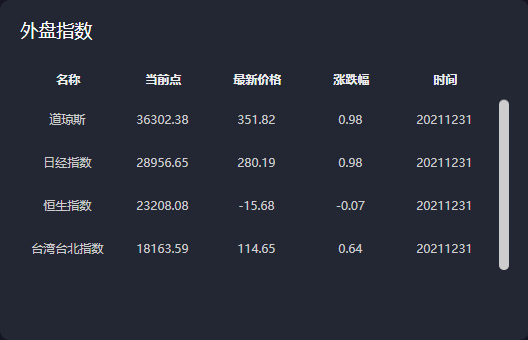
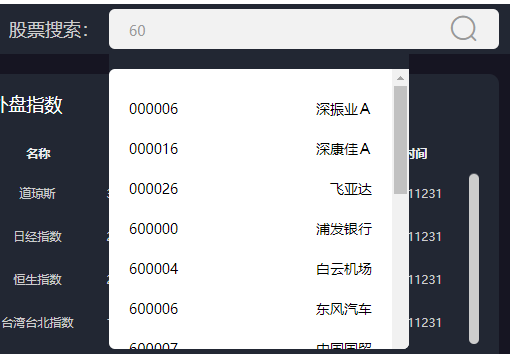
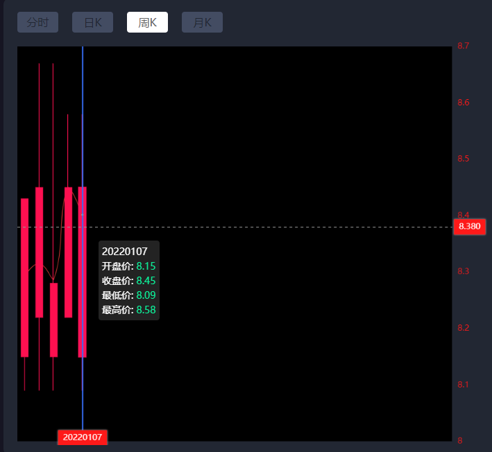

# 今日指数-day07

## 1.外盘指数展示功能

### 1.1 外盘指数展示功能接口说明

#### 1）原型效果

#### 2）接口说明

~~~tex
功能描述：外盘指数行情数据查询，根据时间和大盘点数降序排序取前4 
服务路径：/api/quot/external/index
服务方法：GET
请求参数：无
~~~

响应数据格式：

~~~json
{
    "code": 1,
    "data": [
        {
            "curPoint": 36302.38,//当前大盘点
            "curTime": "20211231",//当前日期
            "name": "道琼斯",//大盘名称
            "tradePrice": 351.82,//当前交易金额
            "updownRate": 0.98//涨幅
        },
        {
            "curPoint": 28956.65,
            "curTime": "20211231",
            "name": "日经指数",
            "tradePrice": 280.19,
            "updownRate": 0.98
        }
    ]
}
~~~

## 2.股票Code联想推荐

### 2.1 股票Code联想推荐功能介绍

#### 1) 原型效果

输入框输入股票编码后，显示关联的股票信息;

#### 2）接口定义说明

接口说明：

~~~tex
功能描述：根据输入的个股代码，进行模糊查询，返回证券代码和证券名称
服务路径：/quot/stock/search
服务方法：GET
请求参数：searchStr （只接受代码模糊查询，不支持文字查询）  
~~~

响应数据格式：

~~~json
{
    "code": 1,
    "data": [
        {
            "code": "600000",//股票编码
            "name": "浦发银行" //股票名称
        },
        {
            "code": "600004",
            "name": "白云机场"
        }
    ]
}
~~~

## 3.个股描述功能实现

### 3.1 个股描述功能实现说明

#### 1）原型示意

#### 2）接口说明

~~~json
功能描述：个股主营业务查询接口
服务路径：/api/quot/stock/describe
服务方法：GET
请求参数：code #股票编码
~~~

响应参数：

~~~json
{
    "code": 1,
    "data": {
        "code": "000002", //股票编码
        "trade": "房地产  ", //行业，也就是行业板块名称
        "business": "房地产开发和物业服务",//公司主营业务
        "name": "万科Ａ" //公司名称
    }
}
~~~

## 4.个股周K线功能实现

### 4.1 个股周K线功能实现功能分析

#### 1）个股周K线功能原型分析

#### 2）个股周K线功能接口分析

~~~tex
个股周K线数据主要包含：
	股票ID、 一周内最高价、 一周内最低价 、周1开盘价、周5的收盘价、
	整周均价、以及一周内最大交易日期（一般是周五所对应日期）
~~~

接口要求：

~~~json
功能描述：统计每周内的股票数据信息，信息包含：
	股票ID、 一周内最高价、 一周内最低价 、周1开盘价、周5的收盘价、
	整周均价、以及一周内最大交易日期（一般是周五所对应日期）;
服务路径：/api/quot/stock/screen/weekkline
服务方法：GET
请求参数：code //股票编码
~~~

响应数据格式：

~~~json
{
    "code": 1,
    "data": [
        {
            "avgPrice": 8.574954,//一周内平均价
            "minPrice": 8.56,//一周内最低价
            "openPrice": 8.6,//周一开盘价
            "maxPrice": 8.6,//一周内最高价
            "closePrice": 8.57,//周五收盘价（如果当前日期不到周五，则显示最新价格）
            "mxTime": "20211219",//一周内最大时间
            "stock_code": "600000"//股票编码
        }
    ]
}
~~~

