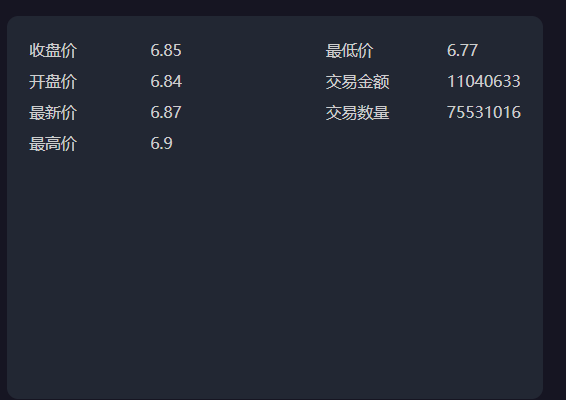
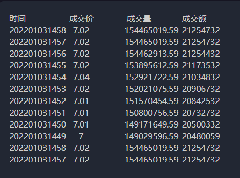

# 今日指数-day08

## 1. 个股最新分时行情数据

### 1.1 个股最新分时行情功能说明

#### 1）个股最新分时行情功能原型

#### 2）个股最新分时行情数据接口分析

~~~json
功能描述：
	获取个股最新分时行情数据，主要包含：
	开盘价、前收盘价、最新价、最高价、最低价、成交金额和成交量、交易时间信息; 
服务路径：/api/quot/stock/screen/second/detail
服务方法：GET
请求参数：code //股票编码
请求频率：每分钟
~~~

响应数据格式：

~~~json
{
    "code": 1,
    "data": {
        "tradeAmt": 58672751,//最新交易量
        "preClosePrice": 3.89,//前收盘价格
        "lowPrice": 3.89,//最低价
        "highPrice": 3.91,//最高价
        "openPrice": 3.9,//开盘价
        "tradeVol": 228625157,//交易金额
        "tradePrice": 3.9//当前价格
        "curDate": '202201031458'//当前日期
    }
}
~~~

#### 2）注意事项

~~~tex
如果当前日期不在股票交易时间内，则查询最近的股票交易时间的数据回显
~~~

## 2.个股实时交易流水查询

### 2.1 个股实时交易流水查询功能介绍

#### 1）功能原型

#### 2）功能接口说明

~~~tex
功能描述：个股交易流水行情数据查询--查询最新交易流水，按照交易时间降序取前10
服务路径：/quot/stock/screen/second
服务方法：GET
请求频率：5秒
~~~

响应数据格式：

~~~json
{
    "code": 1,
    "data": [
        {
            "date": "202201031458",//当前时间，精确到分
            "tradeAmt": 58672751,//交易量
            "tradeVol": 228625157,//交易金额
            "tradePrice": 3.9//交易价格
        }
    ]
}
~~~

## 3.拉取外盘数据功能实现

### 3.1功能分析

国外大盘数据采集与国内大盘数据几乎一致，目前通过sina接口无法获取国外大盘的交易量和交易金额数据，所以针对国外大盘数据，需要单独处理；

注意事项：

​	国外大盘数据接口不提供交易量和交易金额的信息；

## 4.用户权限详情完善

### 1）功能接口说明

~~~tex
功能描述：当前用户登录后，仅仅加载了用户表相关信息，接下来完成的功能是完善用户权限相关的信息；
服务路径：/api/login
请求方式：POST
~~~

接口响应数据格式：

~~~java
{
    "code": 1,
    "data": {
        "id": "1237361915165020161",//用户ID
        "username": "admin",//用户名称
        "phone": "13888888888",//手机号
        "nickName": "itheima",//昵称
        "realName": "heima",//真实名称
        "sex": 1,//性别
        "status": 1,//装填
        "email": "875267425@qq.com",//邮件
        "menus": [//权限树（包含按钮权限）
            {
                "id": "1236916745927790564",//权限ID
                "title": "组织管理",//权限标题
                "icon": "el-icon-star-off",//权限图标（按钮权限无图片）
                "path": "/org",//请求地址
                "name": "org",//权限名称对应前端vue组件名称
                "children": [
                    {
                        "id": "1236916745927790578",
                        "title": "角色管理",
                        "icon": "el-icon-s-promotion",
                        "path": "/roles",
                        "name": "roles",
                        "children": []
                    },
                    {
                        "id": "1236916745927790560",
                        "title": "菜单权限管理",
                        "icon": "el-icon-s-tools",
                        "path": "/menus",
                        "name": "menus",
                        "children": []
                    }
                ]
            },
            {
                "id": "1236916745927790569",
                "title": "账号管理",
                "icon": "el-icon-s-data",
                "path": "/user",
                "name": "user",
                "children": []
            }
        ],
        "permissions": [//按钮权限集合
            "sys:log:delete",//按钮权限security标识
            "sys:user:add",
            "sys:role:update",
            "sys:dept:list"
        ]
    }
}
~~~

提示：用户权限信息先批量查询，然后再通过递归组装数据；