#  认证授权-SpringSecurity

## 学习目标

~~~tex
1.了解认证授权基本概念及权限数据模型
2.了解常见的认证方式
3.掌握SpringSecurity的基本操作
~~~


## 1. 认证授权概述 

### 1.1 认证授权概念

#### 1.1.1 认证

   在互联网中，我们每天都会使用到各种各样的APP和网站，在使用过程中通常还会遇到需要注册登录的情况，输入你的用户名和密码才能正常使用，也就是说成为这个应用的合法身份才可以访问应用的资源，这个过程就是认证。认证是为了保护系统的隐私数据与资源，用户的身份合法方可访问该系统的资源。

   当然认证的方式有很多，常见的账号密码登录，手机验证码登录，指纹登录，刷脸登录等等。

   简单说: 认证就是让系统知道我们是谁。

#### 1.1.2 授权

   认证是为了保护身份的合法性，授权则是为了更细粒度的对数据进行划分，授权是在认证通过的前提下发生的。控制不同的用户能够访问不同的资源。

   授权是用户认证通过后根据用户的权限来控制用户访问资源的过程，拥有资源的访问权限则正常访问，没有权限则拒绝访问。

   例如视频网站的VIP用户，可以查看到普通用户看不到的资源信息。

### 1.2 权限数据模型

授权过程中，我们需要知道如何对用户访问的资源进行控制，需要了解一些简单的授权数据模型。

授权可以非常简单的理解成谁（Who）对什么（What）进行怎么样（How）的操作。

| 名词   | 含义             | 备注                                       |
| ---- | -------------- | ---------------------------------------- |
| Who  | 主体(Subject)    | 一般指用户，也可以是应用程序                           |
| What | 资源(Resource)   | 例如商品信息，订单信息，页面按钮或程序中的接口等信息               |
| How  | 权限(Permission) | 规定了用户或程序对资源操作的许可。例如普通用户只能查看订单，管理员可修改或删除订单，这是因为普通用户和管理员用户对订单资源的操作权限不一样。 |

**1). 主体、资源、权限的关系图：** 

  

主体、资源、权限相关的数据模型如下： 

A. 主体（用户id、账号、密码、...） 

B. 资源（资源id、资源名称、访问地址、...） 

C. 权限（权限id、权限标识、权限名称、资源id、...） 

D. 主体（用户）和权限关系（用户id、权限id、...）


**2). 主体、资源、权限的表结构关系：**  

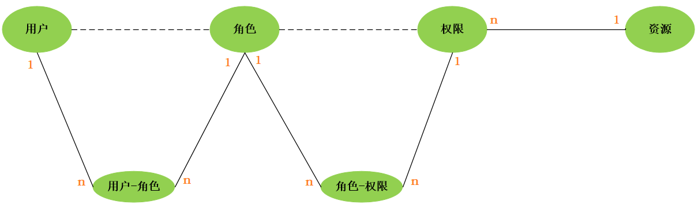 


你会发现权限中包含了一个资源ID，多个权限可指向一个资源，我们是否可以直接在权限信息中把资源信息包含进来呢？当然，这也是很多企业开发中的做法，将权限和资源合并为 权限(权限ID、权限标识、权限名称、资源名称、资源访问地址、...)

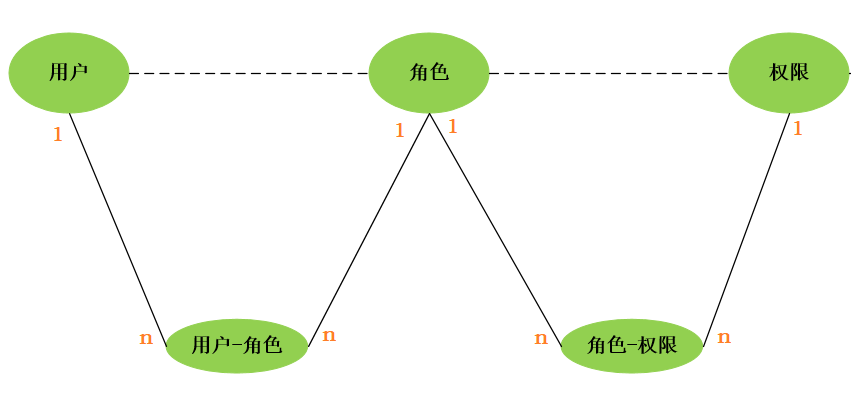 


### 1.3 RBAC权限模型

#### 1.3.1 介绍

   如何实现授权？业界通常基于RBAC模型（Role-Based Access Control -> 基于角色的访问控制）实现授权。 RBAC认为授权实际就是who,what,how三者之间的关系(3W)，即who对what进行how的操作。

#### 1.3.2 基于角色访问控制

RBAC基于角色的访问控制（Role-Based Access Control）是按角色进行授权，比如：主体的角色为总经理可以查询企业运营报表，查询员工工资信息等，访问控制流程如下： 

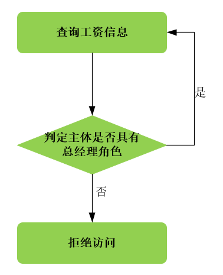 

根据上图中的判断逻辑，授权代码可表示如下： 

```java
if(主体.hasRole("总经理角色标识")){
    //查询工资 
}else{
    //权限不足
}
```

如果上图中查询工资所需要的角色变化为总经理和部门经理，此时就需要修改判断逻辑为“判断用户的角色是否是 总经理或部门经理”，修改代码如下： 

```java
if(主体.hasRole("总经理角色标识") || 主体.hasRole("部门经理角色标识")){ 
	//查询工资 
}else{
    //权限不足
}
```

根据上边的例子发现，当需要修改角色的权限时就需要修改授权的相关代码，系统可扩展性差。 


#### 1.3.3 基于资源访问控制

RBAC基于资源的访问控制(Resource-Based Access Control)是按资源(或权限)进行授权。

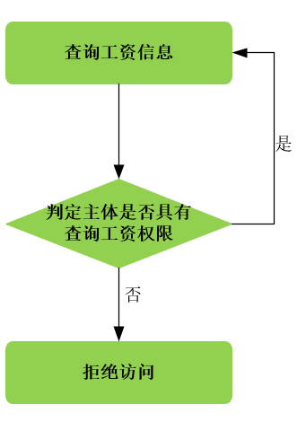 

同样是上面的需求，这时候我们的代码变成了

```
if(Subject.hasPermission("查询员工工资的权限标识")){
	// 查询员工工资
}
```

优点：系统设计时定义好查询工资的权限标识，即使查询工资所需要的角色变化为总经理和部门经理也不需要修授权代码，系统可扩展性强。

### 1.4 常见认证方式

认证(登录)几乎是任何一个系统的标配，web 系统、APP、PC客户端等都需要注册、登录、授权。 

#### 1.4.1 Cookie-Session

早期互联网以 web 为主，客户端是浏览器，所以 Cookie-Session 方式最那时候最常用的方式，直到现在，一些 web 网站依然用这种方式做认证。

**认证过程大致如下：**

A. 用户输入用户名、密码或者用短信验证码方式登录系统；

B. 服务端验证后，创建一个 Session 记录用户登录信息 ，并且将 SessionID 存到 cookie，响应回浏览器；

C. 下次客户端再发起请求，自动带上 cookie 信息，服务端通过 cookie 获取 Session 信息进行校验；

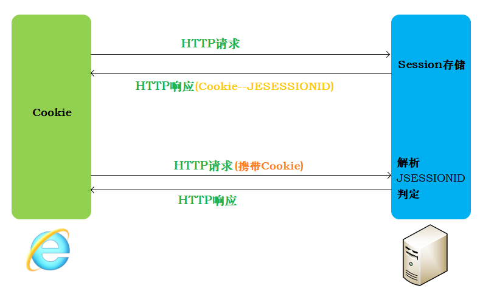 

**弊端**

- 只能在 web 场景下使用，如果是 APP 中，不能使用 cookie 的情况下就不能用了；
- 即使能在 web 场景下使用，也要考虑跨域问题，因为 cookie 不能跨域；（域名或者ip一致，端口号一致，协议要一致）
- cookie 存在 CSRF（跨站请求伪造）的风险；
- 如果是分布式服务，需要考虑 Session 同步（同步）问题；


#### 1.4.2 jwt令牌无状态认证

JSON Web Token（JWT-字符串）是一个非常轻巧的规范。这个规范允许我们使用JWT在用户和服务器之间传递安全可靠的信息。

**认证过程: **

A. 依然是用户登录系统；

B. 服务端验证，并通过指定的算法生成令牌返回给客户端;

C. 客户端拿到返回的 Token，存储到 local storage/Cookie中；

D. 下次客户端再次发起请求，将 Token 附加到 header 中；

E. 服务端获取 header 中的 Token ，通过相同的算法对 Token 进行验证，如果验证结果相同，则说明这个请求是正常的，没有被篡改。这个过程可以完全不涉及到查询 Redis 或其他存储；

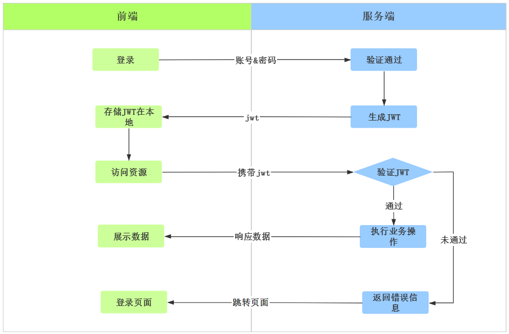  

**优点**

A. 使用 json 作为数据传输，有广泛的通用型，并且体积小，便于传输；

B. 不需要在服务器端保存相关信息，节省内存资源的开销；

C. jwt 载荷部分可以存储业务相关的信息（非敏感的），例如用户信息、角色等；

### 1.5 技术实现

| 技术             | 概述                                       |
| -------------- | ---------------------------------------- |
| Apache Shiro   | Apache旗下的一款安全框架                          |
| SpringSecurity | Spring家族的一部分, Spring体系中提供的安全框架, 包含认证、授权两个大的部分 |
| CAS            | CAS是一个单点登录(SSO)服务，开始是由耶鲁大学的一个组织开发，后来归到apereo去管 |
| 自行实现           | 自行通过业务代码实现, 实现繁琐, 代码量大                   |

## 2. SpringSecurity入门

### 2.1 介绍

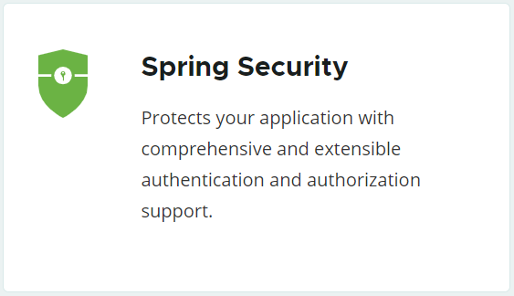 

Spring Security是为基于Spring的企业应用系统提供声明式的安全访问控制解决方案的安全框架(包含: 认证 , 授权两个方面)。它提供了完整的安全性解决方案，可以在Web请求级别和方法调用级别处理身份认证和授权充分利用了Spring IOC，DI（控制反转Inversion of Control ,DI:Dependency Injection 依赖注入）和AOP（面向切面编程）功能，为应用系统提供声明式的安全访问控制功能。

官网地址: https://spring.io/projects/spring-security

### 2.2 入门

#### 2.2.1 工程搭建

创建测试工程并引入依赖 ;

**A. pom.xml**

```xml
<parent>
    <groupId>org.springframework.boot</groupId>
    <artifactId>spring-boot-starter-parent</artifactId>
    <version>2.3.4.RELEASE</version>
    <relativePath/>
</parent>

<dependencies>
    <!-- web起步依赖 -->
    <dependency>
        <groupId>org.springframework.boot</groupId>
        <artifactId>spring-boot-starter-web</artifactId>
    </dependency>
    
	<!-- springBoot整合Security -->
    <dependency>
        <groupId>org.springframework.boot</groupId>
        <artifactId>spring-boot-starter-security</artifactId>
    </dependency>
    
	<!-- lombok -->
    <dependency>
        <groupId>org.projectlombok</groupId>
        <artifactId>lombok</artifactId>
    </dependency>
  
</dependencies>
```


**B. 引导类**

```java
@SpringBootApplication
public class MySecurityApplication {
    public static void main(String[] args) {
        SpringApplication.run(MySecurityApplication.class,args);
    }
}
```


**C. Controller**

```java
@RestController
public class UserController {
    @GetMapping("/hello")
    public String hello(){
        return "hello security";
    }
    @GetMapping("/say")
    public String say(){
        return "say security";
    }
    @GetMapping("/register")
    public String register(){
        return "register security";
    }
}
```


**D. 测试**

访问: http://localhost:8080/hello

会自动拦截，并跳转到登录页面（SpringSecurity提供），登录之后才可以访问； 而登录的用户名和密码都是SpringSecurity中内置的默认的用户名密码， 用户名为user ， 密码为控制台输出的一段随机数；

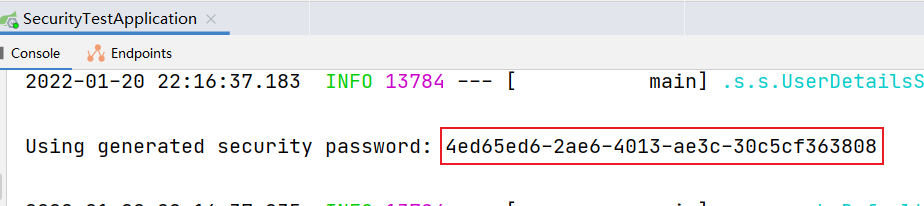

效果：

 

登录成功之后，会自动跳转到之前访问的地址： 

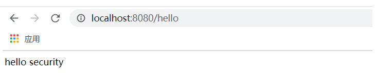 

注意：

~~~properties
# 我们也可在配置文件中配置用户名和密码，实际开发中密码不应明文配置
spring.security.user.name=user
spring.security.user.password=6666
~~~

#### 2.2.2 认证配置

##### 【1】自定义合法登录用户信息

上述的入门程序中, 用户名密码是框架默认帮我们生成的, 我们并没有指定, 如果我们想指定系统的访问用户名及密码, 可以通过配置的形式声明 , 声明一个 UserDetailsService 类型的Bean。

```java
@Configuration
@EnableWebSecurity//开启web安全设置生效
public class SecurityConfig extends WebSecurityConfigurerAdapter {
    /**
     * 构建认证服务，并将对象注入spring IOC容器，用户登录时，会调用该服务进行用户合法信息认证
     * @return
     */
    @Bean
    public UserDetailsService userDetailsService(){
        InMemoryUserDetailsManager inMemoryUserDetailsManager = new InMemoryUserDetailsManager();
        //构建用户
        UserDetails u1 = User
                .withUsername("itcast")
                .password("{noop}123456")
                .authorities("P1", "ROLE_ADMIN").build();
        UserDetails u2 = User
                .withUsername("itheima")
                .password("{noop}123456")
                .authorities("O1", "ROLE_SELLER").build();
        inMemoryUserDetailsManager.createUser(u1);
        inMemoryUserDetailsManager.createUser(u2);
        return inMemoryUserDetailsManager;
    }
}
```

在userDetailsService()方法中 ，我们返回了一个UserDetailsService给spring容器，Spring Security会使用它来获取用户信息。我们暂时使用InMemoryUserDetailsManager实现类，并在其中分别创建了itcast、itheima两个用户，并设置密码和权限。

#### 2.2.3 授权配置

**1). 编码方式**

```java
@Configuration
@EnableWebSecurity
@EnableGlobalMethodSecurity(prePostEnabled = true)
public class SecurityConfig extends WebSecurityConfigurerAdapter {
	
    @Bean
    public UserDetailsService userDetailsService(){
        InMemoryUserDetailsManager inMemoryUserDetailsManager = new InMemoryUserDetailsManager();
        inMemoryUserDetailsManager.createUser(User.withUsername("itcast").password("{noop}123456").authorities("P1","ROLE_ADMIN").build());
        inMemoryUserDetailsManager.createUser(User.withUsername("itheima").password("{noop}123456").authorities("O1","ROLE_SELLER").build());
        return inMemoryUserDetailsManager;
    }
	
    @Override
    protected void configure(HttpSecurity http) throws Exception {
        http.formLogin()
            .and()
            .logout()
            .and()
            .csrf().disable()
            .authorizeRequests()
            .antMatchers("/register").permitAll() //不登录即可访问
            .antMatchers("/hello").hasAuthority("P1") //具有P1权限才可以访问
            .antMatchers("/say").hasRole("SELLER") //具有SELLER 角色才可以访问
            .anyRequest().authenticated(); //其他的登录之后就可以访问
    }
}
```

> CSRF（Cross-site request forgery）跨站请求伪造，也被称为"One Click Attack"或者 Session Riding，通常缩写为 CSRF 或者 XSRF，是一种对网站的恶意利用。


2). 注解方式**

在控制方法/URL的权限时, 可以通过配置类中配置的方式进行控制, 也可以使用 注解 @PreAuthorize 来进行控制, ==推荐使用注解:== 

```java
 @GetMapping("/hello")
 @PreAuthorize("hasAuthority('P5')")
 public String hello(){
 	return "hello security";
 }

@GetMapping("/say")
@PreAuthorize("hasRole('SELLER')")
public String say(){
	return "say security";
}
```

==使用@PreAuthorize,需要开启全局方法授权开关,加上注解@EnableGlobalMethodSecurity(prePostEnabled=true)==


经过上述的入门程序的演示，我们对于SpringSecurity的基本使用有了一定的了解，但是在入门程序中存在两个问题: 

A. 密码采用的是明文的，不安全 ;

B. 用户名/密码直接通过程序硬编码，不够灵活 ；

### 2.3 密码加密

#### 2.3.1 可逆加密算法

加密后, 密文可以反向解密得到密码原文;

**1). 对称加密**

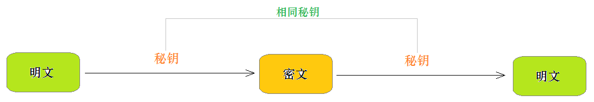 

指加密和解密使用相同密钥的加密算法。

优点: 对称加密算法的优点是算法公开、计算量小、加密速度快、加密效率高。
缺点: 没有非对称加密安全。

常见的对称加密算法：DES、3DES、DESX、Blowfish、RC4、RC5、RC6和AES


**2). 非对称加密**

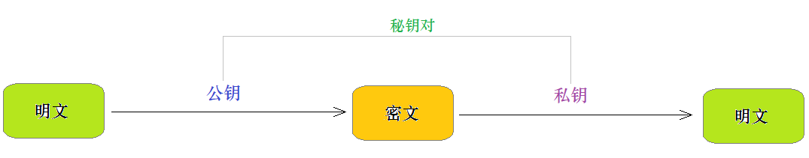 

指加密和解密使用不同密钥的加密算法，也称为公私钥加密。假设两个用户要加密交换数据，双方交换公钥，使用时一方用对方的公钥加密，另一方即可用自己的私钥解密。

加密和解密:

- 私钥加密，持有私钥或公钥才可以解密
- 公钥加密，持有私钥才可解密

优点: 非对称加密与对称加密相比，其安全性更好；
缺点: 非对称加密的缺点是加密和解密花费时间长、速度慢，只适合对少量数据进行加密。

#### 2.3.2 不可逆加密算法

一旦加密就不能反向解密得到密码原文 。通常用于密码数据加密。

常见的不可逆加密算法有：  MD5 、SHA、HMAC

#### 2.3.3 MD5与Bcrypt

**1).MD5**

MD5是比较常见的加密算法，广泛的应用于软件开发中的密码加密，通过MD5生成的密文，是无法解密得到明文密码的。但是现在在大数据背景下，很多的网站通过大数据可以将简单的MD5加密的密码破解。

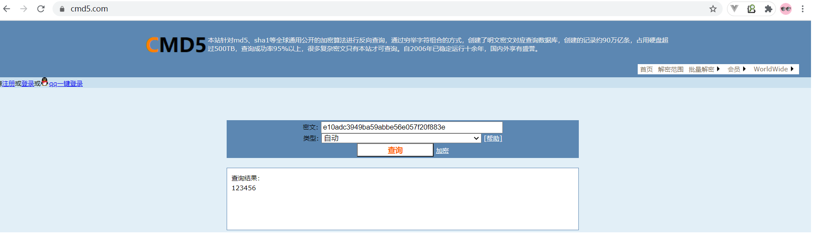 

网址： https://www.cmd5.com/

可以在用户注册时，限制用户输入密码的长度及复杂度，从而增加破解难度。


**2). Bcrypt**

用户表的密码通常使用 MD5 等不可逆算法加密后存储，为防止彩虹表破解，会先使用一个特定的字符串（如域名）加密，然后再使用一个随机的 salt（盐值）加密。 特定字符串是程序代码中固定的，salt 是每个密码单独随机，一般给用户表加一个字段单独存储，比较麻烦。 

BCrypt 算法将 salt 随机并混入最终加密后的密码，验证时也无需单独提供之前的salt，从而无需单独处理 salt 问题。

加密密码: 

```
BCryptPasswordEncoder bCryptPasswordEncoder = new BCryptPasswordEncoder();
for (int i = 0; i < 10; i++) {
	System.out.println(bCryptPasswordEncoder.encode("123456"));
}
```

得到结果: 

```
$2a$10$C6YynRFeJsSy7D/kg3d30OWnuwko7KQIEK5JrX0mWND.vuz2TqwpK
$2a$10$aSJfxH2oBtopFMbkMJ.PQ.sbSBXJH9g.9bv1mCyte/BtcU9VTs7lG
$2a$10$nVoB.eV5Uhc9FNUC36Pn0OosGh7aKlp7Sjfxaiml8NCSJ6PX1q6.m
$2a$10$2RM3mRNjz1LoZ5eeLdj.Hu15vlWIIj2zJC09vwTevBlIi5rjJStam
$2a$10$5bTOnk9hITzJd6EJMsX47uX9UdjASrPl4sEG6GJjfZGTk9f/37Q/q
$2a$10$0.PfbDnlBBWzpsw8PBjDcOtjUnwRgbSPCmhrAg5APUWor/4eQ0VVy
$2a$10$jfpPFH0DuTENicQ6vv38BeBO5YUXolS03bk1Ti3fmCrhQmBL1hYj.
$2a$10$pxR.jhV79v1po1vbhWi8CudiLTaw.W5lpl.E/dOEodfGXCJIPrJ4i
$2a$10$MvWb5LvCojzloYX9QLA8buL2Mkci2qaiMIdIH2PzGDssHUzEU21R2
$2a$10$7HLclohKrBZHvsBLDm8U/eTqe0KP2qV4F9d6jNvP4vO0pJG4wmeQy
```

验证密码: 

```java
BCryptPasswordEncoder bCryptPasswordEncoder = new BCryptPasswordEncoder();
boolean matches = 
   bCryptPasswordEncoder.matches("123456", "$2a$10$c2sZT/LtM1ExWfZjO0yIPeTGSqMSlX7oi.SvliMbeZpT9Y4qIBDue");
System.out.println(matches);//返回值为true, 则代表验证通过; 反之, 验证不通过
```

### 2.4 程序完善

#### 2.4.1 密码加密处理

在配置类 SecurityConfig中配置Bean: 

```java
//配置密码加密器 ;
@Bean
public BCryptPasswordEncoder bCryptPasswordEncoder(){
	return new BCryptPasswordEncoder();
}

//配置认证信息 , 密码使用BCryptPasswordEncoder加密 ;
@Bean
public UserDetailsService userDetailsService(){
	InMemoryUserDetailsManager inMemoryUserDetailsManager = new InMemoryUserDetailsManager();
	inMemoryUserDetailsManager.createUser(User.withUsername("itcast")
	               .password("$2a$10$qcKkkvsoClF9tO8c9wlR/ebgU8VM39GP5ZUdsts.XSPDmE40l.BP2").authorities("P1","ROLE_ADMIN").build());
    inMemoryUserDetailsManager.createUser(User.withUsername("itheima")
                   .password("$2a$10$qcKkkvsoClF9tO8c9wlR/ebgU8VM39GP5ZUdsts.XSPDmE40l.BP2").authorities("O1","ROLE_SELLER").build());
    return inMemoryUserDetailsManager;
}
```

#### 2.4.2 动态查询用户

上述的案例中, 用户名密码都是在代码中写死的, 现在实际项目中, 是需要动态从数据库查询;简易的数据库表如下: 

```sql
create database security_demo default charset=utf8mb4;
use security_demo;

CREATE TABLE `tb_user` (
  `id` int(11) NOT NULL AUTO_INCREMENT,
  `username` varchar(100) DEFAULT NULL,
  `password` varchar(100) DEFAULT NULL,
  `roles` varchar(100) DEFAULT NULL,
  PRIMARY KEY (`id`)
) ENGINE=InnoDB DEFAULT CHARSET=utf8mb4;

INSERT INTO `tb_user` VALUES (1, 'itcast', '$2a$10$f43iK9zKD9unmgLao1jqI.VluZ.Rr/XijizVEA73HeOu9xswaUBXC', 'ROLE_ADMIN,P1');
INSERT INTO `tb_user` VALUES (2, 'itheima', '$2a$10$f43iK9zKD9unmgLao1jqI.VluZ.Rr/XijizVEA73HeOu9xswaUBXC', 'ROLE_SELLER,O1');
```

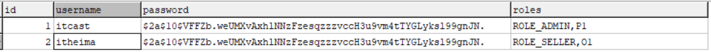 


**A. pom.xml**

```xml
        <dependency>
            <groupId>org.mybatis.spring.boot</groupId>
            <artifactId>mybatis-spring-boot-starter</artifactId>
            <version>2.1.4</version>
        </dependency>

        <dependency>
            <groupId>mysql</groupId>
            <artifactId>mysql-connector-java</artifactId>
        </dependency>
```


**B. application.yml**

```yml
# 应用名称
spring.application.name=security_test
# 应用服务 WEB 访问端口
server.port=8080

# 配置用户名和密码
#spring.security.user.name=user
#spring.security.user.password=6666

#下面这些内容是为了让MyBatis映射
#指定Mybatis的Mapper文件
mybatis.mapper-locations=classpath:mapper/*xml
#指定Mybatis的实体目录
mybatis.type-aliases-package=com.itheima.security.pojo

# 数据库驱动：
spring.datasource.driver-class-name=com.mysql.cj.jdbc.Driver
# 数据库连接地址
spring.datasource.url=jdbc:mysql://192.168.188.130:3306/security_demo?serverTimezone=UTC
# 数据库用户名&密码：
spring.datasource.username=root
spring.datasource.password=root
```


**C. 实体类**

```java

@Data
@NoArgsConstructor
@AllArgsConstructor
@Builder
public class TbUser implements Serializable {
    /**
     * 
     */
    private Integer id;

    /**
     * 
     */
    private String username;

    /**
     * 
     */
    private String password;

    /**
     * 
     */
    private String roles;

    private static final long serialVersionUID = 1L;
}
```


**D. mapper**

```java
@Mapper
public interface TbUserMapper {

    int deleteByPrimaryKey(Long id);

    int insert(TbUser record);

    int insertSelective(TbUser record);

    TbUser selectByPrimaryKey(Long id);

    int updateByPrimaryKeySelective(TbUser record);

    int updateByPrimaryKey(TbUser record);
  
    TbUser findByUserName(@Param("userName") String userName);

}
```

xml:

~~~xml
<?xml version="1.0" encoding="UTF-8"?>
<!DOCTYPE mapper
        PUBLIC "-//mybatis.org//DTD Mapper 3.0//EN"
        "http://mybatis.org/dtd/mybatis-3-mapper.dtd">
<mapper namespace="com.itheima.security.mapper.TbUserMapper">

    <resultMap id="BaseResultMap" type="com.itheima.security.pojo.TbUser">
            <id property="id" column="id" jdbcType="INTEGER"/>
            <result property="username" column="username" jdbcType="VARCHAR"/>
            <result property="password" column="password" jdbcType="VARCHAR"/>
            <result property="roles" column="roles" jdbcType="VARCHAR"/>
    </resultMap>

    <sql id="Base_Column_List">
        id,username,password,
        roles
    </sql>

    <select id="selectByPrimaryKey" parameterType="java.lang.Long" resultMap="BaseResultMap">
        select
        <include refid="Base_Column_List" />
        from tb_user
        where  id = #{id,jdbcType=INTEGER} 
    </select>
    <select id="findByUserName" resultMap="BaseResultMap">
        select <include refid="Base_Column_List"/> from tb_user where username=#{userName}
    </select>

    <delete id="deleteByPrimaryKey" parameterType="java.lang.Long">
        delete from tb_user
        where  id = #{id,jdbcType=INTEGER} 
    </delete>
    <insert id="insert" keyColumn="id" keyProperty="id" parameterType="com.itheima.security.pojo.TbUser" useGeneratedKeys="true">
        insert into tb_user
        ( id,username,password
        ,roles)
        values (#{id,jdbcType=INTEGER},#{username,jdbcType=VARCHAR},#{password,jdbcType=VARCHAR}
        ,#{roles,jdbcType=VARCHAR})
    </insert>
    <insert id="insertSelective" keyColumn="id" keyProperty="id" parameterType="com.itheima.security.pojo.TbUser" useGeneratedKeys="true">
        insert into tb_user
        <trim prefix="(" suffix=")" suffixOverrides=",">
                <if test="id != null">id,</if>
                <if test="username != null">username,</if>
                <if test="password != null">password,</if>
                <if test="roles != null">roles,</if>
        </trim>
        <trim prefix="values (" suffix=")" suffixOverrides=",">
                <if test="id != null">id = #{id,jdbcType=INTEGER},</if>
                <if test="username != null">username = #{username,jdbcType=VARCHAR},</if>
                <if test="password != null">password = #{password,jdbcType=VARCHAR},</if>
                <if test="roles != null">roles = #{roles,jdbcType=VARCHAR},</if>
        </trim>
    </insert>
    <update id="updateByPrimaryKeySelective" parameterType="com.itheima.security.pojo.TbUser">
        update tb_user
        <set>
                <if test="username != null">
                    username = #{username,jdbcType=VARCHAR},
                </if>
                <if test="password != null">
                    password = #{password,jdbcType=VARCHAR},
                </if>
                <if test="roles != null">
                    roles = #{roles,jdbcType=VARCHAR},
                </if>
        </set>
        where   id = #{id,jdbcType=INTEGER} 
    </update>
    <update id="updateByPrimaryKey" parameterType="com.itheima.security.pojo.TbUser">
        update tb_user
        set 
            username =  #{username,jdbcType=VARCHAR},
            password =  #{password,jdbcType=VARCHAR},
            roles =  #{roles,jdbcType=VARCHAR}
        where   id = #{id,jdbcType=INTEGER} 
    </update>
</mapper>
~~~


**D. 自定义UserDetailsService**

```java
package com.itheima.security.config;

import com.itheima.security.mapper.TbUserMapper;
import com.itheima.security.pojo.TbUser;
import org.springframework.beans.factory.annotation.Autowired;
import org.springframework.security.core.GrantedAuthority;
import org.springframework.security.core.authority.AuthorityUtils;
import org.springframework.security.core.userdetails.User;
import org.springframework.security.core.userdetails.UserDetails;
import org.springframework.security.core.userdetails.UserDetailsService;
import org.springframework.security.core.userdetails.UsernameNotFoundException;
import org.springframework.stereotype.Component;
import org.springframework.stereotype.Service;

import java.util.List;

/**
 * @author by itheima
 * @Date 2022/1/21
 * @Description
 */
@Component
public class UserDetailsServiceImpl implements UserDetailsService {

    @Autowired
    private TbUserMapper tbUserMapper;

    @Override
    public UserDetails loadUserByUsername(String userName) throws UsernameNotFoundException {
        TbUser user = tbUserMapper.findByUserName(userName);
        if (user==null) {
            throw new UsernameNotFoundException("用户不存在");
        }
        //构建认证明细对象
        //获取用户权限
        List<GrantedAuthority> list = AuthorityUtils.commaSeparatedStringToAuthorityList(user.getRoles());
        User user1 = new User(user.getUsername(),user.getPassword(),list);
        return user1;
    }
}
```

==UserDetails是一个接口,User是该接口的实现类,封装用户的数据及用户的权限数据, 注意不要导错包 ;==

在SecurityConfig中注释掉inMemoryUserDetailsManager bean，并配置加密bean：

~~~java
    @Bean
    public PasswordEncoder passwordEncoder(){
        return new BCryptPasswordEncoder();
    }
~~~

整体访问流程如下：

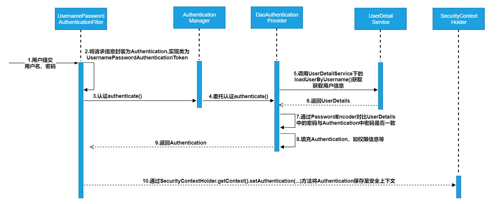

### 2.5 认证原理分析(==了解==)

Spring Security所解决的问题就是安全访问控制，而安全访问控制功能其实就是对所有进入系统的请求进行拦截，校验每个请求是否能够访问它所期望的资源。根据前边知识的学习，可以通过Filter或AOP等技术来实现，Spring Security对Web资源的保护是靠Filter实现的，所以从这个Filter来入手，逐步深入Spring Security原理。 当初始化Spring Security时，会创建一个名为 SpringSecurityFilterChain的Servlet过滤器，类型为 org.springframework.security.web.FilterChainProxy，它实现了javax.servlet.Filter，因此外部的请求会经过此 类，下图是Spring Security过虑器链结构图：

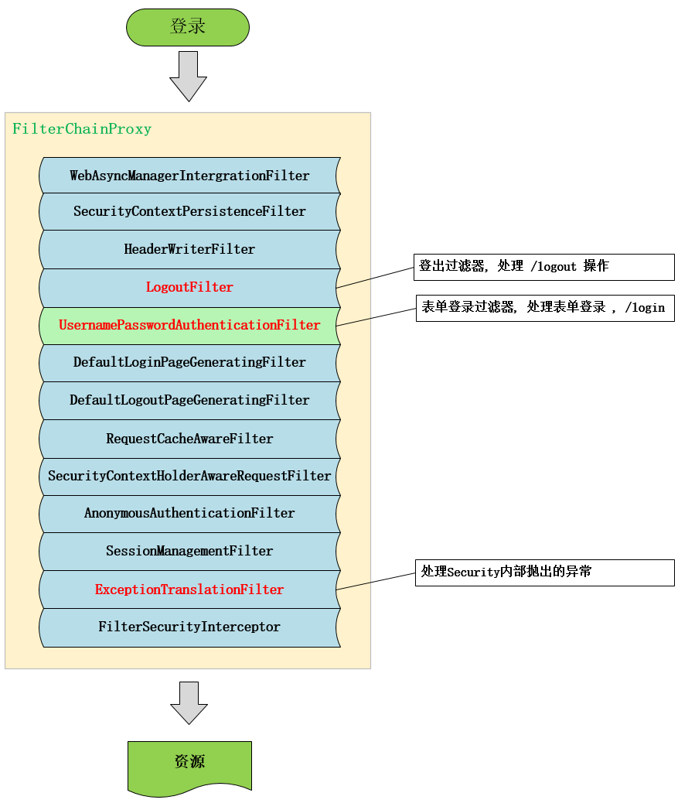 

FilterChainProxy是一个代理，真正起作用的是FilterChainProxy中SecurityFilterChain所包含的各个Filter，同时 这些Filter作为Bean被Spring管理，它们是Spring Security核心，各有各的职责，但他们并不直接处理用户的认 证，也不直接处理用户的授权，而是把它们交给了认证管理器
（AuthenticationManager）和决策管理器 （AccessDecisionManager）进行处理。

下面介绍过滤器链中主要的几个过滤器及其作用：

- SecurityContextPersistenceFilter 这个Filter是整个拦截过程的入口和出口（也就是第一个和最后一个拦截 器），会在请求开始时从配置好的 SecurityContextRepository 中获取SecurityContext，然后把它设置给 SecurityContextHolder。在请求完成后将SecurityContextHolder 持有的 SecurityContext 再保存到配置好 的SecurityContextRepository，同时清除 securityContextHolder 所持有的 SecurityContext；
- ==UsernamePasswordAuthenticationFilter==用于处理来自表单提交的认证。该表单必须提供对应的用户名和密 码，其内部还有登录成功或失败后进行处理的 AuthenticationSuccessHandler 和 AuthenticationFailureHandler，这些都可以根据需求做相关改变；
- FilterSecurityInterceptor 是用于保护web资源的，使用AccessDecisionManager对当前用户进行授权访问，前面已经详细介绍过了；
- ExceptionTranslationFilter 能够捕获来自 FilterChain 所有的异常，并进行处理。但是它只会处理两类异常： AuthenticationException 和 AccessDeniedException，其它的异常它会继续抛出。


