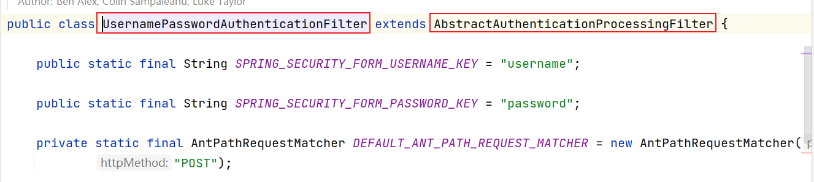
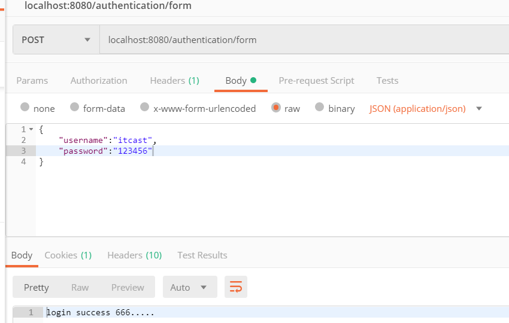
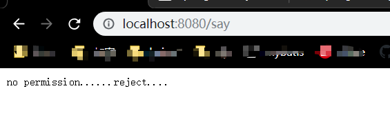
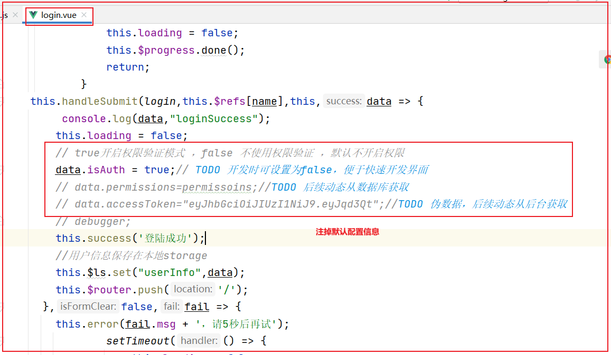
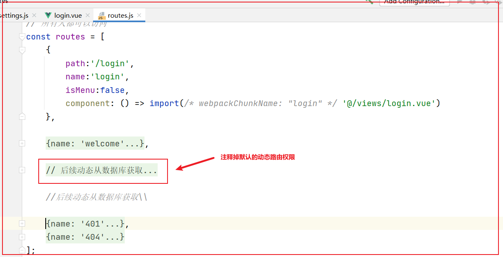
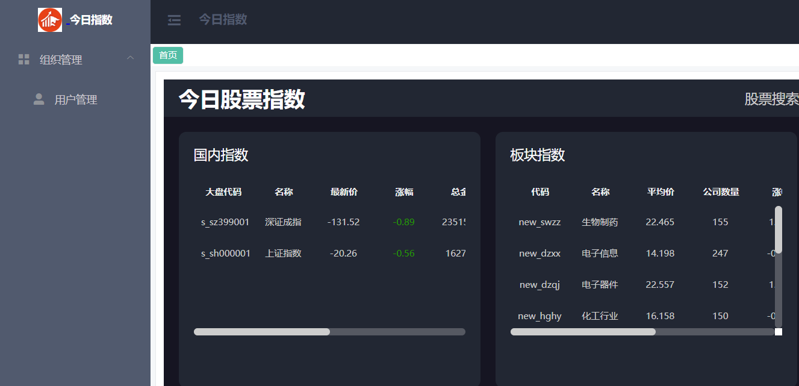
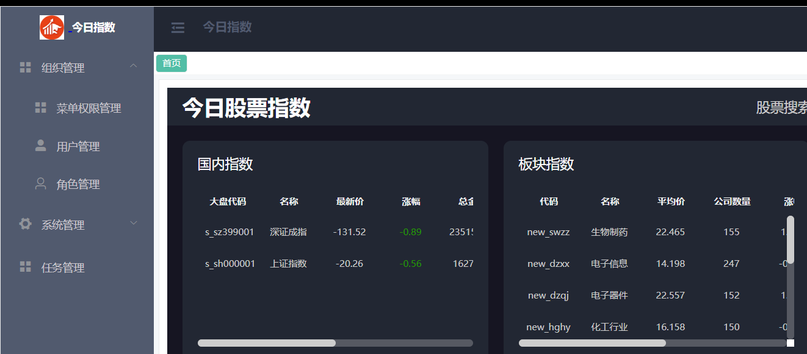

# 2.项目集成SpringSecurity

## 目标

~~~tex
1.理解自定义认证和授权过滤器流程；
2.理解项目集成SprignSecurity流程；
~~~


## 1.自定义认证和授权过滤器

SpringSecurity给我提供了基于form表单认证的方式，那如何实现ajax异步提交登录信息的功能呢？

通过研究UsernamePasswordAuthenticationFilter内置认证过滤器，我们可以仿照这个登录过滤器自定义认证规则：



### 1.1.自定义Security认证过滤器

​	我们统一可写一个类，然后继承AbstractAuthenticationProcessingFilter抽象类，并实现认证和认证成功失败的处理器方法：

~~~java
package com.itheima.security.security_test.config;

import com.fasterxml.jackson.databind.ObjectMapper;
import org.springframework.http.MediaType;
import org.springframework.security.authentication.UsernamePasswordAuthenticationToken;
import org.springframework.security.core.Authentication;
import org.springframework.security.core.AuthenticationException;
import org.springframework.security.web.authentication.AbstractAuthenticationProcessingFilter;

import javax.servlet.FilterChain;
import javax.servlet.ServletException;
import javax.servlet.ServletInputStream;
import javax.servlet.http.HttpServletRequest;
import javax.servlet.http.HttpServletResponse;
import java.awt.*;
import java.io.IOException;
import java.util.HashMap;

/**
 * @author by itheima
 * @Date 2022/1/21
 * @Description
 */
public class MyUserNamePasswordAuthenticationFilter extends AbstractAuthenticationProcessingFilter {

    /**
     * 设置构造，传入自定义登录url地址
     * @param defaultFilterProcessesUrl
     */
    public MyUserNamePasswordAuthenticationFilter(String defaultFilterProcessesUrl) {
        super(defaultFilterProcessesUrl);
    }

    @Override
    public Authentication attemptAuthentication(HttpServletRequest request, HttpServletResponse response) throws AuthenticationException, IOException, ServletException {
        //从post请求流中获取登录信息
        String username=null;
        String password=null;
        try {
            //判断 是否是ajax登录
            if (request.getContentType().equalsIgnoreCase(MediaType.APPLICATION_JSON_VALUE) || request.getContentType().equalsIgnoreCase(MediaType.APPLICATION_JSON_UTF8_VALUE)) {
                ServletInputStream in = request.getInputStream();
                HashMap<String,String> map = new ObjectMapper().readValue(in, HashMap.class);
                username=map.get("username");
                password=map.get("password");
            }

        } catch (IOException e) {
            e.printStackTrace();
        }
        //生成认证token
        UsernamePasswordAuthenticationToken token = new UsernamePasswordAuthenticationToken(username, password);
        //交给认证管理器取认证token
        return this.getAuthenticationManager().authenticate(token);

    }

    /**
     * 认证成功处理方法
     * @param request
     * @param response
     * @param chain
     * @param authResult
     * @throws IOException
     * @throws ServletException
     */
    @Override
    protected void successfulAuthentication(HttpServletRequest request,
                                            HttpServletResponse response,
                                            FilterChain chain,
                                            Authentication authResult) throws IOException, ServletException {
        response.getWriter().write("login success 666.....");
    }

    /**
     * 认证失败处理方法
     * @param request
     * @param response
     * @param failed
     * @throws IOException
     * @throws ServletException
     */
    @Override
    protected void unsuccessfulAuthentication(HttpServletRequest request,
                                              HttpServletResponse response,
                                              AuthenticationException failed) throws IOException, ServletException {
        response.getWriter().write("login failue 999");
    }
}
~~~

### 1.2 定义SecurityConfig类

配置默认认证过滤器，保证自定义的认证过滤器要在默认的认证过滤器之前；

~~~java
    /**
     * 配置授权策略
     * @param http
     * @throws Exception
     */
    @Override
    protected void configure(HttpSecurity http) throws Exception {
        http
          		//坑-过滤器要添加在默认过滤器之前，否则，登录失效
                .addFilterBefore(myUserNamePasswordAuthenticationFilter(), UsernamePasswordAuthenticationFilter.class)
                .csrf().disable();
    }


    @Bean
    public MyUserNamePasswordAuthenticationFilter myUserNamePasswordAuthenticationFilter() throws Exception {
      	//设置默认登录路径
        MyUserNamePasswordAuthenticationFilter myUserNamePasswordAuthenticationFilter =
                new MyUserNamePasswordAuthenticationFilter("/authentication/form");
        myUserNamePasswordAuthenticationFilter.setAuthenticationManager(authenticationManagerBean());
        return myUserNamePasswordAuthenticationFilter;
    }
~~~

postman测试：



### 1.3.认证成功后响应token实现

在自定义的登录过滤器：MyUserNamePasswordAuthenticationFilter内实现响应jwt token实现：

~~~java
    /**
     * 认证工程处理方法
     * @param request
     * @param response
     * @param chain
     * @param authResult
     * @throws IOException
     * @throws ServletException
     */
    @Override
    protected void successfulAuthentication(HttpServletRequest request,
                                            HttpServletResponse response,
                                            FilterChain chain,
                                            Authentication authResult) throws IOException, ServletException {
        //认证主体信息
        UserDetails principal = (UserDetails) authResult.getPrincipal();
        //组装响应前端的信息
        String username = principal.getUsername();
        String password = principal.getPassword();
        Collection<? extends GrantedAuthority> authorities = principal.getAuthorities();
        //构建JwtToken
        String token = JwtTokenUtil.createToken(username, new Gson().toJson(authorities));
        HashMap<String, String> info = new HashMap<>();
        info.put("name",username);
        info.put("token",token);
        //设置响应格式
        response.setContentType(MediaType.APPLICATION_JSON_VALUE);
        response.getWriter().write(new Gson().toJson(info));
    }
~~~

### 1.4.自定义权限认证过滤

在登录认证通过后，后台向前端发送token相关的信息，此时前端访问后端时，只需带着token即可，因为token中携带了用户的权限信息，我们只需解析获取，然后生成认证凭证对象(UsernamePasswordAuthenticationToken)即可：

实现流程如下：

~~~java
package com.itheima.security.config;

import com.google.gson.Gson;
import com.itheima.security.utils.JwtTokenUtil;
import org.springframework.http.MediaType;
import org.springframework.security.authentication.UsernamePasswordAuthenticationToken;
import org.springframework.security.core.authority.AuthorityUtils;
import org.springframework.security.core.context.SecurityContextHolder;
import org.springframework.web.filter.OncePerRequestFilter;

import javax.servlet.FilterChain;
import javax.servlet.ServletException;
import javax.servlet.http.HttpServletRequest;
import javax.servlet.http.HttpServletResponse;
import java.io.IOException;
import java.util.HashMap;

/**
 * @author by itheima
 * @Date 2022/1/23
 * @Description 权限认证filter
 */
public class AuthenticationFilter extends OncePerRequestFilter {
    @Override
    protected void doFilterInternal(HttpServletRequest request,
                                    HttpServletResponse response,
                                    FilterChain filterChain) throws ServletException, IOException {
        //1.从http请求头中获取token
        String token = request.getHeader(JwtTokenUtil.TOKEN_HEADER);
        if (token==null) {
            //用户未登录,则放行，去登录拦截
            filterChain.doFilter(request,response);
            return;
        }
        //2.token存在则，安全校验
        try {
            String username = JwtTokenUtil.getUsername(token);
            //获取以逗号间隔的权限拼接字符串
            String userRole = JwtTokenUtil.getUserRole(token);
            //组装token
            UsernamePasswordAuthenticationToken authenticationToken = new UsernamePasswordAuthenticationToken(username, null, AuthorityUtils.commaSeparatedStringToAuthorityList(userRole));
            //将生成的token存入上下文
            SecurityContextHolder.getContext().setAuthentication(authenticationToken);
            //放行资源
            filterChain.doFilter(request,response);
        } catch (Exception e) {
            e.printStackTrace();
//            throw new RuntimeException("token无效");
            response.setContentType(MediaType.APPLICATION_JSON_VALUE);
            HashMap<String, String> info = new HashMap<>();
            info.put("status","0");
            info.put("ex","无效的token凭证");
            response.getWriter().write(new Gson().toJson(info));
        }
    }
}
~~~

### 1.5.配置授权拒绝策略

自定义权限拒绝策略：

~~~java
    /**
     * 自定义登录认证策略配置授权策略 -1
     * @param http
     * @throws Exception
     */
    @Override
    protected void configure(HttpSecurity http) throws Exception {
        http.formLogin()
                .and()
                .logout()
                .and()
                //默认都会产生一个hiden标签 里面有安全相关的验证 防止请求伪造 这边我们暂时不需要可禁用掉
                .csrf().disable()
                //授权设置
                .authorizeRequests()
                .antMatchers("/register").permitAll() //不登录即可访问
                .antMatchers("/hello").hasAuthority("P1") //具有P1权限才可以访问
                .antMatchers("/say").hasRole("SELLER") //具有SELLER 角色才可以访问
                .anyRequest().authenticated(); //其他的登录之后就可以访问
        http.exceptionHandling()
                .accessDeniedHandler(new AccessDeniedHandler() {
                    @Override
                    public void handle(HttpServletRequest request,
                                       HttpServletResponse response,
                                       AccessDeniedException e) throws IOException, ServletException {
                        //权限拒绝处理策略
                        response.getWriter().write("no permission......reject....");
                    }
                });
    }
~~~

效果：



## 2.项目集成SpringSecurity

### 2.1 依赖导入

在stock_backend工程导入SpringSecurity启动依赖：

~~~xml
<!--引入security-->
<dependency>
  <groupId>org.springframework.boot</groupId>
  <artifactId>spring-boot-starter-security</artifactId>
</dependency>
~~~

### 2.2  自定义认证顾虑器

背景：当前项目前后端基于ajax异步交互，前后登录功能也会基于ajax实现的，而原生的security默认基于form表单同步提交，所以我们需要重写认证过滤器；

通过研究UsernamePasswordAuthenticationFilter发现过滤器实现了AbstractAuthenticationProcessingFilter类，并重写了attemptAuthentication等方法，我们也可做类似实现。

代码如下：

~~~java
package com.itheima.stock.security.filter;

import com.fasterxml.jackson.databind.ObjectMapper;
import com.google.gson.Gson;
import com.itheima.stock.pojo.SysUser;
import com.itheima.stock.utils.JwtTokenUtil;
import com.itheima.stock.vo.resp.LoginRespVo;
import com.itheima.stock.vo.resp.R;
import org.springframework.data.redis.core.RedisTemplate;
import org.springframework.http.MediaType;
import org.springframework.security.authentication.*;
import org.springframework.security.core.Authentication;
import org.springframework.security.core.AuthenticationException;
import org.springframework.security.core.GrantedAuthority;
import org.springframework.security.web.authentication.AbstractAuthenticationProcessingFilter;

import javax.servlet.FilterChain;
import javax.servlet.ServletException;
import javax.servlet.ServletInputStream;
import javax.servlet.http.HttpServletRequest;
import javax.servlet.http.HttpServletResponse;
import java.io.IOException;
import java.util.Collection;
import java.util.HashMap;

/**
 * @author by itheima
 * @Date 2021/12/26
 * @Description 自定义登录过滤器
 */
public class JwtLoginAuthenticationFilter extends AbstractAuthenticationProcessingFilter {

    private RedisTemplate redisTemplate;

    public void setRedisTemplate(RedisTemplate redisTemplate) {
        this.redisTemplate = redisTemplate;
    }

    /**
     * 自定义的登录路径
     * @param loginUrl
     */
    public JwtLoginAuthenticationFilter(String loginUrl) {
        super(loginUrl);
    }

    /**
     * 认证过滤
     * @param request
     * @param response
     * @return
     * @throws AuthenticationException
     * @throws IOException
     * @throws ServletException
     */
    @Override
    public Authentication attemptAuthentication(HttpServletRequest request, HttpServletResponse response) throws AuthenticationException, IOException, ServletException {
        String username=null;
        String password=null;
        //验证码
        String checkCode=null;
        //redis中rkeyS
        String rkey=null;
        //判断当前是form登录还是ajax登录
        if (request.getContentType().equalsIgnoreCase(MediaType.APPLICATION_JSON_VALUE) ||
 request.getContentType().equalsIgnoreCase(MediaType.APPLICATION_JSON_UTF8_VALUE)) {
            try {
                // 从输入流中获取到登录的信息
                ServletInputStream in = request.getInputStream();
                HashMap<String,String> map = new ObjectMapper().readValue(in, HashMap.class);
                username=map.get("username");
                password=map.get("password");
                //获取校验码
                checkCode=map.get("code");
                rkey=map.get("rkey");
            } catch (IOException e) {
                e.printStackTrace();
            }
        }else{
            //支持form表单提交方式
            username = request.getParameter("username");
            password=request.getParameter("password");
            checkCode=request.getParameter("code");
            rkey=request.getParameter("rkey");
        }
        String rkeyValue = (String) redisTemplate.opsForValue().get(rkey);
        if (rkeyValue==null || !rkeyValue.equals(checkCode)) {
            throw new RuntimeException("验证码错误");
        }
        //删除验证码
        redisTemplate.delete(rkey);
        //生成认证token
        UsernamePasswordAuthenticationToken token = new UsernamePasswordAuthenticationToken(username,password);
       //构建token后调用authenticationManager.authenticate()方法让spring-security去进行验证
        return this.getAuthenticationManager().authenticate(token);
    }

    /**
     * 认证成功后的处理方法
     * @param request
     * @param response
     * @param chain
     * @param authResult
     * @throws IOException
     * @throws ServletException
     */
    @Override
    protected void successfulAuthentication(HttpServletRequest request, HttpServletResponse response, FilterChain chain, Authentication authResult) throws IOException, ServletException {
        SysUser user= (SysUser) authResult.getPrincipal();
        // 从User中获取权限信息
        Collection<? extends GrantedAuthority> authorities = user.getAuthorities();
        // 创建Token
        String token = JwtTokenUtil.createToken(user.getUsername(), authorities.toString());
        //设置响应编码格式
        response.setContentType(MediaType.APPLICATION_JSON_UTF8_VALUE);
        //组装响应结果
        LoginRespVo loginResult = LoginRespVo.builder().id(user.getId())
                .nickName(user.getNickName())
                .username(user.getUsername())
                .phone(user.getPhone())
                .menus(user.getMenus())
                .permissions(user.getPermissions())
                .accessToken(token)
                .build();
        R<LoginRespVo> ok = R.ok(loginResult);
        //转化成json字符串响应前端
        String result = new Gson().toJson(ok);
        //响应数据
        response.getWriter().write(result);
    }

    /**
     * 认证失败后的处理方法
     * @param request
     * @param response
     * @param failed
     * @throws IOException
     * @throws ServletException
     */
    @Override
    protected void unsuccessfulAuthentication(HttpServletRequest request, HttpServletResponse response, AuthenticationException failed) throws IOException, ServletException {
        String returnData="";
        // 账号过期
        if (failed instanceof AccountExpiredException) {
            returnData="账号过期";
        }
        // 密码错误
        else if (failed instanceof BadCredentialsException) {
            returnData="密码错误";
        }
        // 密码过期
        else if (failed instanceof CredentialsExpiredException) {
            returnData="密码过期";
        }
        // 账号不可用
        else if (failed instanceof DisabledException) {
            returnData="账号不可用";
        }
        //账号锁定
        else if (failed instanceof LockedException) {
            returnData="账号锁定";
        }
        // 用户不存在
        else if (failed instanceof InternalAuthenticationServiceException) {
            returnData="用户不存在";
        }
        // 其他错误
        else{
            returnData="未知异常";
        }
        // 处理编码方式 防止中文乱码
        response.setContentType(MediaType.APPLICATION_JSON_UTF8_VALUE);
        // 将反馈塞到HttpServletResponse中返回给前台
        R result = R.error(returnData);
        response.getWriter().write(new Gson().toJson(result));
    }
}
~~~

### 2.3 自定义UserDetailsService

#### 【1】完善SysUser实体类

自定义UserDetails认证实体类，并将认证对象对应的权限树和按钮权限进行封装：

~~~java
package com.itheima.stock.pojo;

import java.io.Serializable;
import java.util.Collection;
import java.util.Date;
import java.util.List;

import com.itheima.stock.vo.resp.PermissionRespNodeVo;
import lombok.Data;
import org.springframework.security.core.GrantedAuthority;
import org.springframework.security.core.userdetails.UserDetails;

/**
 * 用户表
 * @TableName sys_user
 */
@Data
public class SysUser implements UserDetails {
	//省略.......

    /**
     * 权限集合
     */
    private List<GrantedAuthority> authorities;

//    @Override
//    public Collection<? extends GrantedAuthority> getAuthorities() {
//        return null;
//    }

    /**
     * true:账户未过期
     */
    private boolean isAccountNonExpired=true;
//    @Override
//    public boolean isAccountNonExpired() {
//        return false;
//    }

    /**
     * true:账户未锁定
     */
    private boolean isAccountNonLocked=true;
//    @Override
//    public boolean isAccountNonLocked() {
//        return false;
//    }

    /**
     * true:凭证（密码）未过期
     */
    private boolean isCredentialsNonExpired=true;
//    @Override
//    public boolean isCredentialsNonExpired() {
//        return false;
//    }

    /**
     * true:不禁用
     */
    private boolean isEnabled=true;
//    @Override
//    public boolean isEnabled() {
//        return false;
//    }

    /**
     * 给认证的用户添加权限菜单集合
     */
    private List<PermissionRespNodeVo> menus;

    /**
     * 前端按钮权限表示
     */
    private List<String> permissions;
}
~~~

#### 【2】自定义UserDetailsService实现

~~~java
package com.itheima.stock.security.service;

import com.google.common.base.Strings;
import com.itheima.stock.mapper.SysPermissionMapper;
import com.itheima.stock.mapper.SysRoleMapper;
import com.itheima.stock.mapper.SysUserMapper;
import com.itheima.stock.pojo.SysPermission;
import com.itheima.stock.pojo.SysRole;
import com.itheima.stock.pojo.SysUser;
import com.itheima.stock.service.PermissionService;
import com.itheima.stock.vo.resp.PermissionRespNodeVo;
import org.springframework.beans.factory.annotation.Autowired;
import org.springframework.security.core.GrantedAuthority;
import org.springframework.security.core.authority.AuthorityUtils;
import org.springframework.security.core.userdetails.UserDetails;
import org.springframework.security.core.userdetails.UserDetailsService;
import org.springframework.security.core.userdetails.UsernameNotFoundException;
import org.springframework.stereotype.Component;
import org.springframework.util.CollectionUtils;

import java.util.ArrayList;
import java.util.List;
import java.util.stream.Collectors;

/**
 * @author by itheima
 * @Date 2021/12/24
 * @Description
 */
@Component
public class LoginUserDetailService implements UserDetailsService {

    @Autowired
    private SysUserMapper sysUserMapper;

    @Autowired
    private SysPermissionMapper sysPermissionMapper;

    @Autowired
    private SysRoleMapper sysRoleMapper;

    @Autowired
    private PermissionService permissionService;

    /**
     * 根据用户名获取用户详情
     * @param userName 用户名
     * @return
     * @throws UsernameNotFoundException
     */
    @Override
    public UserDetails loadUserByUsername(String userName) throws UsernameNotFoundException {
        SysUser user= this.sysUserMapper.findUserByUserName(userName);
        if (user==null) {
            throw new UsernameNotFoundException("用户不存在！");
        }
        //获取权限集合
        List<SysPermission> permissionList=this.sysPermissionMapper.getPermissionByUserId(user.getId());
        List<String> permsNameList = permissionList.stream().filter(item -> !Strings.isNullOrEmpty(item.getPerms())).map(item -> item.getPerms())
                .collect(Collectors.toList());

        //获取角色集合 基于角色鉴权注解需要将角色前追加ROLE_
        List<SysRole> roleList= sysRoleMapper.getRoleByUserId(user.getId());
        //角色表示需要追加前缀ROLE_
        List<String> roleNameList = roleList.stream().filter(item -> !Strings.isNullOrEmpty(item.getName()))
                .map(item ->  "ROLE_" + item.getName()).collect(Collectors.toList());
        List<String> auths= new ArrayList<String>();
        auths.addAll(permsNameList);
        auths.addAll(roleNameList);

        //转化为数组
        String[] perms=auths.toArray(new String[auths.size()]);

        //转化为数组，给springSecurity的
        List<GrantedAuthority> authorityList = AuthorityUtils.createAuthorityList(perms);
        user.setAuthorities(authorityList);

        //权限树结构，给前端响应
        List<PermissionRespNodeVo> treeNodeVo = permissionService.getTree(permissionList, "0", true);
        user.setMenus(treeNodeVo);

        //按钮权限集合，给前端响应
        List<String> authBtnPerms=null;
        if (!CollectionUtils.isEmpty(permissionList)) {
            authBtnPerms = permissionList.stream().filter(per -> !Strings.isNullOrEmpty(per.getCode()) && per.getType()==3)
                    .map(per -> per.getCode()).collect(Collectors.toList());
        }
        user.setPermissions(authBtnPerms);
        return user;
    }
}
~~~

#### 【3】完善相关mapper

1.定义根据用户名查询用户信息的接口方法

在SysUserMapper定义方法：

~~~java
    /**
     * 根据用户名查询用户信息
     * @param username
     * @return
     */
    SysUser findUserByUserName(@Param("username") String username);
~~~

绑定xml：

~~~xml
    <select id="findUserByUserName" resultMap="BaseResultMap">
        select <include refid="Base_Column_List"/> from sys_user where username=#{username}
    </select>
~~~

2.定义根据用户id查询角色信息的接口方法

在SysRoleMapper定义方法：

```java
    /**
     * 根据用户id查询角色信息
     * @param userId
     * @return
     */
    List<SysRole> getRoleByUserId(@Param("userId") String userId);
```

绑定xml：

```xml
    <select id="getRoleByUserId" resultMap="BaseResultMap">
        SELECT
            r.*
        FROM
            sys_user_role AS ur,
            sys_role AS r
        WHERE
            ur.role_id = r.id
          AND ur.user_id = #{userId}
    </select>
```

3.定义根据用户id查询权限信息的接口方法

在SysPermissionMapper定义方法：

~~~java
    /**
     * 根据用户id查询用户信息
     * @param userId
     * @return
     */
    List<SysPermission> getPermissionByUserId(@Param("userId") String userId);
~~~

绑定xml：

~~~xml
    <select id="getPermissionByUserId" resultMap="BaseResultMap">
        SELECT
           distinct  p.*
        FROM
            sys_role_permission AS rp,
            sys_user_role AS ur,
            sys_permission AS p
        WHERE
            ur.role_id = rp.role_id
          AND rp.permission_id = p.id
          AND ur.user_id = #{userId}
    </select>
~~~

### 2.4 定义security配置类

~~~java
package com.itheima.stock.security.config;

import com.itheima.stock.security.filter.JwtAuthorizationFilter;
import com.itheima.stock.security.filter.JwtLoginAuthenticationFilter;
import com.itheima.stock.security.handler.AccessAnonymousEntryPoint;
import com.itheima.stock.security.handler.StockAccessDeniedHandler;
import org.springframework.beans.factory.annotation.Autowired;
import org.springframework.context.annotation.Bean;
import org.springframework.context.annotation.Configuration;
import org.springframework.data.redis.core.RedisTemplate;
import org.springframework.security.config.annotation.method.configuration.EnableGlobalMethodSecurity;
import org.springframework.security.config.annotation.web.builders.HttpSecurity;
import org.springframework.security.config.annotation.web.configuration.EnableWebSecurity;
import org.springframework.security.config.annotation.web.configuration.WebSecurityConfigurerAdapter;
import org.springframework.security.config.http.SessionCreationPolicy;
import org.springframework.security.crypto.bcrypt.BCryptPasswordEncoder;
import org.springframework.security.crypto.password.PasswordEncoder;
import org.springframework.security.web.authentication.UsernamePasswordAuthenticationFilter;

/**
 * @author by itheima
 * @Date 2021/12/24
 * @Description
 */
@Configuration
@EnableWebSecurity
@EnableGlobalMethodSecurity(prePostEnabled=true)
public class SecurityConfig extends WebSecurityConfigurerAdapter {

    @Autowired
    private RedisTemplate redisTemplate;

    private String[] getPubPath(){
        //公共访问资源
        String[] urls = {
                "/**/*.css","/**/*.js","/favicon.ico",
                "/druid/**","/webjars/**","/v2/api-docs","/api/captcha",
                "/swagger/**","/swagger-resources/**","/swagger-ui.html"
        };
        return urls;
    }

    /**
     *http安全配置
     * @param http
     * @throws Exception
     */
    @Override
    protected void configure(HttpSecurity http) throws Exception {
        //设置登录规则
        http.formLogin().permitAll();
        //登出功能
        http.logout().logoutUrl("/api/logout").invalidateHttpSession(true);
        //允许跨域共享
        http.csrf().disable().cors();
        //开启允许iframe 嵌套。security默认禁用firam跨域与缓存
        http.headers().frameOptions().disable().cacheControl().disable();
        //session禁用
        http.sessionManagement().sessionCreationPolicy(SessionCreationPolicy.STATELESS);
        //授权策略
        http.authorizeRequests()//设置需要认证才能访问的请求
                .antMatchers(getPubPath()).permitAll()
                .anyRequest()
                .authenticated();//其他所有请求都需要认证
        //认证和授权设置(登录认证和授权检查)
        http
                //自定义的登录认证过滤器在内置认证过滤之前，这样认证生成token对象后，就不会走默认认证过滤器
                .addFilterBefore(jwtCustomLoginFilter(),UsernamePasswordAuthenticationFilter.class)
                //授权过滤要在登录认证过滤之前，保证认证通过的资源无需经过登录认证过滤器
                .addFilterBefore(jwtCustomAuthorizationFilter(),JwtLoginAuthenticationFilter.class);
    }

    /**
     * 定义加密方式
     * @return
     */
    @Bean
    public PasswordEncoder passwordEncoder(){
        return new BCryptPasswordEncoder();
    }

    /**
     * 登录认证拦截过滤器bean
     * @return
     */
    @Bean
    public JwtLoginAuthenticationFilter jwtCustomLoginFilter() throws Exception {
        //指定登录路径，通知注释点之前的登录web接口
        JwtLoginAuthenticationFilter jwtCustomLoginFilter = new JwtLoginAuthenticationFilter("/api/login");
        //注册认证管理器
        jwtCustomLoginFilter.setAuthenticationManager(authenticationManagerBean());
        jwtCustomLoginFilter.setRedisTemplate(redisTemplate);
        return jwtCustomLoginFilter;
    }

    /**
     * 自定义授权过滤器bean
     * @return
     */
    @Bean
    public JwtAuthorizationFilter jwtCustomAuthorizationFilter(){
        JwtAuthorizationFilter jwtCustomAuthorizationFilter = new JwtAuthorizationFilter();
        return jwtCustomAuthorizationFilter;
    }

}

~~~

### 2.5 自定义处理器

1.自定义权限拒绝处理器

~~~java
package com.itheima.stock.security.handler;

import com.google.gson.Gson;
import com.itheima.stock.vo.resp.R;
import com.itheima.stock.vo.resp.ResponseCode;
import org.springframework.http.MediaType;
import org.springframework.security.access.AccessDeniedException;
import org.springframework.security.web.access.AccessDeniedHandler;

import javax.servlet.ServletException;
import javax.servlet.http.HttpServletRequest;
import javax.servlet.http.HttpServletResponse;
import java.io.IOException;

/**
 * 认证用户无权限访问资源时处理器
 */
public class StockAccessDeniedHandler implements AccessDeniedHandler {

    @Override
    public void handle(HttpServletRequest request, HttpServletResponse response, AccessDeniedException accessDeniedException) throws IOException, ServletException {
        //设置响应数据格式
        response.setContentType(MediaType.APPLICATION_JSON_UTF8_VALUE);
        //构建结果
        R result = R.error(ResponseCode.NOT_PERMISSION.getCode(),ResponseCode.NOT_PERMISSION.getMessage());
        //将对象序列化为json字符串响应前台
        response.getWriter().write(new Gson().toJson(result));
    }
}

~~~

2.自定义匿名用户拒绝处理器

~~~java
package com.itheima.stock.security.handler;

import com.google.gson.Gson;
import com.itheima.stock.vo.resp.R;
import com.itheima.stock.vo.resp.ResponseCode;
import org.springframework.http.MediaType;
import org.springframework.security.core.AuthenticationException;
import org.springframework.security.web.AuthenticationEntryPoint;

import javax.servlet.ServletException;
import javax.servlet.http.HttpServletRequest;
import javax.servlet.http.HttpServletResponse;
import java.io.IOException;

/**
 * 匿名用户(即未登录时访问资源为匿名访问)无权限处理器
 */
public class AccessAnonymousEntryPoint implements AuthenticationEntryPoint {

    /**
     * 当用户请求了一个受保护的资源，但是用户没有通过认证，那么抛出异常，
     * AuthenticationEntryPoint. Commence(..)就会被调用。
     * @param request
     * @param response
     * @param authException
     * @throws IOException
     * @throws ServletException
     */
    @Override
    public void commence(HttpServletRequest request, HttpServletResponse response, AuthenticationException authException) throws IOException, ServletException {
        //设置响应数据格式
        response.setContentType(MediaType.APPLICATION_JSON_UTF8_VALUE);
        //构建结果
        R result = R.error(ResponseCode.NOT_PERMISSION.getCode(),ResponseCode.NOT_PERMISSION.getMessage());
        //将对象序列化为json字符串响应前台
        response.getWriter().write(new Gson().toJson(result));
    }
}
~~~

3.配置类配置处理器

在SecurityConfig类配置处理器：

~~~java
    /**
     *http安全配置
     * @param http
     * @throws Exception
     */
    @Override
    protected void configure(HttpSecurity http) throws Exception {
		//......
        //注册匿名访问拒绝处理器和认证失败处理器
        http.exceptionHandling()
                //未经过认证的匿名用户处理
                .authenticationEntryPoint(new AccessAnonymousEntryPoint())
                //权限不足的处理
                .accessDeniedHandler(new StockAccessDeniedHandler());
    }
~~~

### 2.6 配置权限拦截

为接口添加权限注解，比如：

~~~java
    /**
     * 多条件综合查询用户分页信息，条件包含：分页信息 用户创建日期范围
     * @param userPageReqVo
     * @return
     */
    @PostMapping("/users")
    @PreAuthorize("hasAuthority('sys:user:list')")
    public R<PageResult>  pageUsers(@RequestBody UserPageReqVo userPageReqVo){
      return this.userService.pageUsers(userPageReqVo);
    }
~~~

### 2.7 前端准备工作

1.登录逻辑中注释掉默认的参数配置：



2.注释掉默认的路由组件，自动加载来自后台的动态路由参数；



### 2.8 访问测试

用户：test 密码：123456登录后效果：



用户：admin 密码：123456登录后效果：




