typora-copy-images-to: assets

# 今日指数部署

## 目标

~~~tex
1.理解前端打包和nginx静态资源部署流程;
2.理解后端基本部署流程
~~~

## 1. 项目部署

在本章节，我们要做的是项目的部署，包含前端项目的部署，及后端项目的部署。

### 1.1 部署架构

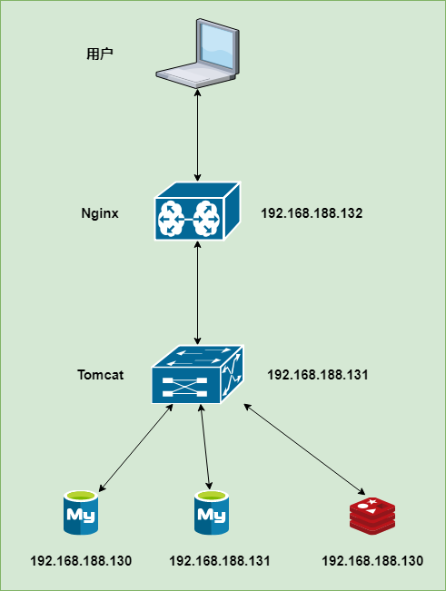

前端部署服务器： Nginx

后端部署服务器： Tomcat(内嵌)

### 1.2 环境说明

由于我们的服务器数量有限，就使用这三台服务器，具体的软件规划如下: 

| 服务器             | 软件                   | 名称   |
| --------------- | -------------------- | ---- |
| 192.168.188.130 | Mysql、redis（缓存中间件）   | 服务器A |
| 192.168.188.131 | Mysql、tomcat(内置)     | 服务器B |
| 192.168.188.132 | Nginx(部署前端项目、配置反向代理) | 服务器C |

由于我们前面的课程中Nginx、MySQL、Redis、JDK、Maven都已经演示过安装及配置了，这里我们就不再演示软件的安装了。

### 1.3 前端部署

前端打包：

在stock_front_admin工程运行打包：

~~~shell
npm run build
~~~

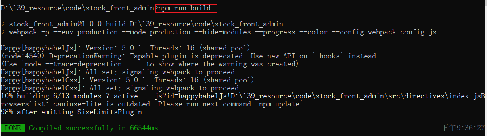

运行完毕后，在stock_front_admin工程下会产生一个dist目录：

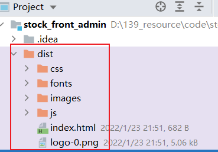

**1). 在服务器A(192.168.188.132)中安装Nginx，将课程资料中的dist目录上传到Nginx的html目录下**

将整个dist目录上传至/usr/local/nginx/html目录下

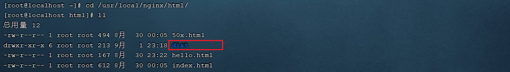 


**2). 修改Nginx配置文件nginx.conf**

将nginx.conf配置文件中，将原有的监听80, 82, 8080端口号 的虚拟主机注释掉，引入如下的配置信息：

```properties
    server {
        listen       80;
        server_name  localhost;

        location / {
            root   html/dist;
            index  index.html;
        }
		# 匹配一切以api前缀的资源，都代理到192.168.188.131:8081
		location ^~ /api/ {
			proxy_pass http://192.168.188.131:8081;
		}
		
        location = /50x.html {
            root   html;
        }
    }
```

 


**3). 通过nginx访问前端工程**

http://192.168.188.132

 


### 1.4 反向代理配置

前端工程部署完成之后，我们可以正常的访问到系统的登录页面，点击登录按钮，可以看到服务端发起的请求，请求信息如下： 

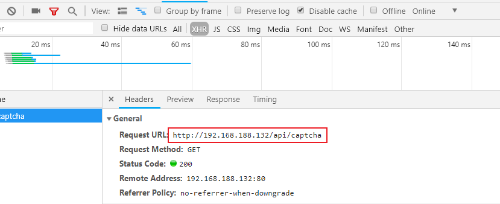 

我们只需将以api开头的请求路径反向代理到192.168.188.131服务下即可。

在上述我们配置的nginx.conf中，除了配置了静态资源的加载目录以外，我们还配置了一段反向代理的配置，配置信息如下： 

```properties
location ^~ /api/ {
    proxy_pass http://192.168.188.131:8081;
}
```

这一段配置代表，如果请求当前nginx，并且请求的路径如果是 /api/ 开头，将会被该location处理。而在该location中，主要配置了proxy_pass(反向代理)。 

说明：

~~~tex
配置中 ^~ /api/表示匹配一切以api开头的请求路径；
~~~

### 1.5 服务端部署

**1). 在服务器B(192.168.188.131)中安装jdk、git、maven、MySQL，使用git clone命令将git远程仓库的代码克隆下来**

A. 确认JDK环境

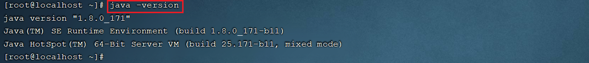 


B. 确认Git环境

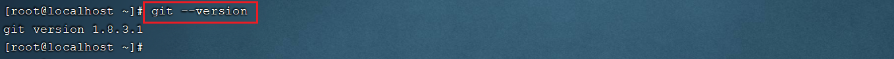 


C. 确认Maven环境

 


D. 将我们开发完成的代码推送至远程仓库,并在服务器B中克隆下来

```shell
#创建java代码存放目录
mkdir -p /usr/local/javaapp

#切换目录
cd /usr/local/javaapp

#克隆代码 , 需要使用自己的远程仓库
git clone https://gitee.com/jicaifang/stock_parent.git
```

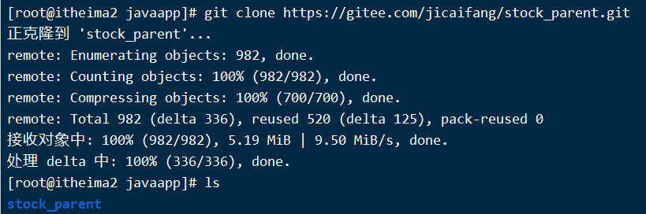  


**2). 将资料中提供的stock.sh文件上传到服务器B，通过chmod命令设置执行权限**

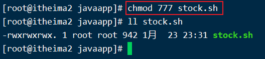 

**3). 执行stock.sh脚本文件，自动部署项目**

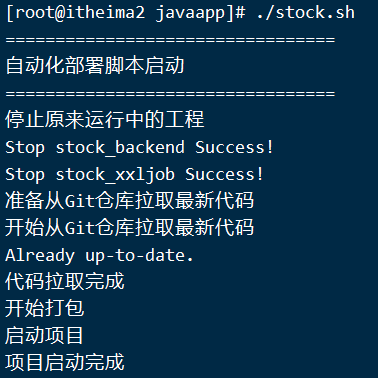 

执行完shell脚本之后，我们可以通过 ps -ef | grep java 指令，查看服务是否启动

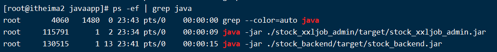 

**4). 访问系统测试**

http://192.168.188.132/

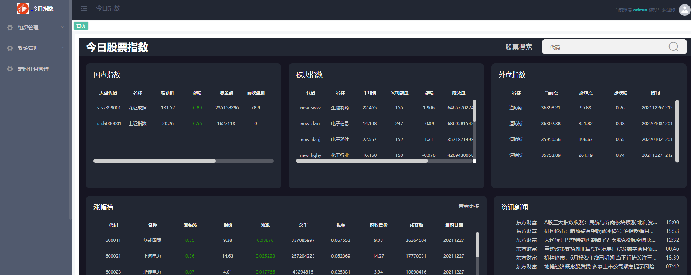 